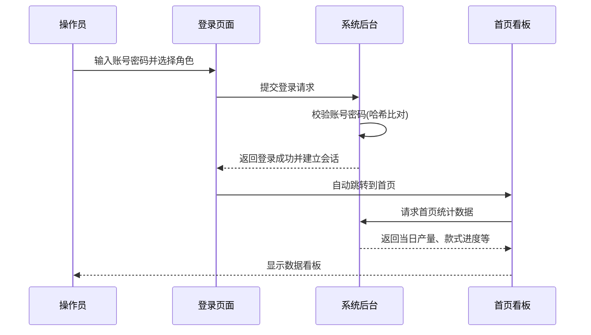
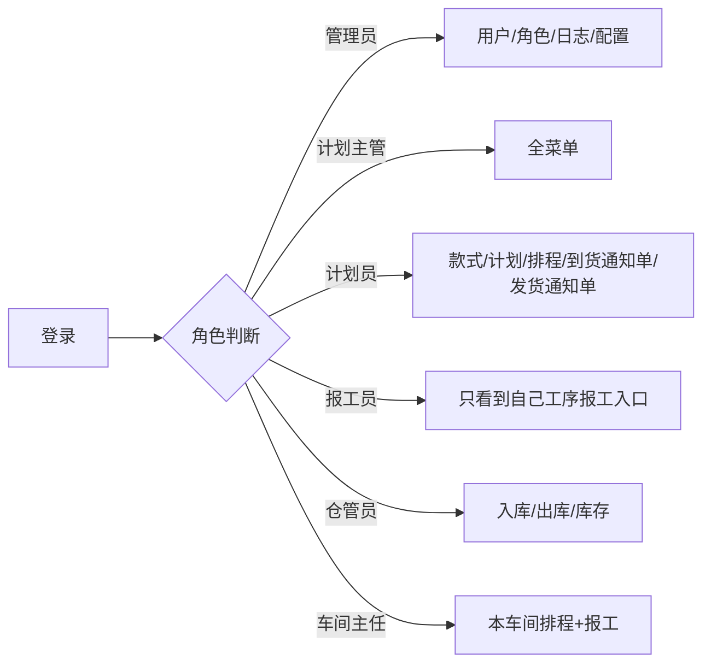

# SOP-00 总览与登录

> **适用对象**: 全员(第一次使用本系统必读)
> **预计阅读**: 15 分钟
> **难度**: ⭐ (入门级)

---

## 一、系统是干什么的(白话版)

**一句话**: 替代电子表格手排,系统自动算交期、自动看产能、自动提醒超期。

**以前用电子表格怎么做**:
- 计划员在表格文件里手动填款式、填数量、填日期
- 跨多个款式同时排期时,产能冲突要手动算
- 报工数据要手动同步回表格文件,容易算错
- 出货前才发现在制品积压,赶不上船期

**现在用系统怎么做**:
- 款式建档后,系统自动算裁剪 → 二次加工 → 缝制的时间
- 排产时系统自动避开产能冲突的产线
- 报工一录,进度实时更新,差异自动算
- 临近交期自动标红,看板一眼能看到风险款式

---

## 二、6 类角色一览

工厂里 6 种人用这个系统,看到的功能不一样:

| 角色 | 人数 | 日常干啥 | 对应 SOP |
|------|------|----------|----------|
| 🛡️ 系统管理员 | 1 人 | 管账号、管角色、管车间产线、查操作日志 | SOP-01 |
| 👔 计划主管 | 1 人 | 审核计划、调排程、看全厂数据 | SOP-02 |
| 📋 计划员 | 3 人 | 建款式、编计划、跑自动排产 | SOP-03 |
| ✍️ 报工员 | 6 人 | 在工序页面录当日完成数 | SOP-04 |
| 📦 裁片仓管员 | 2 人 | 入库确认、出库登记、库存查询 | SOP-05 |
| 🏭 缝制车间主任 | 5 人 | 看本车间排程、录本车间报工 | SOP-06 |

---

## 三、登录系统

### 3.1 打开系统

1. 打开浏览器(推荐主流浏览器,比如谷歌浏览器、微软 Edge 浏览器)
2. 地址栏输入系统地址(向系统管理员要,格式类似 `http://工厂内网IP:5173`)
3. 出现登录页面

💡 **提示**: 把这个地址收藏到浏览器书签,下次省事。

### 3.2 输入账号密码

```
┌─────────────────────────────┐
│   制衣工厂生产排程系统        │
│                             │
│   用户名: [_______________] │
│   密  码: [_______________] │
│   角  色: [▼  请选择     ] │
│                             │
│       [   登  录   ]        │
│                             │
│   默认管理员账号 admin / 初始密码 admin123 │
└─────────────────────────────┘
```

**步骤**:
1. 🟢 在「用户名」框输入您的账号(找系统管理员要)
2. 🟢 在「密码」框输入密码
3. 🟢 在「角色」下拉框选择您的角色(第一次登录需要选)
4. 🟢 点「登录」按钮

### 3.3 登录成功流程



### 3.4 登录失败处理

| 现象 | 原因 | 怎么办 |
|------|------|--------|
| 提示"用户名或密码错误" | 输错了 / 账号被停用 | 重新核对,或找管理员重置 |
| 提示"角色未选择" | 没选角色下拉框 | 选好角色再登录 |
| 页面空白 / 转圈圈死 | 网络不通 / 后端挂了 | 检查网络,联系系统管理员 |
| 提示"会话已过期" | 半小时没操作 | 重新登录 |

---

## 四、主界面导航

### 4.1 整体布局

```
┌──────────────────────────────────────────────────────────────┐
│  顶栏: [系统图标] 制衣排程系统   🔔 通知  👤 张三(计划员)  ▼ │
├──────────┬───────────────────────────────────────────────────┤
│          │                                                   │
│  侧边栏   │            主内容区 (随菜单切换)                    │
│          │                                                   │
│ 📊 首页   │                                                   │
│ 👕 款式   │                                                   │
│ 📅 计划   │                                                   │
│ 📆 排程   │                                                   │
│ ✂️ 报工   │                                                   │
│ 📦 仓库   │                                                   │
│ ⚙️ 设置   │                                                   │
│          │                                                   │
└──────────┴───────────────────────────────────────────────────┘
```

### 4.2 顶栏功能

| 图标 | 功能 | 谁会用 |
|------|------|--------|
| 🔔 通知 | 系统消息、待办 | 全员 |
| 👤 用户名 | 显示当前账号 | 全员 |
| ▼ 下拉 | 修改密码 / 退出登录 | 全员 |

### 4.3 侧边栏菜单(按角色显示不同)

不同角色看到的菜单不一样:



💡 **提示**: 看不到某个菜单 = 你没这个权限。找系统管理员开权限。

---

## 五、通用操作(所有页面通用)

### 5.1 查询 / 筛选

大多数列表页顶部都有筛选区:

```
┌─────────────────────────────────────────────────────────┐
│  🔍 筛选: [款式编号▼] [状态▼] [日期范围▼] [🔎查询][↻重置] │
└─────────────────────────────────────────────────────────┘
```

**步骤**:
1. 🟢 在筛选框填条件(可选填,什么都不填就查全部)
2. 🟢 点「查询」按钮
3. 🟢 想清空条件 → 点「重置」

### 5.2 新增数据

列表页右上角通常有「+ 新增」按钮:

**步骤**:
1. 🟢 点「+ 新增」按钮
2. 🟢 弹出表单,填必填项(标红星号 * 的字段)
3. 🟢 点「确定」保存
4. 🟢 提示「保存成功」→ 列表自动刷新

⚠️ **警告**: 必填项没填就点确定,会弹红色提示。仔细看提示哪一项没填。

### 5.3 编辑数据

**步骤**:
1. 🟢 在列表找到要改的那一行
2. 🟢 点行尾的「✏️ 编辑」按钮
3. 🟢 修改字段
4. 🟢 点「确定」保存

🟡 **谨慎**: 有些字段是「锁定」的(灰色不能改),说明这个数据已被下游流程使用,改不了。

### 5.4 删除数据

**步骤**:
1. 🟢 点行尾的「🗑️ 删除」按钮
2. 🟡 系统弹确认框:「确定删除?」
3. 🟢 点「确定」→ 删除完成

🔴 **禁止**: 业务数据删除前必须确认没被其他模块引用。误删可能导致排程错乱。

### 5.5 导出表格

列表页通常有「📥 导出」按钮:

**步骤**:
1. 🟢 (可选)先筛选要导出的数据
2. 🟢 点「📥 导出」
3. 🟢 浏览器自动下载一个表格文件

### 5.6 导入表格

**步骤**:
1. 🟢 点「📤 导入」按钮(部分页面有)
2. 🟢 下载模板 → 按模板格式填数据
3. 🟢 上传填好的文件
4. 🟢 系统显示「导入成功 X 条,失败 Y 条」
5. 🟡 失败行要看错误原因,改完重新导入

---

## 六、核心术语表

工厂里大家平时说的口头语,系统里叫啥:

| 口头语 | 系统术语 | 解释 |
|----------|----------|------|
| 款号 / 款式 | 款式 | 一个产品(比如「T-001 圆领短袖」) |
| 订单数 | 计划数量 | 这个款式要做多少件 |
| 出货日 | 交期 | 客户要货的日期 |
| 裁片 | 裁片 | 布料裁好后还没缝的片 |
| 工序 | 工序 | 裁剪 / 印花 / 刺绣 / 模板 / 烫标 / 缝制 |
| 排产 | 排程 | 把款式排到具体哪天、哪条产线 |
| 倒推 | 交期倒推 | 从出货日往回算各工序起止日期 |
| 报工 | 报工 | 工人录当天做了多少件 |
| 入库 | 入库 | 裁片 / 成品从车间进仓库 |
| 出库 | 出库 | 从仓库领料到车间 |
| 产线 | 产线 | 缝制车间里的一条流水线 |
| 车间 | 车间 | 缝制车间的统称(本系统共 5 个) |
| 在制 | 在制数 | 已经开始做但还没做完的数量 |
| 差异 | 差异数 | 计划数 - 实际完成数 |

---

## 七、修改密码

登录后建议 **第一时间改密码**,默认密码大家都知道不安全:

```
┌────────────────────────────────┐
│   顶栏 → 👤 用户名 → 修改密码   │
└────────────────────────────────┘
```

**步骤**:
1. 🟢 点右上角「👤 用户名」→ 弹出菜单
2. 🟢 点「修改密码」
3. 🟢 填「原密码」+「新密码」+「确认新密码」
4. 🟢 新密码至少 8 位,含字母+数字
5. 🟢 点「确定」

💡 **提示**: 忘记密码 → 找系统管理员重置,他会给你一个临时密码。

---

## 八、退出登录

**步骤**:
1. 🟢 点右上角「👤 用户名」→ 弹出菜单
2. 🟢 点「退出登录」
3. 🟢 跳回登录页

⚠️ **警告**: 离开工位前一定要退出,防止别人操作你的账号。

---

## 九、常见问题

### Q1: 登录页面打不开 / 白屏

**排查顺序**:
```
[1] 浏览器地址对吗?
    ↓ 不对 → 找管理员要正确地址
    ↓ 对
[2] 网线或者无线网络连着吗?
    ↓ 没连 → 连上网络后重试
    ↓ 连着
[3] 后端服务在跑吗?(找系统管理员确认)
    ↓ 没跑 → 联系系统管理员启动
    ↓ 在跑
[4] 按 Ctrl 加 F5 强制刷新浏览器
    ↓ 还不行 → 换一台电脑试试
```

### Q2: 登录后菜单是空的 / 看不到功能

**原因**: 你的角色没分配菜单权限
**解决**: 联系系统管理员,让他在「角色管理」里给你勾选菜单

### Q3: 点了按钮没反应 / 页面一直转圈

**排查**:
- 🟢 看浏览器底部状态栏有没有报错
- 🟢 按 F12 键打开浏览器的「开发者工具」面板 → 切到「控制台」标签 → 看里面的红色错误信息
- 🟢 把错误截图发给系统管理员

### Q4: 数据和我看到的不一样 / 别人能看到我看不到的款式

**原因**: 数据权限隔离(计划员只看自己负责的款式,车间主任只看本车间)
**解决**: 找系统管理员确认你的数据范围

### Q5: 误删了数据怎么办?

🔴 **数据删除后无法恢复!**
- 立即联系系统管理员
- 管理员可以从操作日志查到删除时间和操作人
- 如果当天有数据库备份,管理员可以恢复(但会丢失备份点之后的全部数据)

### Q6: 报工录错了能改吗?

🟢 当天的报工可以修改和删除
🔴 跨日报工需要找计划主管,主管有权限改历史数据

### Q7: 系统突然变慢 / 卡顿

**排查**:
- 🟢 看是不是只有你卡,还是全厂都卡
- 🟢 全厂卡 → 联系系统管理员,可能是数据库锁了
- 🟢 只有你卡 → 清浏览器缓存 / 换电脑

---

## 十、下一步

根据你的岗位,接下来看:

| 你是谁 | 接下来读 |
|--------|----------|
| 系统管理员 | [SOP-01 系统管理员](./SOP-01-系统管理员.md) |
| 计划主管 | [SOP-02 计划主管](./SOP-02-计划主管.md) |
| 计划员 | [SOP-03 计划员](./SOP-03-计划员.md) |
| 报工员 | [SOP-04 报工人员](./SOP-04-报工人员.md) |
| 裁片仓管员 | [SOP-05 裁片仓管员](./SOP-05-裁片仓管员.md) |
| 缝制车间主任 | [SOP-06 缝制车间主任](./SOP-06-缝制车间主任.md) |

---

**版本**: v1.0 (2026-06-21)
**反馈**: 内容有误或看不懂的地方,联系系统管理员,或直接在本文件末尾追加修订意见。