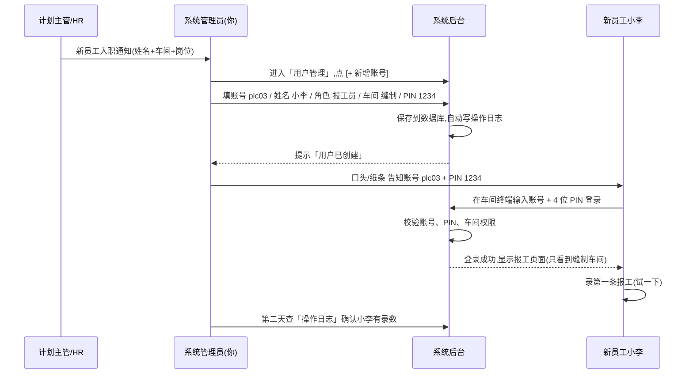
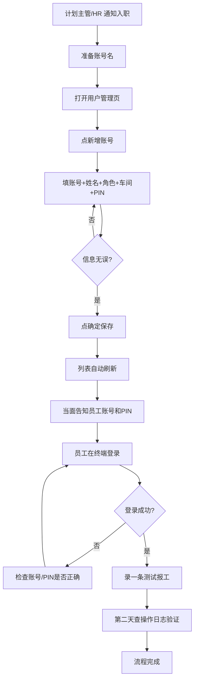
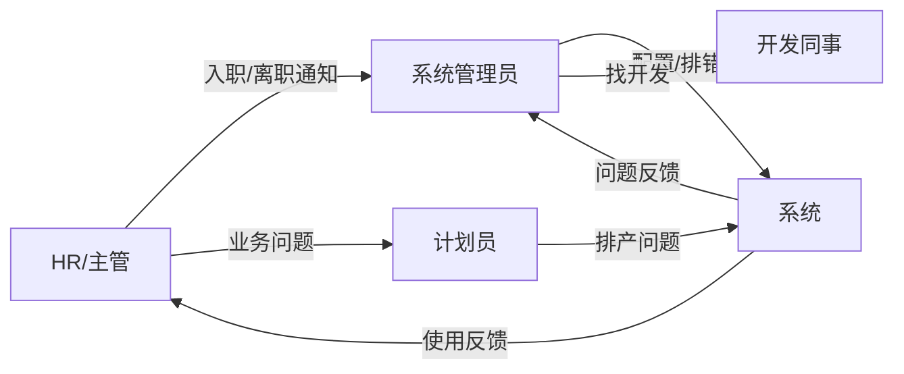

# SOP-01 系统管理员

> **适用对象**: 🛡️ 系统管理员(全厂只此 1 人)
> **预计阅读**: 30 分钟
> **难度**: ⭐⭐ (需要懂车间业务 + 基础电脑操作)
> **核心职责**: 管账号、配权限、维护车间产线、设工作日历、查操作日志

---

## 一、这个岗位是干什么的(白话版)

**一句话**: 系统跑得稳不稳、数据准不准,全看你。

**日常大致要做的事**:
- 新员工来了 → 开账号、配角色、告诉他怎么用
- 老员工走了 / 换岗 → 改权限、改车间
- 厂里加了新车间 / 班组 / 产线 → 录进系统
- 一年到头有调休、春节、国庆 → 改工作日历
- 计划员发现自动排产出来的数不对 → 调产能参数、查系统参数
- 哪个账号误删了数据 / 谁改了什么 → 翻操作日志找证据
- 系统突然卡了 / 出错了 → 第一时间顶上,联系开发同事

**对系统的期望**:
- 🟢 全厂数据想看就看,不被权限挡住
- 🟢 改完配置,全厂立刻生效
- 🟢 出了问题能快速定位(谁、什么时候、改了啥)

---

## 二、权限范围(看得见什么,看不见什么)

### 2.1 菜单可见性

```
┌──────────────────────────────────────────────────────────┐
│  🛡️ 系统管理员 看到的菜单                                  │
├──────────────────────────────────────────────────────────┤
│  📊 工作台        ✅ 可见                                  │
│  📁 基础数据      ✅ 可见(款式、车间、面料、产量配置)        │
│  📅 计划管理      ✅ 可见(总计划、裁剪、二次、缝制)          │
│  ✍️ 报工管理      ✅ 可见(全部工序报工入口)                 │
│  📦 仓库          ✅ 可见(裁片、面料、辅料、成品)            │
│  ⚙️ 设置          ✅ 可见(以下子菜单全部)                   │
│    ├─ 🏭 缝制车间管理                                       │
│    ├─ ⚙️ 系统设置(产能配置)                                │
│    ├─ 🗓️ 工作日历                                          │
│    ├─ 📊 排产策略                                          │
│    └─ 🔧 系统参数                                          │
│  👥 用户管理      ✅ 可见(管理员专属)                      │
│  📜 操作日志      ✅ 可见(管理员专属)                      │
│  👤 个人设置      ✅ 可见(改自己头像/密码)                  │
└──────────────────────────────────────────────────────────┘
```

### 2.2 按钮级权限差异(看得见 vs 能动)

| 功能 | 看得见 | 能新增/改/删 | 备注 |
|------|--------|--------------|------|
| 用户管理 | ✅ | ✅ | 增删改账号、重置密码、重置 PIN |
| 缝制车间 | ✅ | ✅ | 增删改车间/班组/分类、导入导出 |
| 系统设置(产能字段) | ✅ | ✅ | 改甘特图字段配置 |
| 系统参数 | ✅ | ✅ | 改算法阈值(数值类) |
| 工作日历 | ✅ | ✅ | 增删改日历、特殊日期 |
| 排产策略 | ✅ | ⚠️ 部分 | 建议让计划主管改,见说明 |
| 操作日志 | ✅ | ❌ 只读 | 不能改不能删,只能查 |
| 款式/计划/排程 | ✅ | ⚠️ 慎用 | 误改会影响排产,留给计划员 |
| 仓库 | ✅ | ⚠️ 慎用 | 当前周期仓库功能冻结(见项目说明) |

### 2.3 跟其他角色相比,独有的能力

| 能力 | 系统管理员 | 计划主管 | 计划员 |
|------|------------|----------|--------|
| 看全部操作日志 | ✅ | ❌ 只能看自己 | ❌ 只能看自己 |
| 重置别人密码 | ✅ | ❌ | ❌ |
| 停用/启用账号 | ✅ | ❌ | ❌ |
| 改系统参数 | ✅ | ✅ | ❌ |
| 改工作日历 | ✅ | ❌ | ❌ |
| 改排产策略 | ✅ | ✅ | ❌ |
| 改缝制车间结构 | ✅ | ❌ | ❌ |

💡 **提示**: 系统管理员是「超级管理员」,但 **不是「什么都自己干」**。日常建款式、跑排产这些活,应该让计划员和计划主管做,你只管「系统能不能用」。

---

## 三、视图 1:用户与角色管理(管理员专属)

### 3.1 这个页面是干啥的

管全厂账号。新人入职开账号,老人离职停账号,谁换岗改他的角色和车间。系统里 **没有独立的「角色管理」页面** — 角色是固定的 5 种(管理员/计划主管/计划员/报工员/车间主任),在下拉框里选,后端硬编码做权限校验。

### 3.2 进入路径

```
侧边栏  →  👥 用户管理
菜单路径 → 侧边栏「用户管理」(仅管理员可见)
权限    →  只能「系统管理员」进,其他角色看到的是「无权限」提示页
```

### 3.3 界面长啥样

```
┌──────────────────────────────────────────────────────────────────┐
│  👥 用户管理                                       [+ 新增账号]  │
├──────────────────────────────────────────────────────────────────┤
│  🔍 [角色▼]  [车间▼]  [🔎 搜姓名/账号          ]                  │
├──────┬──────────┬──────────┬──────────┬──────┬───────┬──────────┤
│  ID  │ 账号     │ 姓名     │ 角色     │ 车间 │ 状态  │ 操作     │
├──────┼──────────┼──────────┼──────────┼──────┼───────┼──────────┤
│  1   │ admin    │ 张老板   │ 管理员   │  -   │ 启用  │ 编辑 重置│
│  2   │ plan01   │ 李主管   │ 计划主管 │  -   │ 启用  │ 编辑 重置│
│  3   │ plc01    │ 王计划   │ 计划员   │  -   │ 启用  │ 编辑 重置│
│  4   │ disp01   │ 柬小张   │ 报工员   │ 缝制 │ 启用  │ 编辑 重置│
│  5   │ supv01   │ 柬小李   │ 车间主任 │ 缝制 │ 启用  │ 编辑 重置│
│  6   │ old01    │ 柬小陈   │ 计划员   │  -   │ 禁用  │ 编辑 重置│
└──────┴──────────┴──────────┴──────────┴──────┴───────┴──────────┘
│  共 6 条  30条/页  < 1 2 3 >                                      │
└──────────────────────────────────────────────────────────────────┘
```

### 3.4 新增账号(完整步骤)

**场景**: 新来一个计划员小张,需要开账号。

```
步骤 1:  页面右上角点 [+ 新增账号]
步骤 2:  弹窗出现,逐项填:

  ┌──────────────────────────────────────┐
  │  账号*:      [plc02            ]      │   ← 字母+数字,不能改
  │  账号(高棉语): [plc02_kh        ]      │   ← 选填,柬埔寨同事用
  │  姓名*:      [小张              ]      │   ← 显示用
  │  姓名(高棉语): [ស្ហាយ          ]      │   ← 选填
  │  角色*:      [▼ 计划员        ]      │   ← 必选
  │  车间:       (报工员/车间主任才显示)   │   ← 看角色
  │  密码*:      [••••••            ]      │   ← 至少 6 位
  │                                      │
  │  [取消]                    [确定]    │
  └──────────────────────────────────────┘

步骤 3:  角色选「计划员」,无需选车间
步骤 4:  密码给个临时简单好记的,比如 Zhang@2026
步骤 5:  点 [确定]
步骤 6:  弹窗自动关闭,列表自动刷新,新账号出现在第一行
步骤 7:  告诉小张去登录页,账号 plc02 / 密码 Zhang@2026
步骤 8:  提醒他登录后 **马上改密码**
```

⚠️ **警告**: 账号一旦创建 **不能改**。输错了只能停用再建。所以账号先想好,别跟旧人撞。

### 3.5 编辑账号

能改:姓名、姓名高棉语、角色、车间、密码。
不能改:账号本身(灰色禁用)。

**场景**: 小张从计划员升职为计划主管。

```
步骤 1:  找到小张那行,点 [编辑]
步骤 2:  弹出表单(账号字段灰色不可改)
步骤 3:  角色下拉框改为「计划主管」
步骤 4:  (密码字段保持空,表示不改密码)
步骤 5:  点 [确定]
步骤 6:  列表自动刷新,小张的角色标签从「计划员」变成「计划主管」
步骤 7:  小张重新登录后,菜单立刻按新角色显示
```

### 3.6 重置密码(忘记密码时)

**场景**: 报工员小陈忘密码了,找你重置。

```
步骤 1:  找到小陈那行,点 [重置密码] 按钮(橙色)
步骤 2:  弹窗出现,显示「即将重置 X 的密码」
步骤 3:  在新密码框填一个临时密码,比如 Chen@2026
步骤 4:  点 [确定]
步骤 5:  提示「密码已重置」,弹窗关闭
步骤 6:  把临时密码告诉小陈,提醒他登录后改
```

🟢 **记住**: 重置密码至少 6 位,字母+数字组合更安全。

### 3.7 重置 PIN(报工员专用)

**场景**: 报工员在车间用 4 位 PIN 登录,忘了。

```
步骤 1:  找到报工员那行(角色是「报工员」才有这个按钮)
步骤 2:  点 [重置 PIN] 按钮(橙色)
步骤 3:  弹窗出现,填 4 位数字,比如 1234
步骤 4:  点 [确定]
步骤 5:  把 1234 告诉报工员,让他用账号+新 PIN 登录
```

⚠️ **注意**: PIN 必须是 **4 位数字**,字母不行,超过 4 位也不行。

### 3.8 停用 / 启用账号

**场景 1**: 老员工离职 → 停用(不是删除)。

```
步骤 1:  找到离职员工那行
步骤 2:  点 [启用/禁用] 按钮(红色或绿色,看当前状态)
步骤 3:  弹窗「确定要禁用 XX 吗?」→ 点 [确定]
步骤 4:  状态标签变成「禁用」(灰色)
步骤 5:  此人再登录会提示「账号已停用」,但历史数据还在
```

🟢 **建议**: 离职员工一律 **停用**,不要删除。删除后历史日志里看不到操作人,审计会断链。

**场景 2**: 误停用了 → 重新启用,操作同上,按钮文案会变成「启用」。

### 3.9 筛选 / 搜索

- 按角色筛:下拉框选「计划员」,只显示计划员
- 按车间筛:下拉框选「缝制」,只显示缝制车间相关账号
- 按姓名/账号搜:输入框输入「小张」,会模糊匹配

💡 **提示**: 这三个筛选 **可以同时用**,比如筛「缝制车间 + 报工员」就是缝制车间的报工员。

### 3.10 5 种角色对照表

| 角色 | 干啥的 | 数据范围 | 必填车间 |
|------|--------|----------|----------|
| 管理员 | 管系统 | 看全厂 | 否 |
| 计划主管 | 审核计划 | 看全厂 | 否 |
| 计划员 | 建款式/编计划 | 全厂数据 | 否 |
| 报工员 | 录报工 | 自己负责的工序 | **是**(缝制/裁剪/印花/刺绣/模板/烫标) |
| 车间主任 | 本车间 | 自己负责的车间 | **是**(缝制) |

⚠️ **报错提示**: 「报工员/车间主任必须选择车间」— 选角色后忘记选车间,提交时会弹红框。

### 3.11 常见错误

| 现象 | 原因 | 解决 |
|------|------|------|
| 新增时报「账号已存在」 | 跟旧人撞名 | 换一个,比如 plc02 → plc02a |
| 报错「非报工员必须设置密码」 | 选了非报工员但密码框空着 | 填密码 |
| 报错「报工员必须设置 PIN」 | 选了报工员但 PIN 框空着 | 填 4 位数字 |
| 改完角色,用户菜单没变 | 浏览器缓存或后端会话未刷新 | 让用户退出再登录 |
| 重置密码后用户还是登不上 | 旧密码残留会话 | 让用户彻底退出浏览器再登 |
| 列表显示某用户状态是「禁用」 | 之前停用过 | 重新启用即可 |

### 3.12 与其他模块联动

```
┌──────────────┐         ┌─────────────────┐
│  用户管理     │  ─────→ │  登录/会话系统    │
│  (你在这里)   │         │  角色决定能看到啥  │
└──────────────┘         └─────────────────┘
        │
        │ 报工员的 PIN
        ▼
┌──────────────────┐
│  报工页(车间终端) │
│  用 PIN 登录录数  │
└──────────────────┘
```

- **改角色** → 用户重新登录后,菜单立刻按新角色显示
- **停用账号** → 用户立即无法登录,但历史报工数据保留
- **重置密码** → 用户必须用新密码登录,旧密码立刻失效

---

## 四、视图 2:缝制车间三层树管理

### 4.1 这个页面是干啥的

厂里有 5 个缝制车间,每个车间下分几个班组,每个班组下分款式分类(比如 T 恤/裤子/外套)。这个页面就是管这个 **三层树结构** 的:车间 → 班组 → 款式分类。

### 4.2 进入路径

```
侧边栏  →  📁 基础数据  →  🏭 缝制车间管理
菜单路径 → 侧边栏「基础数据」→「缝制车间管理」
权限    →  管理员专属
```

### 4.3 界面长啥样

```
┌──────────────────────────────────────────────────────────────────────┐
│  🏭 缝制车间管理                                                      │
│  [+ 新增车间] [批量编辑(3)] [批量删除(3)]  |  [导出电子表格] [导入电子表格]│
├──────────────────────────────────────────────────────────────────────┤
│  ☐ │ 车间     │ 班组     │ 款式分类   │ 日产量 │ 操作              │
├──────────────────────────────────────────────────────────────────────┤
│  ☐ │ 1 (车间) │          │           │   -    │ +新增班组  编辑 删  │
│  ☐ │   ├      │ 1班 (班组)│           │  200   │ +新增分类  编辑 删  │
│  ☐ │   │      │   └      │ T恤       │   -    │        编辑 删      │
│  ☐ │   │      │   └      │ 裤子      │   -    │        编辑 删      │
│  ☐ │   ├      │ 2班 (班组)│           │  180   │ +新增分类  编辑 删  │
│  ☐ │          │          │           │        │                     │
│  ☐ │ 2 (车间) │          │           │   -    │ +新增班组  编辑 删  │
│  ☐ │   ├      │ 1-1班(班组)│          │  150   │ +新增分类  编辑 删  │
└──────────────────────────────────────────────────────────────────────┘
```

### 4.4 新增车间

```
步骤 1:  页面右上角点 [+ 新增车间]
步骤 2:  弹窗出现
步骤 3:  「名称」框输入数字,比如 1、2、5
步骤 4:  点 [确定]
步骤 5:  列表自动多出一行「1(车间)」
```

⚠️ **命名规则**: 车间名称 **只能是数字**(1、2、12),不能是「缝制一车间」「1号车间」等。系统强校验,输错会弹黄框警告。

### 4.5 新增班组

```
步骤 1:  找到要加班组的那个车间那行
步骤 2:  点行尾 [+ 新增班组] 按钮
步骤 3:  弹窗出现,「上级」自动填好车间名
步骤 4:  「名称」框输入,比如 1班、2-2班
步骤 5:  点 [确定]
步骤 6:  列表自动在该车间下多出一行
```

⚠️ **命名规则**: 班组名格式 **「数字+班」**,比如 1班、2班、1-1班、2-2班。系统强校验。

### 4.6 新增款式分类

```
步骤 1:  找到要加分类的那个班组那行
步骤 2:  点行尾 [+ 新增款式分类] 按钮
步骤 3:  弹窗出现
步骤 4:  「名称」框输入分类名,比如 T恤、裤子、外套
步骤 5:  点 [确定]
```

💡 **注意**: 款式分类命名 **无强校验**,中文英文都行,但建议跟计划员统一口径。

### 4.7 编辑(改名称 / 改日产量)

**场景**: 1班日产量从 200 件改成 250 件。

**方式 1 — 单行编辑**:
```
步骤 1:  找到 1班那行
步骤 2:  点行尾 [编辑] 按钮(橙色)
步骤 3:  「名称」和「日产量」字段变成可输入
步骤 4:  把日产量从 200 改成 250
步骤 5:  按回车键 或 点 [保存] 链接
步骤 6:  列表自动刷新,日产量显示 250
```

**方式 2 — 批量编辑(快捷重命名)**:
```
场景: 多个班组都要加「-A」后缀

步骤 1:  勾选要改的那几行
步骤 2:  点 [批量编辑(3)] 按钮(橙色)
步骤 3:  弹窗出现,选「加后缀」
步骤 4:  在「后缀」框输入 -A
步骤 5:  点 [确定]
步骤 6:  列表自动刷新,所有选中班组名都加了 -A
```

批量编辑的 4 种模式:

| 模式 | 用途 | 示例 |
|------|------|------|
| 加前缀 | 全部加同样前缀 | 1班 → A1班 |
| 加后缀 | 全部加同样后缀 | 1班 → 1班-A |
| 替换文本 | 查找并替换 | 1班 → 一班 |
| 统一重命名 | 全部改成同一个 | 1班、2班、3班 → 通用班 |

### 4.8 删除

**场景 1 — 删除单项**:
```
步骤 1:  找到要删的那行
步骤 2:  点行尾 [删除] 按钮(红色)
步骤 3:  弹窗「确定删除 XX?」 → 点 [确定]
步骤 4:  如果有子项,会提示「将同时删除其下 N 个子项」,确认后一起删
```

**场景 2 — 批量删除**:
```
步骤 1:  勾选要删的那几行
步骤 2:  点 [批量删除(3)] 按钮(红色)
步骤 3:  弹窗「确定删除选中的 3 项?」 → 点 [确定]
步骤 4:  一次性删完
```

🔴 **危险**: 删除车间 / 班组前,必须确认这个车间/班组 **没有被任何排程引用**。如果被引用,先让计划员把这个车间的排程改到别处,再删。

### 4.9 导入电子表格(批量建车间)

**场景**: 新厂一下子要建 10 个车间、30 个班组,一个一个点太慢,用电子表格一次导入。

```
步骤 1:  点页面右上角 [导入电子表格]
步骤 2:  弹窗出现,选模式:
         - 覆盖模式(清空后重建)  ← 慎用,会把现有车间全删
         - 追加模式(跳过重复)    ← 安全,推荐
步骤 3:  点 [选择文件],选事先填好的电子表格
步骤 4:  确认文件名出现在弹窗里
步骤 5:  点 [开始导入]
步骤 6:  提示「导入完成:新增 X 条,跳过 Y 条」
```

电子表格 格式:
```
第 1 行(表头):  车间   班组   款式分类   日产量
第 2 行:        1      1班   T恤       200
第 3 行:        1      1班   裤子      200
第 4 行:        1      2班   T恤       180
```

### 4.10 导出电子表格

```
步骤 1:  (可选)先在列头筛选,只导出想看的数据
步骤 2:  点 [导出电子表格]
步骤 3:  浏览器自动下载一个文件「车间班组款式分类.xlsx」
步骤 4:  用表格软件打开核对
```

### 4.11 列头筛选(高级用法)

每个列头旁边有个小箭头,点开可以:
- 多选具体值(比如只显示车间 = 1 和 2)
- 排序(升序/降序)
- 包含空值/不包含空值

💡 **小窍门**: 50 个车间/班组太多看不清时,用列头筛选快速定位。

### 4.12 常见错误

| 现象 | 原因 | 解决 |
|------|------|------|
| 弹「车间名称只能是数字」 | 输成「缝制一车间」了 | 改成纯数字 1、2 |
| 弹「班组名称格式不对」 | 缺「班」字,或写成「1组」 | 改成「1班」「2-2班」 |
| 删除失败,提示「存在子节点」 | 有下属班组/分类没删 | 先删子节点 |
| 导入 0 条 | 电子表格 格式不对 | 检查列顺序、是否有空行 |
| 日产量改了但排产没生效 | 缓存 | 退出页面重新进 |

### 4.13 与其他模块联动

```
┌──────────────┐         ┌─────────────────┐
│  缝制车间管理  │  ─────→ │  缝制排程页       │
│  (你在这里)   │         │  班组下拉框的来源  │
└──────────────┘         └─────────────────┘
        │
        │ 班组名 + 日产量
        ▼
┌──────────────────┐
│  自动排产算法      │
│  用日产量算交期    │
└──────────────────┘
```

- **新增班组** → 缝制排程页下拉框立刻多一个选项
- **改日产量** → 下次跑自动排产时用新数值
- **删除班组** → 如果已被排程引用,会删不掉,必须先改排程

---

## 五、视图 3:产能配置(系统设置)

### 5.1 这个页面是干啥的

「系统设置」这个名字容易让人误解。它 **不是** 改车间日产量的地方,也不是改算法阈值的地方。它管的是 **甘特图上显示啥字段**。

简单说:**给计划员看的甘特图,字段长啥样,你来定**。

### 5.2 进入路径

```
侧边栏  →  ⚙️ 设置  →  ⚙️ 系统设置
菜单路径 → 侧边栏「设置」→「系统设置」
权限    →  管理员、计划主管、计划员(只读权限也开放)
```

### 5.3 界面长啥样

```
┌──────────────────────────────────────────────────────────────┐
│  ⚙️ 系统设置                                                │
├──────────────────────────────────────────────────────────────┤
│  预排总计划 — 甘特图字段配置                                    │
│                                                              │
│  任务条显示字段    [款号 ×] [计划数量 ×]               [▼]    │
│  鼠标悬停提示字段  [款号 ×] [品名 ×] [计划数量 ×] [交期 ×]    │
│  左侧列表显示字段  [款号 ×]                            [▼]    │
│                                                              │
│  [保存预排总计划配置]                                          │
├──────────────────────────────────────────────────────────────┤
│  缝制排程 — 甘特图字段配置                                      │
│                                                              │
│  任务条显示字段    [款号 ×] [计划数量 ×]               [▼]    │
│  鼠标悬停提示字段  [款号 ×] [品名 ×] [计划数量 ×] [缝制开始 ×]│
│  左侧列表显示字段  [车间 ×] [班组 ×]                  [▼]    │
│                                                              │
│  [保存缝制排程配置]                                            │
└──────────────────────────────────────────────────────────────┘
```

### 5.4 三类字段的解释

| 字段 | 作用 | 配置建议 |
|------|------|----------|
| 任务条显示字段 | 甘特图彩色条上印的字 | 款号 + 计划数量(默认) |
| 鼠标悬停提示字段 | 鼠标移到条上弹的小窗 | 款号 + 品名 + 数量 + 日期 |
| 左侧列表显示字段 | 甘特图左边表格的列 | 款号(默认) |

### 5.5 修改配置步骤

**场景**: 想在缝制排程的悬停提示里加「优先级」字段。

```
步骤 1:  找到「缝制排程」那一段
步骤 2:  点「鼠标悬停提示字段」下拉框
步骤 3:  弹出所有可选字段(14 个),勾选「优先级」
步骤 4:  点页面下方 [保存缝制排程配置] 按钮
步骤 5:  提示「保存成功」
步骤 6:  打开缝制排程页 → 鼠标移到任意条上 → 看小窗里多出「优先级」一栏
```

### 5.6 可选字段清单(14 个)

| 字段名 | 含义 |
|--------|------|
| 款号 | T-001 这种 |
| 品名 | 圆领短袖 |
| 计划数量 | 要做多少件 |
| 颜色 | 红/蓝/黑 |
| 规格 | S/M/L |
| 交期 | 出货日 |
| 优先级 | 高/中/低 |
| 缝制开始 | 缝制哪天开工 |
| 缝制结束 | 缝制哪天完工 |
| 裁剪开始 | 裁剪哪天开工 |
| 裁剪结束 | 裁剪哪天完工 |
| 二次加工类型 | 印花/刺绣/模板/烫标 |
| 车间 | 1车间/2车间 |
| 班组 | 1班/2-2班 |

### 5.7 常见错误

| 现象 | 原因 | 解决 |
|------|------|------|
| 保存失败,提示无权限 | 用计划员账号改 | 换管理员账号 |
| 改了不生效 | 浏览器缓存 | Ctrl 加 F5 强制刷新 |
| 字段选多了,任务条显示不下 | 选超过 3 个 | 任务条只显示 2-3 个字段 |

### 5.8 与其他模块联动

- **预排总计划配置** → 影响「主计划」页面的甘特图
- **缝制排程配置** → 影响「缝制排程」页面的甘特图

---

## 六、视图 3.5:前置车间产量管理(产能)

### 6.1 这个页面是干啥的

缝制车间之外,还有 5 个前置工序:裁剪、印花、刺绣、模板、烫标。每个工序的 **日产量标准** 在这个页面设置。系统算交期时,会拿这个日产量反推各工序的开始日期。

### 6.2 进入路径

```
侧边栏  →  📁 基础数据  →  ⚙️ 前置车间产量管理
菜单路径 → 侧边栏「基础数据」→「前置车间产量管理」
权限    →  管理员、计划主管、计划员
```

### 6.3 界面长啥样

```
┌──────────────────────────────────────────────────────────────┐
│  ⚙️ 前置车间产量管理                                          │
├──────────────────────────────────────────────────────────────┤
│  工序      │ 日产量标准(件/天) │ 操作                       │
├────────────┼──────────────────┼────────────────────────────┤
│  裁剪       │   800            │  [保存]                    │
│  印花       │   500            │  [保存]                    │
│  刺绣       │   400            │  [保存]                    │
│  模板       │   300            │  [保存]                    │
│  烫标       │   600            │  [保存]                    │
└──────────────────────────────────────────────────────────────┘
```

### 6.4 修改日产量步骤

**场景**: 厂里扩了一条裁剪线,裁剪日产量从 800 改到 1000。

```
步骤 1:  找到「裁剪」那行
步骤 2:  在「日产量标准」框里把 800 改成 1000
步骤 3:  点行尾 [保存] 按钮
步骤 4:  提示「裁剪 保存成功」
步骤 5:  下次跑自动排产,会用新日产量
```

### 6.5 常见错误

| 现象 | 原因 | 解决 |
|------|------|------|
| 保存后算出来的交期没变 | 这是历史排程,新值只对新增款式生效 | 让计划员重新跑自动排产 |
| 输 0 保存失败 | 系统拒绝 0 | 至少填 1 |

### 6.6 与其他模块联动

- **改日产量** → 下次跑「自动排产」时,系统按新值反推各工序起止日期
- 这个值是「全厂统一」,不区分车间 — 如果要区分,得在缝制车间管理里设班组级日产量

---

## 七、视图 4:工作日历

### 7.1 这个页面是干啥的

告诉系统 **哪天是工作日、哪天是休息日、哪天是补班**。系统算交期、算日产量时,会自动跳过休息日。春节、国庆、柬埔寨新年(宋干节)都在这里配。

### 7.2 进入路径

```
侧边栏  →  ⚙️ 设置  →  🗓️ 工作日历
菜单路径 → 侧边栏「设置」→「工作日历」
权限    →  管理员专属
```

### 7.3 界面长啥样

```
┌──────────────────────────────────────────────────────────────────────┐
│  🗓️ 工作日历     管理工作日、休息日、节假日,排程计算时自动跳过休息日     │
├────────────────┬─────────────────────────────────────────────────────┤
│ 工作日历        │     2026 年 6 月         [< 上月] [下月 >]          │
│ + 新建          │                                                     │
│ ▸ 默认日历 (选中)│   一  二  三  四  五  六  日                         │
│   工作日:1111100│  [ 1][ 2][ 3][ 4][ 5][ 6][ 7]                      │
│   优先级: 0     │  [ 8][ 9][10][11][12][13][14]                      │
│ [删除]          │  [15][16][17][18][19][20][21]                      │
│                 │  [22][23][24][25][26][27][28]                      │
│ 工作模式        │  [29][30]                                           │
│ + 新建          │                                                     │
│ ▸ 两班倒 (8h)   │  图例: 🟢 工作日  🔴 休息日  🔵 特殊日期              │
│                 │                                                     │
│ 工作日设置      │  特殊日期(3)                                         │
│ 一  二 三 四 五 │  2026-06-15  工作日  补班  [删除]                    │
│  ✓  ✓  ✓  ✓  ✓ │  2026-06-21  休息日  端午节  [删除]                  │
│  ✗  ✗          │  2026-06-22  休息日  端午节  [删除]                  │
│ [保存工作日设置] │                                                     │
└────────────────┴─────────────────────────────────────────────────────┘
```

### 7.4 关键概念

```
┌─────────────────────────────────────────────────────┐
│  「工作日串」 7 位数字                               │
│                                                     │
│  位:      一  二  三  四  五  六  日                  │
│  1111100:  ✓  ✓  ✓  ✓  ✓  ✗  ✗   (周一到周五上班)  │
│  1111111:  ✓  ✓  ✓  ✓  ✓  ✓  ✓   (全年无休)        │
│  0000000:  ✗  ✗  ✗  ✗  ✗  ✗  ✗   (厂休)            │
└─────────────────────────────────────────────────────┘

「优先级」: 多个日历同时存在时,数字大的覆盖小的(0 最低)

「工作模式」: 班次定义(8 小时、两班倒、三班倒)

「特殊日期」: 临时改某一天的工作/休息状态(覆盖默认规则)
```

### 7.5 调整周一到周五的工作日设置

**场景**: 厂里决定周六也上班(赶货)。

```
步骤 1:  左侧「工作日历」区,确认选中了要改的那个日历
步骤 2:  左侧「工作日设置」区,找到「六」这一列的开关
步骤 3:  把「六」的开关从关(灰色) → 开(蓝色)
步骤 4:  点 [保存工作日设置] 按钮
步骤 5:  提示「保存成功」
步骤 6:  右侧月历里,所有周六的格子立刻从红色(休息)变绿色(工作)
```

### 7.6 设置特殊日期(节假日 / 补班)

**场景 1**: 把春节假期 1 月 28 日-2 月 4 日标为休息日。

```
步骤 1:  右侧月历,点 1 月 28 日那个格子
步骤 2:  弹窗「设置特殊日期」出现
步骤 3:  「类型」开关拨到「休息日」
步骤 4:  「备注」框填「春节」
步骤 5:  点 [保存]
步骤 6:  弹窗关闭,28 日格子变成蓝色边框(代表特殊日期)+ 红色背景(休息)
步骤 7:  同样的步骤处理 29、30、31 日和 2 月 1-4 日
```

**场景 2**: 某周六补班(原本是休息日)。

```
步骤 1:  右侧月历,找到那个周六
步骤 2:  点格子 → 弹窗
步骤 3:  「类型」拨到「工作日」
步骤 4:  「备注」填「国庆补班」
步骤 5:  [保存]
```

### 7.7 删除特殊日期(恢复默认)

**场景**: 之前设的补班,现在确认取消,恢复成普通休息日。

```
步骤 1:  页面下方「特殊日期」列表,找到那一行
步骤 2:  点 [删除] 链接
步骤 3:  弹窗「确定删除此例外?」 → [确定]
步骤 4:  列表自动移除,月历格子恢复默认颜色
```

### 7.8 新建工作日历(多个工厂/车间用不同日历)

**场景**: 一厂、二厂工作时间不一样,需要两个日历。

```
步骤 1:  左侧「工作日历」区,点 [+ 新建]
步骤 2:  弹窗出现
步骤 3:  「名称」填「一厂日历」
步骤 4:  「工作日」7 个开关按需设
步骤 5:  「开始日期」填 2026-01-01
步骤 6:  「结束日期」填 2026-12-31
步骤 7:  「优先级」填 1
步骤 8:  点 [创建]
步骤 9:  列表自动多出一项
```

### 7.9 新建工作模式(两班倒 / 三班倒)

```
步骤 1:  左侧「工作模式」区,点 [+ 新建]
步骤 2:  弹窗出现
步骤 3:  「名称」填「两班倒」
步骤 4:  「工时」填 8(每天 8 小时)
步骤 5:  点 [创建]
```

### 7.10 删除日历 / 模式

🔴 **谨慎**: 删除日历会影响所有引用这个日历的排程。删除前先确认没人在用。

```
步骤 1:  左侧「工作日历」区,找到要删的日历
步骤 2:  鼠标移上去,右上角出现 [删除] 链接
步骤 3:  点 [删除]
步骤 4:  弹窗「确定删除此日历?」 → [确定]
```

### 7.11 常见错误

| 现象 | 原因 | 解决 |
|------|------|------|
| 设了特殊日期,月历没变色 | 没保存 | 点弹窗的 [保存] |
| 改了工作日开关,没保存就关页面 | 忘了点 [保存工作日设置] | 重新进来再保存 |
| 排程算的交期跟实际不一样 | 特殊日期没设对 | 检查节假日/补班列表 |
| 多日历冲突,不知道用哪个 | 优先级没设 | 数字大的覆盖小的 |

### 7.12 与其他模块联动

```
┌──────────────┐         ┌─────────────────┐
│  工作日历     │  ─────→ │  自动排产         │
│  跳过休息日   │         │  按日历算交期     │
└──────────────┘         └─────────────────┘
        │
        │ 补班/调休
        ▼
┌──────────────────┐
│  报工页面          │
│  补班日可以录报工  │
└──────────────────┘
```

- **加休息日** → 排程自动避开,交期往后推
- **加补班日** → 排程可以利用这天,交期可以提前

---

## 八、视图 5:系统参数

### 8.1 这个页面是干啥的

管一些 **算法阈值** 和 **业务规则参数**。比如「特殊水洗要加几天」「自动排产时,缝制最多提前几天」之类。

这些值一旦改,全厂排产立刻用新值。所以改之前一定要想清楚。

### 8.2 进入路径

```
侧边栏  →  ⚙️ 设置  →  🔧 系统参数
菜单路径 → 侧边栏「设置」→「系统参数」
权限    →  管理员、计划主管(共同维护)
```

### 8.3 界面长啥样

```
┌──────────────────────────────────────────────────────────────────────┐
│  🔧 系统参数                                                        │
│  预排产算法中的可调阈值。修改后下次自动排产生效。橙色行表示有未保存修改。│
├──────────────────────────────────────────────────────────────────────┤
│  [刷新]                                            [保存全部(2)]    │
├──────────────────────────────────────────────────────────────────────┤
│  参数键名         │ 当前值 │ 新值        │ 说明        │ 操作      │
├──────────────────────┼────────┼─────────────┼─────────────┼───────────┤
│  缝制缓冲天数(参数键 sewing_buffer_days)  │  1    │ [2       ] │ 缝制提前几天开始  │ [保存]    │
│  裁剪缓冲天数(参数键 cutting_buffer_days) │  0    │ [0       ] │ 裁剪提前几天开始  │ [保存]    │
│  单线最大日缝制量(参数键 max_sewing_qty_per)  │  3000 │ [3000    ] │ 单条缝制线每天最多做多少件 │ [保存]    │
│  ...                │  ...  │            │             │            │
├──────────────────────────────────────────────────────────────────────┤
│  通用参数(用户可调,如特殊水洗时间)                                   │
│  影响业务规则的用户可调参数,即时生效。                                 │
├──────────────────────────────────────────────────────────────────────┤
│  参数名称         │ 参数键              │ 当前值 │ 新值    │ 说明  │操作│
├───────────────────┼──────────────────┼────────┼─────────┼──────┼───┤
│  特殊水洗前置天数  │ special_wash_days │   3   │ [5  ]  │需要特殊水洗的款式前置几天  │[保存]│
└──────────────────────────────────────────────────────────────────────┘
```

### 8.4 两类参数的区别

| 类别 | 谁可以改 | 说明 |
|------|----------|------|
| 预排产算法阈值 | 管理员 + 计划主管 | 算法用的内部参数,改后下次自动排产生效 |
| 通用参数 | 管理员 + 计划主管 | 业务规则参数(比如特殊水洗几天),即时生效 |

### 8.5 修改单个参数

**场景**: 特殊水洗时间从 3 天改成 5 天。

```
步骤 1:  页面下方「通用参数」区,找到「特殊水洗前置天数」
步骤 2:  「新值」框把 3 改成 5
步骤 3:  行尾点 [保存]
步骤 4:  弹窗「确认将参数键 special_wash_days 改为 5?」 → [确定]
步骤 5:  提示「已保存」
步骤 6:  立刻生效 — 下次有款需要特殊水洗,系统会预留 5 天
```

### 8.6 批量保存(改了多个一起保存)

**场景**: 改完 3 个参数,想一次保存。

```
步骤 1:  改完 3 个「新值」框(橙色行 = 有未保存修改)
步骤 2:  点页面顶部 [保存全部(3)] 按钮
步骤 3:  弹窗「共 3 项修改,确认保存?」 → [确定]
步骤 4:  提示「保存完成 3/3」
步骤 5:  橙色行变回白色
```

### 8.7 数值类参数校验

```
「特殊水洗前置天数」(参数键 special_wash_days):
  - 必须是 0-365 之间的整数
  - 输 -1 报错
  - 输 400 报错
  - 输 1.5 报错
```

### 8.8 常见错误

| 现象 | 原因 | 解决 |
|------|------|------|
| 保存失败「必须是 0-365 整数」 | 数值超范围 | 检查范围 |
| 改完没生效 | 计划员已跑过排程,值没回算 | 让计划员重跑自动排产 |
| 不知道某参数是干啥的 | 说明栏写得简略 | 问计划主管 |

### 8.9 与其他模块联动

- **改算法阈值** → 下次跑自动排产时用新值
- **改通用参数** → 立刻生效(已经完成的款式不重新算)

🟡 **谨慎**: 改参数前最好截图记录原值。改错了能回滚。

---

## 九、视图 6:操作日志

### 9.1 这个页面是干啥的

**全厂所有人的操作记录都在这里**。谁、什么时候、在哪个模块、做了什么。系统管理员独有 — 其他角色只能看自己的日志。

### 9.2 进入路径

```
侧边栏  →  📜 操作日志
菜单路径 → 侧边栏「操作日志」
权限    →  管理员能看全厂日志,其他角色只能看自己
```

### 9.3 界面长啥样

```
┌──────────────────────────────────────────────────────────────────────┐
│  📜 操作日志                                                        │
│  [模块▼] [操作类型▼] [🔎 操作人                  ] [↻刷新]           │
├──────────────────────────────────────────────────────────────────────┤
│  ID │ 模块          │ 操作  │ 对象       │ 详情        │ 操作人 │ 时间│
├─────┼────────────────┼───────┼────────────┼─────────────┼───────┼─────┤
│ 123 │ 用户管理       │ 新增  │ plc02     │ role=planner│ admin │ ... │
│ 122 │ 用户管理       │ 重置  │ disp01    │ PIN=1234    │ admin │ ... │
│ 121 │ 款式管理       │ 新增  │ T-2026-005│             │ plc01 │ ... │
│ 120 │ 预排总计划     │ 自动  │ -         │ 生成15条计划 │ plc01 │ ... │
│ 119 │ 缝制排程       │ 修改  │ 1班 T-001 │ 数量 200→250│ plc01 │ ... │
│ 118 │ 报工管理       │ 新增  │ T-001     │ 缝制 50件   │ disp01│ ... │
│ 117 │ 仓库           │ 入库  │ 裁片 T-001│ 300件       │ adm01 │ ... │
└─────┴────────────────┴───────┴────────────┴─────────────┴───────┴─────┘
│  共 1234 条    < 1 2 3 ... 42 >                                      │
└──────────────────────────────────────────────────────────────────────┘
```

### 9.4 关键概念

| 字段 | 含义 |
|------|------|
| 模块 | 在哪个页面操作的(款式/总计划/缝制/仓库/用户...) |
| 操作 | 新增/修改/删除/导入/导出/重置密码/重置 PIN... |
| 对象 | 被操作的那条数据的名字 |
| 详情 | 改了什么具体内容(比如「数量 200→250」) |
| 操作人 | 谁做的(账号) |
| 时间 | 什么时候(精确到秒) |

### 9.5 筛选

- 按模块筛:下拉框选「用户管理」,只看用户相关
- 按操作类型筛:下拉框选「删除」,只看删除记录
- 按操作人筛:输入框输入「admin」,只看管理员的操作

💡 **提示**: 3 个筛选可以叠加,比如「模块=用户管理 + 操作=重置密码 + 操作人=admin」就是「管理员重置过谁的密码」。

### 9.6 排查场景

**场景 1**: 某款式数量对不上,谁改的?

```
步骤 1:  模块下拉框选「预排总计划」或「缝制排程」
步骤 2:  操作下拉框选「修改」
步骤 3:  在操作人框输入嫌疑人姓名
步骤 4:  点 [↻刷新]
步骤 5:  在「详情」列找「数量 200→250」这种记录
```

**场景 2**: 报工数据被删,谁干的?

```
步骤 1:  模块选「报工管理」
步骤 2:  操作选「删除」
步骤 3:  点 [↻刷新]
步骤 4:  看「操作人」和「时间」,找到对应记录
步骤 5:  找当事人核实,误删还是故意
```

**场景 3**: 谁重置了某报工员 PIN?

```
步骤 1:  模块选「用户管理」
步骤 2:  操作选「重置 PIN」
步骤 3:  点 [↻刷新]
步骤 4:  「对象」列就是被重置 PIN 的人
```

### 9.7 敏感操作标记

敏感操作(改密码 / 重置 PIN / 启用停用账号)会 **自动记录 IP 和浏览器**:
```
详情:  PIN=1234 [ip=192.168.1.100 ua=Mozilla/5.0...]
```

🔴 **作用**: 出事时能定位是哪个 IP 操作的(比如是厂内还是远程)。

### 9.8 翻页 / 导出

- 翻页:页面底部有 [上一页] [页码] [下一页],每页 30 条
- 导出:当前页面 **没有导出按钮**(只能逐条看)
  - 💡 如果要批量导出,需要联系开发同事从数据库拉

### 9.9 常见错误

| 现象 | 原因 | 解决 |
|------|------|------|
| 看不到别人的操作 | 不是管理员,系统自动只显示自己的 | 用管理员账号 |
| 模块下拉框没找到某模块 | 模块名不在列表里(老系统模块) | 直接看表格,值就是模块名 |
| 详情是英文 | 老数据 | 不影响,英文就是字段名 |
| 翻页没反应 | 筛选条件 + 分页混了 | 清掉筛选,先点第一页 |

### 9.10 与其他模块联动

- **任何操作** → 都会留痕
- 误删/误改 → 通过日志定位 + 找当事人 + 找计划主管
- 数据争议 → 拿日志当证据

---

## 十、端到端核心流程:新员工入职

**场景**: 厂里新来一个报工员,叫「小李」,分到 1 缝制车间。需要让他第一天就能在车间用 PIN 登录录报工。

### 10.1 流程总览



### 10.2 详细步骤

**阶段 1:收到通知**

| 步骤 | 动作 | 说明 |
|------|------|------|
| 1 | 计划主管或 HR 通知你 | 「明天来新人,小李,报工员,分到 1 车间」 |
| 2 | 准备账号名 | 跟旧人别撞,常用 `车间+编号` 或 `工号` |

**阶段 2:开账号(5 分钟)**

| 步骤 | 动作 | 备注 |
|------|------|------|
| 3 | 浏览器打开系统,用管理员账号登录 | |
| 4 | 左侧菜单 → 👥 用户管理 | 确认在「用户管理」页 |
| 5 | 点 [+ 新增账号] | 弹窗出现 |
| 6 | 账号:`disp02` | 字母+数字,不能跟现有的撞 |
| 7 | 姓名:`小李` | 厂里叫他啥就填啥 |
| 8 | 角色:`报工员` | 下拉框选 |
| 9 | 车间:`缝制` | 报工员必填 |
| 10 | PIN:`1234` | 4 位数字,先给简单的 |
| 11 | 点 [确定] | 弹窗关闭,列表自动刷新 |
| 12 | 列表里能看到新账号「disp02」 | 验证成功 |

**阶段 3:通知员工(2 分钟)**

| 步骤 | 动作 | 备注 |
|------|------|------|
| 13 | 当面告诉小李:账号 disp02,PIN 1234 | 纸条写也行,口头说也行 |
| 14 | 提醒:登录后马上能录报工 | 让他自己先试一下 |
| 15 | 提醒:不要把 PIN 给别人 | 跟工资条一样保密 |

**阶段 4:首次登录(员工自己操作)**

| 步骤 | 动作 | 备注 |
|------|------|------|
| 16 | 小李在车间终端打开登录页 | 终端已固定放在工位上 |
| 17 | 输入账号 disp02 | |
| 18 | 输入 PIN 1234 | |
| 19 | 选角色「报工员」 | 第一次需要选,后续记住 |
| 20 | 点 [登录] | |
| 21 | 进入报工页面(只看到缝制车间) | 验证权限正确 |
| 22 | 录一条测试报工 | 让他试一下,确认能录数 |

**阶段 5:你做后续核查(第二天)**

| 步骤 | 动作 | 备注 |
|------|------|------|
| 23 | 第二天,进入「操作日志」页 | |
| 24 | 模块选「报工管理」 | |
| 25 | 操作人输入 disp02 | |
| 26 | 看到昨晚/今早有数据 | 说明登录成功、权限正常 |
| 27 | 如果没数据,找小李问清楚 | 可能是 PIN 输错 / 不会录 |

### 10.3 流程图(可视化)



### 10.4 常见卡点

| 卡点 | 原因 | 解决 |
|------|------|------|
| 「账号已存在」 | 跟旧人撞名 | 换账号名 |
| 「报工员必须选择车间」 | 忘记选车间下拉框 | 选「缝制」 |
| 「PIN 必须是 4 位数字」 | 输成 12345 或 abcd | 重新输 4 位数字 |
| 员工能登录但看不到报工页 | 角色选错(选了「计划员」) | 重新编辑账号,改角色 |
| 员工能录数但别人看不到 | 车间选错(选了「裁剪」) | 改车间 |
| 操作日志查不到 | 用错账号登录查 | 用管理员账号 |

---

## 十一、跨模块协作

### 11.1 跟谁对接、传什么信息

| 对接人 | 什么时候 | 传什么 |
|--------|----------|--------|
| 🟡 计划主管 | 每周一次 | 系统运行状况、待解决问题 |
| 🟡 计划主管 | 新员工入职 | 账号名、角色、车间需求 |
| 🟡 计划主管 | 排程出错时 | 出错截图、日志记录 |
| 🟡 计划员 | 参数/产能要改时 | 当前值、改成啥、原因 |
| 🟡 HR / 行政 | 新员工入职 | 姓名、岗位、车间、到岗日期 |
| 🔴 计划主管 | 误删/误改数据 | 配合恢复,找日志 |

### 11.2 协作流程图



### 11.3 定期检查清单(建议每周一次)

```
┌──────────────────────────────────────────────┐
│  🛡️ 系统管理员 周检查清单                      │
├──────────────────────────────────────────────┤
│  □ 1. 看操作日志,有没有异常操作(陌生账号登录)  │
│  □ 2. 看禁用账号列表,离职的是否都禁用了         │
│  □ 3. 看工作日历,临近节假日是否设了             │
│  □ 4. 看缝制车间,有没有空的班组/分类要清理      │
│  □ 5. 看系统参数,有没有人改乱了需要回滚         │
│  □ 6. 看后端日志(问开发),有没有报错堆积        │
│  □ 7. 备份数据(联系开发同事)                   │
└──────────────────────────────────────────────┘
```

---

## 十二、常见问题

### Q1: 新员工来了,我休假不在,谁能顶我开账号?

🟡 **预防方案**:
- 给计划主管开一个 **「用户查看」** 权限(目前做不到 — 见 Q2)
- 或者提前 1 天,把所有要新开的账号先建好
- 或者把账号建好的标准操作截图,贴在工位上,让 HR 临时代开简单账号

📞 **应急**: 实在紧急,先让新员工用现有账号临时登录,后补流程。

### Q2: 角色管理在哪里?我能新建自定义角色吗?

🔴 **现状**: 系统里 **没有独立的角色管理页面**。角色是后端硬编码的 5 种:
- 管理员(系统管理员)
- 计划主管
- 计划员
- 报工员
- 车间主任

**不能新增自定义角色**,也不能改这 5 种的权限范围。

💡 **未来**: 等系统重构到新架构后(详见 `架构与重构方案.md`),会拆出独立的「角色管理」,届时再加自定义角色。

### Q3: 某个用户能登录,菜单空空的看不到任何功能,咋办?

**排查**:
```
[1] 让用户截图发给你,确认他看到的是空白还是 403
    ↓ 是 403 → 角色不匹配,见步骤 2
    ↓ 是空白 → 继续步骤 3
[2] 进用户管理,看这个人的角色对不对
    ↓ 角色是「计划员」但没菜单 → 联系开发,可能是权限代码有问题
    ↓ 角色是「报工员」 → 正常,他只看到报工入口
[3] 强制刷新浏览器:Ctrl 加 F5
    ↓ 还不行 → 清浏览器缓存
    ↓ 还不行 → 重启后端服务(联系开发)
```

### Q4: 我改了工作日,为什么排程算的交期没变?

**原因**: 系统算过的排程不会因为工作日历改了而重算。

**解决**:
- 让计划员手动删除相关款式,重新跑「自动排产」
- 或者只是看未来,后续新建款式会按新日历

### Q5: 改了缝制车间的日产量,自动排产为什么没用新值?

**原因**:
- 「日产量」分两个地方:「前置车间产量管理」是工序级,「缝制车间管理」是班组级
- 改了班组级,自动排产在缝制阶段用新值
- 改了工序级,自动排产在裁剪/印花/刺绣/模板/烫标阶段用新值

**解决**:
- 检查你改的是不是对应阶段
- 让计划员重跑自动排产(已有排程不回算)

### Q6: 误删了一个车间/班组,数据还能恢复吗?

🔴 **删除通常不可逆**!但有几条路可以试:
```
[1] 看操作日志,确认是哪个 ID 被删的
    ↓
[2] 找开发同事,让 ta 查数据库,看能不能从备份恢复
    ↓ 如果当天有备份,能恢复删除前那一刻的数据
    ↓ 但会丢失备份点之后的所有修改
    ↓
[3] 评估:是被删的车间下还有没有排程在用?
    ↓ 有 → 找计划员,把所有排程改到别处,再考虑恢复
    ↓ 没有 → 直接重新建一个同名车间/班组
```

💡 **预防**: 删之前先「导出电子表格」当备份,删错了再导回来。

### Q7: 报工员忘记 PIN,自己能不能改?

🟢 **能,但有限制**:
- 报工员登录页有「忘记 PIN」功能,走短信验证(目前未上线)
- 暂时只能你来重置 — 「用户管理」→「重置 PIN」

### Q8: 系统慢 / 页面卡 / 操作超时,怎么办?

**排查**:
```
[1] 只有你卡,还是全厂都卡?
    ↓ 只有你卡 → 清浏览器缓存、换电脑、换网线
    ↓ 全厂都卡 → 联系开发同事,可能是数据库锁了或后端挂了
[2] F12 打开浏览器开发者工具,看「控制台」有没有红色错误
    ↓ 有 → 截图发给开发同事
    ↓ 没有 → 看「网络」标签,哪个请求卡住
[3] 实在不行,重启后端服务
    ↓ 联系开发,不要自己乱动后端进程
```

### Q9: 哪个数据能删,哪个不能删?

| 数据 | 能删? | 删了会怎样 |
|------|-------|-----------|
| 用户 | ❌ 停用就行,别删 | 历史报工会找不到人 |
| 车间/班组 | ⚠️ 先确认没引用 | 排程会报错 |
| 款式 | ⚠️ 先导出备份 | 排程会找不到款式 |
| 排程 | ⚠️ 计划员的事 | 影响后续排产 |
| 报工 | ⚠️ 主管批准 | 影响产量统计 |
| 操作日志 | 🔴 不能删 | 审计要求保留 |

### Q10: 怎么知道系统是不是最新的版本?

**办法**:
- 看页面顶栏有没有「版本号」标签(目前没有)
- 问开发同事,新功能上线时他们会通知
- 发现某个功能突然跟 SOP 写的不一样 → 可能是新版改了,问开发

---

## 十三、紧急情况处理

### 13.1 紧急情况分类

```
┌────────────────────────────────────────────────┐
│  📞 紧急情况速查                                │
├────────────────────────────────────────────────┤
│  🔴 P0 - 系统全挂:后端进程不在、数据库锁死     │
│  🟡 P1 - 数据错误:误删/误改、排程算错          │
│  🟢 P2 - 单点问题:某用户登录不上、某页打不开    │
└────────────────────────────────────────────────┘
```

### 13.2 P0 - 系统全挂

**现象**: 全厂所有人都登不上,或登上去全是空白。

**应急步骤**:
```
[1] 自己试一下,确认不是只有你电脑的问题
    ↓
[2] 联系开发同事,说「后端挂了,请帮忙重启」
    ↓ 开发不在 → 继续步骤 3
[3] 找有后端服务访问权限的同事(详见项目说明文档)
    ↓
[4] 通知全厂:「系统临时维护,预计 X 分钟」
    - 工厂群发消息
    - 车间张贴告示
    ↓
[5] 重启后验证
    - 自己先登录
    - 让计划员登录
    - 让报工员登录
    ↓
[6] 全员恢复 → 通知「系统已恢复」
```

🟡 **降级方案**: 如果系统一时半会起不来:
- 排程 → 用电子表格手算
- 报工 → 用纸笔记,系统恢复后补录
- 款式/计划 → 不动,等系统恢复

### 13.3 P1 - 误删 / 误改 数据

**应急步骤**:
```
[1] 立即停止该用户操作
    - 让他退出登录
    - 停用账号(用户管理 → 启用/禁用)
    ↓
[2] 进操作日志,确认误操作时间和内容
    - 记录:谁、什么时候、改了什么、改之前是啥、改之后是啥
    ↓
[3] 评估影响范围
    - 只有这一条? 还是连带其他?
    - 涉及哪些款式? 哪些人?
    ↓
[4] 找计划主管,告知情况
    - 主管决定:重做? 回滚? 接受?
    ↓
[5] 找开发,问能不能从备份恢复
    - 如果当天有备份,可能能恢复
    - 但会丢失备份点之后的所有修改
    ↓
[6] 处理完毕后,通知当事人
    - 告诉他数据已经怎么处理的
    - 避免再犯
```

### 13.4 P2 - 单点问题

**现象**: 某个用户登录不上 / 某页打不开 / 某按钮点了没反应。

**应急步骤**:
```
[1] 让用户先试:
    - Ctrl 加 F5 强制刷新
    - 退出浏览器重进
    - 换浏览器
    ↓ 还不行 → 继续
[2] 让他截图 + 描述,发给你
    ↓
[3] F12 看控制台,有没有红色错误
    ↓
[4] 如果是某个用户的问题:
    - 停用账号,重建
    ↓
[5] 如果是某个页面的问题:
    - 看操作日志,这个页面最近有没有改动
    - 联系开发,可能是新代码有问题
```

### 13.5 数据备份(每天自动)

**当前状态**:
- 系统有每日自动备份(具体时间问开发同事)
- 备份位置在服务器上,不在你电脑里
- 出事时联系开发,从备份恢复

**你的责任**:
- 不删服务器上的备份文件
- 不动数据库相关文件
- 备份相关的操作都让开发来做

### 13.6 联系开发同事的时机

| 情况 | 找管理员(你) | 找开发 |
|------|--------------|--------|
| 加账号、改权限 | ✅ 你能搞定 | 不用找 |
| 改工作日历、改参数 | ✅ 你能搞定 | 不用找 |
| 误删数据 | 你先排查 | 备份恢复找开发 |
| 系统挂了 | 你通知 | 重启服务找开发 |
| 新功能需求 | 你转达 | 开发评估 |
| 报错看不懂 | 你截图转给开发 | 开发分析 |
| 数据库相关 | 🔴 别自己动 | 必须找开发 |

---

## 十四、反馈渠道

### 14.1 日常反馈

| 类型 | 找谁 | 怎么找 |
|------|------|--------|
| 用系统遇到问题 | 计划主管 / 系统管理员 | 当面说 / 工厂群发 |
| 发现新功能建议 | 计划主管 | 周会上提 |
| 紧急系统故障 | 系统管理员 | 工厂群 @ + 电话 |
| 后端代码问题 | 开发同事 | 工厂群 @ + 截图 |

### 14.2 文档反馈

发现本 SOP 文档有错误、缺漏、读不懂的地方:
- 在文件末尾追加修订意见
- 或当面告诉系统管理员
- 或在工厂群里反馈

💡 **本 SOP 文档会持续更新**,有变化会通知到全厂。

### 14.3 紧急联系

```
┌──────────────────────────────────────────────┐
│  📞 紧急联系(贴在工位上)                       │
├──────────────────────────────────────────────┤
│  系统管理员(本人):____________________         │
│  计划主管:____________________                │
│  开发同事:____________________                │
│  后端服务器账号位置(运维知道):____________     │
│  数据库备份位置(运维知道):________________     │
└──────────────────────────────────────────────┘
```

---

## 十五、下一步

读完本 SOP,建议你按顺序做这几件事:

| 顺序 | 事项 | 时间 |
|------|------|------|
| 1 | 登录系统,实际操作一遍「用户管理」所有按钮 | 当天 |
| 2 | 实际操作一遍「缝制车间管理」,导入导出电子表格 试一次 | 当天 |
| 3 | 设一个未来 30 天的特殊日期(模拟春节) | 一周内 |
| 4 | 看一周的操作日志,熟悉各种模块的记录长啥样 | 一周内 |
| 5 | 跟计划主管对一遍「周检查清单」,确认没遗漏 | 一周内 |
| 6 | 跟开发同事确认:后端怎么重启、备份在哪、紧急联系方式 | 一周内 |

**其他角色的 SOP 索引**:
- [SOP-02 计划主管](./SOP-02-计划主管.md)
- [SOP-03 计划员](./SOP-03-计划员.md)
- [SOP-04 报工人员](./SOP-04-报工人员.md)
- [SOP-05 裁片仓管员](./SOP-05-裁片仓管员.md)
- [SOP-06 缝制车间主任](./SOP-06-缝制车间主任.md)

---

**版本**: v1.0 (2026-06-21)
**反馈**: 内容有误或看不懂的地方,联系系统管理员,或直接在本文件末尾追加修订意见。
