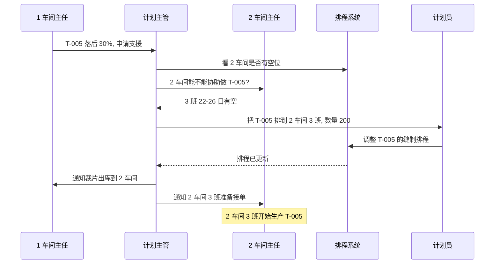
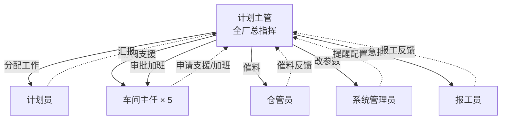
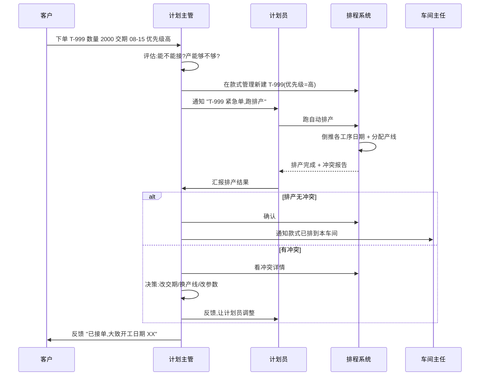
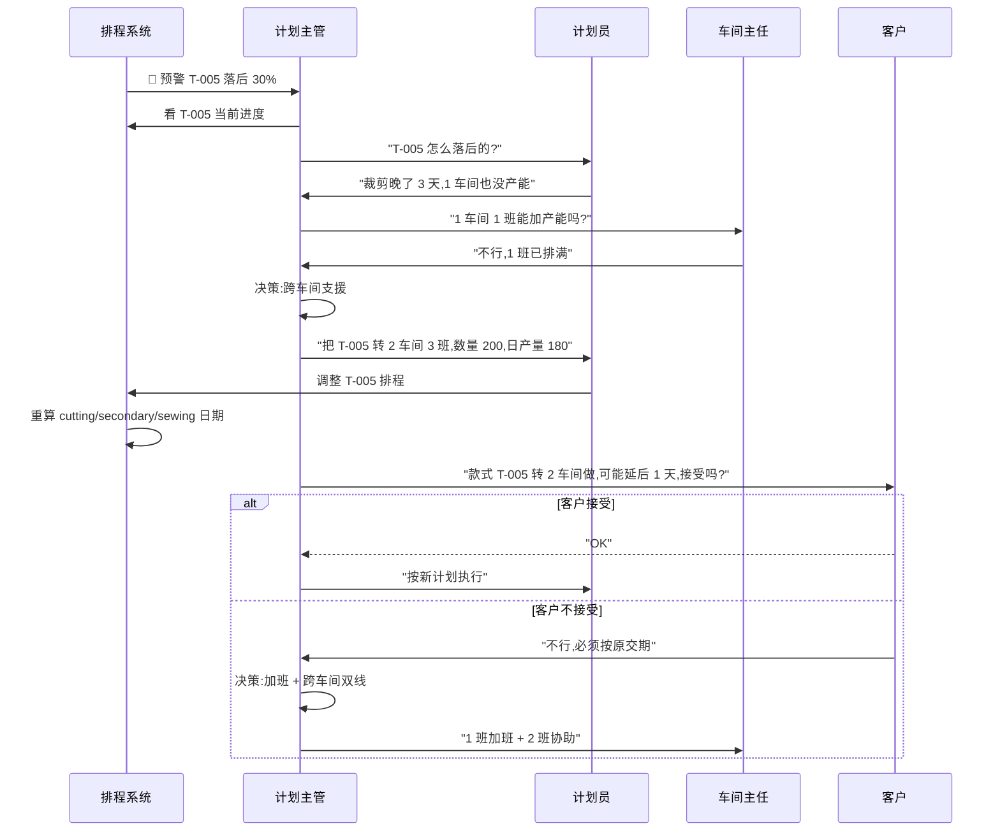
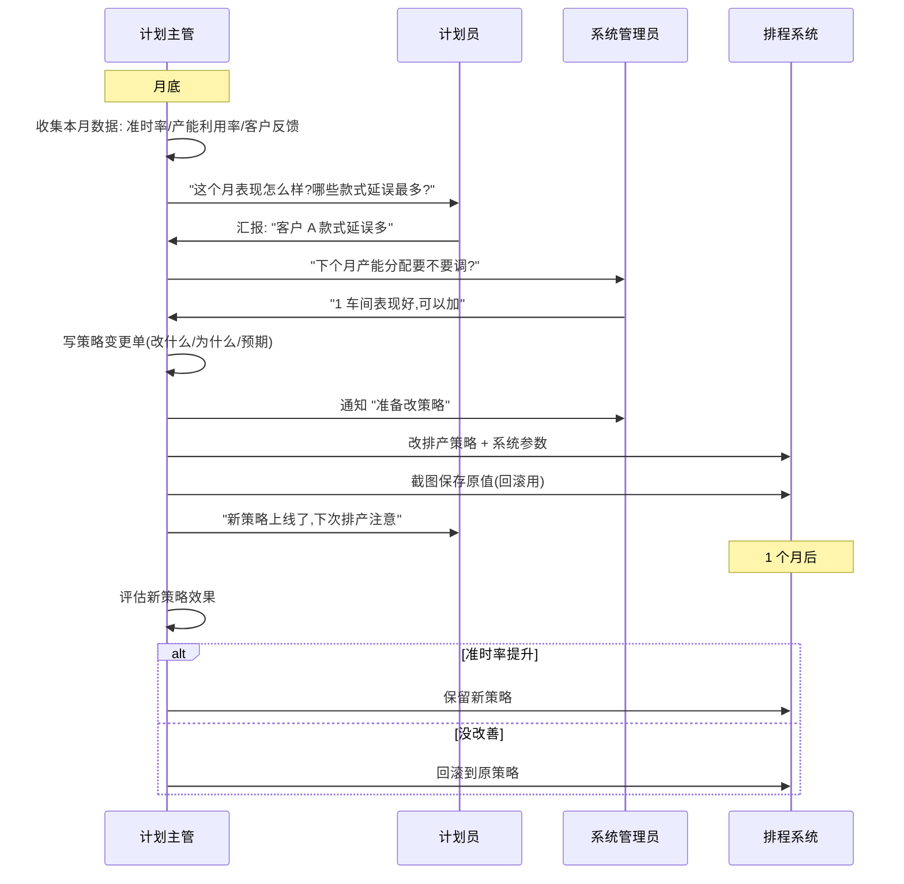
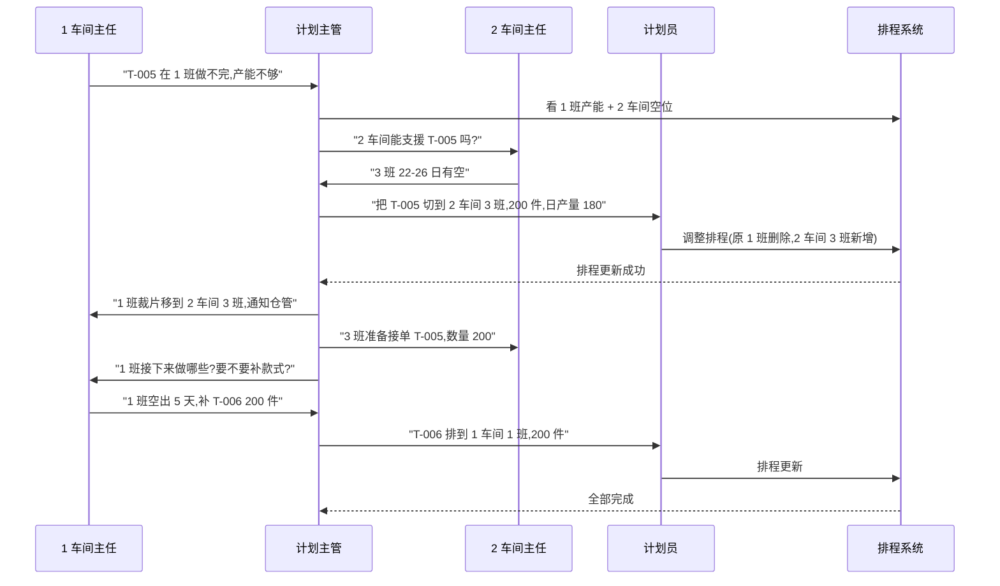
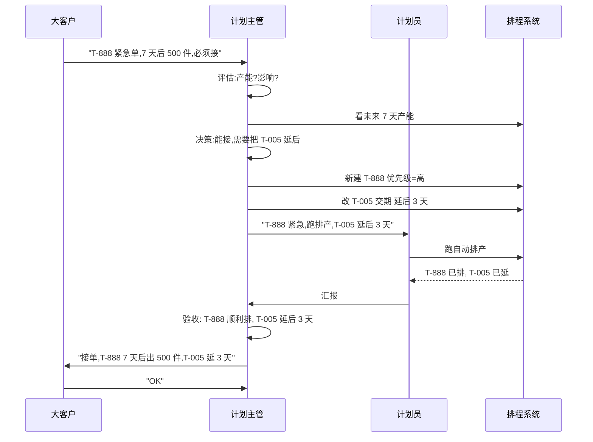

# SOP-02 计划主管

> **适用对象**: 👔 计划主管(全厂排程的"总指挥",共 1 人)
> **预计阅读**: 40 分钟
> **难度**: ⭐⭐⭐ (需要熟悉全厂业务 + 排产算法 + 跨车间协调)
> **核心职责**: 审核计划、调整排程、配置算法、跨车间协调、看全厂数据
> **前置阅读**: [SOP-00 总览与登录](./SOP-00-总览与登录.md)(必读)、[SOP-03 计划员](./SOP-03-计划员.md)(建议,了解日常操作)

---

## 一、角色定位

**一句话**: 全厂排程合不合理、能不能按时出货,关键看计划主管。

### 1.1 与计划员的区别

```
┌──────────────────────────────────────────────────────────────┐
│  计划主管 vs 计划员                                          │
├──────────────────────────────────────────────────────────────┤
│  计划员(3 人):                                              │
│    • 日常建款式、跑自动排产、录入报工                         │
│    • 各自分工负责不同款式                                    │
│    • 操作层面:做"例行公事"                                  │
│                                                              │
│  计划主管(1 人):                                            │
│    • 审核计划员的工作、调整异常                              │
│    • 跨车间协调(支援、加班)                                 │
│    • 改算法(排产策略、系统参数)                             │
│    • 决策层面:拍板"做不做、怎么改"                          │
│                                                              │
│  关系: 计划员"做事",计划主管"管事"                          │
└──────────────────────────────────────────────────────────────┘
```

### 1.2 核心职责清单

| 职责 | 干啥 | 频次 |
|------|------|------|
| 看全厂看板 | Dashboard 早报 | 每天早班前 |
| 审核款式 | 计划员建好的款式过一眼 | 每天 |
| 审核主计划 | 总计划交期倒推结果是否合理 | 每天 |
| 调排程 | 跨车间协调、紧急插单、改产线 | 随时 |
| 改排产策略 | 调优先级、产能分配规则 | 每周/每季 |
| 改系统参数 | 缝制缓冲、特殊水洗等阈值 | 每月/异常时 |
| 处理预警 | 看板红色预警款式跟进 | 每天 |
| 协调车间 | 跨车间支援、加班申请 | 随时 |
| 看报工汇总 | 全厂 5 车间 + 5 工序报工 | 每天 |
| 培训计划员 | 教新人怎么用系统 | 每月 |

### 1.3 与其他角色的关系

| 对接人 | 关系 | 主要协作 |
|--------|------|----------|
| 🛡️ 系统管理员 | 上下级 | 改系统参数前沟通、改工作日历需协同 |
| 📋 计划员 | 下属 | 分配工作、审核结果、培训 |
| 🏭 5 个车间主任 | 平行协调 | 跨车间支援、加班申请、延误处理 |
| 🏭 仓管员 | 平行 | 催料、协调入库出库 |
| ✍️ 报工员 | 服务 | 不直接对接,看汇总数据 |
| 👔 HR / 主管 | 上报 | 周报、紧急情况上报 |

---

## 二、权限范围

### 2.1 菜单可见性(几乎全菜单)

计划主管看到的菜单 **与计划员完全相同**(全厂数据视角,不受车间限制):

```
┌──────────────────────────────────────────────────────────────┐
│  👔 计划主管 看到的菜单                                      │
├──────────────────────────────────────────────────────────────┤
│  🏠 工作台              ✅                                   │
│  📊 数据看板            ✅                                   │
│  📁 基础数据            ✅ 全部(款式/面料/车间/分色分码)       │
│  📅 计划管理            ✅ 全部(总计划/裁剪/二次/缝制)         │
│  ✍️ 报工管理            ✅ 全部 5 工序 + 缝制                  │
│  📦 裁片库              ✅                                   │
│  ⚙️ 系统设置            ✅ 排产策略/系统参数/工作日历           │
│  📜 操作日志            ✅ (只能看自己)                        │
│  👤 个人设置            ✅                                   │
│  👥 用户管理            ❌ 管理员专属                          │
└──────────────────────────────────────────────────────────────┘
```

### 2.2 按钮级权限差异(关键区别)

| 功能 | 计划主管 | 计划员 | 区别说明 |
|------|----------|--------|----------|
| 款式管理(增删改) | ✅ | ✅ | 主管 **审核** 后由计划员执行 |
| 主计划(增删改) | ✅ | ✅ | 同上 |
| 跑自动排产 | ✅ | ✅ | 主管可全量,计划员日常用 |
| 排产策略(改) | ✅ | ❌ | 主管专属,算法层调整 |
| 系统参数(改) | ✅ | ❌ | 主管专属,业务阈值调整 |
| 工作日历(改) | ❌ | ❌ | 管理员专属 |
| 跨车间调排程 | ✅ | ❌ | 主管专属,普通计划员只动自己负责的 |
| 隔日报工修正 | ✅ | ❌ | 主管可改历史数据,计划员只能改当天 |
| 强制重排 | ✅ | ❌ | 主管可强制覆盖计划员已排的 |
| 操作日志(看全厂) | ❌ | ❌ | 管理员专属,主管只能看自己的 |

### 2.3 跟其他角色相比独有的能力

| 能力 | 计划主管 | 计划员 | 车间主任 | 报工员 |
|------|----------|--------|----------|--------|
| 跨车间协调 | ✅ | ❌ | ❌ | ❌ |
| 改排产策略 | ✅ | ❌ | ❌ | ❌ |
| 改系统参数 | ✅ | ❌ | ❌ | ❌ |
| 强制重排 | ✅ | ❌ | ❌ | ❌ |
| 隔日报工修正 | ✅ | ❌ | ❌ | ❌ |
| 审核计划员工作 | ✅ | ❌ | ❌ | ❌ |
| 看全厂数据 | ✅ | ✅ | ❌(本车间) | ❌(本工序) |

💡 **提示**: 计划主管是 **业务决策层**,不是每个功能都自己操作。重点是 **审核、调整、决策**。

---

## 三、主界面导航

### 3.1 计划主管看到的菜单布局

```
┌──────────────────────────────────────────────────────────────┐
│  顶栏: [系统图标] 制衣排程系统   🔔 通知  👤 李主管(计划主管)  ▼ │
├──────────┬───────────────────────────────────────────────────┤
│ 侧边栏    │            主内容区 (随菜单切换)                    │
│          │                                                   │
│ 🏠 工作台 │                                                   │
│ 📊 看板  │                                                   │
│ 📁 基础  │                                                   │
│  ├ 款式  │                                                   │
│  ├ 车间  │                                                   │
│  └ 分码  │                                                   │
│ 📅 计划  │                                                   │
│  ├ 总计划│                                                   │
│  ├ 裁剪  │                                                   │
│  ├ 二次  │                                                   │
│  └ 缝制  │                                                   │
│ ✂️ 报工  │                                                   │
│ 📦 仓库  │                                                   │
│ ⚙️ 设置  │                                                   │
│ 📜 日志  │                                                   │
│          │                                                   │
└──────────┴───────────────────────────────────────────────────┘
```

### 3.2 顶栏功能

| 图标 | 功能 | 计划主管用法 |
|------|------|--------------|
| 🔔 通知 | 预警消息 | 每天必看,有红色预警说明有款式落后 |
| 👤 用户名 | 显示账号 | 显示"李主管(计划主管)" |
| ▼ 下拉 | 修改密码/退出 | 离开工位必退 |

### 3.3 侧边栏快速入口(按使用频率)

```
每天必看:
  🏠 工作台     →  今日待办、预警款式
  📊 数据看板   →  全厂总览
  📜 操作日志   →  查谁干了啥(只能查自己的)

每周必看:
  📁 基础数据   →  款式管理、看款式列表
  📅 计划管理   →  预排总计划、缝制排程
  ✂️ 报工管理   →  报工汇总(全厂)
  📦 裁片库     →  看库存

每月/异常时:
  ⚙️ 系统设置   →  排产策略、系统参数
```

---

## 四、视图 1:数据看板(Dashboard)

### 4.1 这个页面是干什么的

**全厂生产数据一屏总览**。早上一上班第一件事打开这个页面,看昨天生产情况、今天待办、款式预警。

### 4.2 进入路径

```
侧边栏 → 📊 数据看板
```

### 4.3 页面示意图

```
┌──────────────────────────────────────────────────────────────────┐
│  📊 数据看板                            📅 2026-06-22  周一       │
├──────────────────────────────────────────────────────────────────┤
│  ┌──────────┐ ┌──────────┐ ┌──────────┐ ┌──────────┐             │
│  │  85      │ │  92.3%   │ │  3 🔴    │ │  12      │             │
│  │ 款式总数  │ │ 准时率   │ │ 预警款式 │ │ 待审款式  │             │
│  └──────────┘ └──────────┘ └──────────┘ └──────────┘             │
├──────────────────────────────────────────────────────────────────┤
│  车间产量对比(昨日)         工序产能利用率(本周)                  │
│  [柱状图]                  [折线图]                              │
├──────────────────────────────────────────────────────────────────┤
│  款式预警列表(3 款)                                                │
│  ┌──────┬──────┬──────┬──────┬──────┬──────┐                       │
│  │ 款号  │ 车间 │ 计划 │ 实际 │ 进度 │ 落后  │                       │
│  │ T-005│ 1班  │ 2000 │  500 │ 25%  │ 30%  │ 🔴                     │
│  │ T-008│ 2班  │ 1500 │  200 │ 13%  │ 40%  │ 🔴                     │
│  │ T-012│ 3班  │ 1000 │  100 │ 10%  │ 35%  │ 🔴                     │
│  └──────┴──────┴──────┴──────┴──────┴──────┘                       │
└──────────────────────────────────────────────────────────────────┘
```

### 4.4 关键指标解读

| 指标 | 含义 | 主管应该关注什么 |
|------|------|------------------|
| 款式总数 | 系统里在产的款式 | 突然暴增/锐减要问 |
| 准时率 | 计划交期内的完工率 | 低于 90% 要警惕 |
| 预警款式 | 落后进度 20%+ 的款式 | 每天必看,挨个处理 |
| 待审款式 | 计划员建好待主管审核的 | 0 表示没积压 |
| 车间产量对比 | 5 车间昨日完成数 | 哪个车间明显低要问 |
| 工序产能利用率 | 裁剪/印花/刺绣/模板/烫标 利用率 | 高于 90% 可能要扩产 |

### 4.5 早班标准动作(15 分钟)

```
步骤 1: 打开 Dashboard(2 分钟)
步骤 2: 看 4 个顶部数字,异常的问计划员(2 分钟)
步骤 3: 滚到「款式预警列表」,逐个点开看延误原因(5 分钟)
步骤 4: 看「车间产量对比」,发现异常车间(3 分钟)
步骤 5: 紧急的发 🔔 通知给对应车间主任,要求响应(3 分钟)
```

📞 **找人**: 款式预警 → 找负责的计划员 + 车间主任;工序利用率异常 → 找系统管理员(可能要改产能参数)。

### 4.6 常见错误

| 现象 | 原因 | 怎么办 |
|------|------|--------|
| 数字与计划员报的不一样 | 缓存延迟 | 强制刷新 Ctrl+F5 |
| 预警款式一直不消失 | 该款式已停产,未清理 | 让计划员归档 |
| 准时率显示 0% | 系统刚上线,数据不足 | 1 周后再看 |
| 车间对比图全 0 | 昨天没录报工 | 催报工员录数 |

---

## 五、视图 2:款式管理(审核)

### 5.1 这个页面是干什么的

看 **全厂所有款式** 的列表。计划员建好的款式在这里能看到,主管的工作是 **审核**(确认款式信息正确)、**协调**(看是否有款式积压)、**决策**(优先级调整)。

### 5.2 进入路径

```
侧边栏 → 📁 基础数据 → 款式管理
```

### 5.3 计划主管视角(与计划员不同)

| 操作 | 计划员 | 计划主管 |
|------|--------|----------|
| 新增款式 | ✅ 日常 | ⚠️ 偶尔补录(主要让计划员做) |
| 编辑款式 | ✅ 改信息 | ✅ 改 **优先级** 是主管核心工作 |
| 删除款式 | ⚠️ 慎用 | ✅ 可批删(确认没人用) |
| 看款式列表 | 自己的 | **全厂** |
| 改优先级 | ❌ | ✅ 主管专属 |
| 批量改优先级 | ❌ | ✅ 主管批量操作 |
| 导入/导出 | ✅ | ✅ 主管也会用 |

### 5.4 改优先级(主管核心操作)

**场景**: 客户催 T-001(原优先级"中"),要提前。

```
步骤 1:  侧边栏 → 📁 基础数据 → 款式管理
步骤 2:  找到 T-001 那一行(用款号筛选)
步骤 3:  点行尾 [编辑] 按钮
步骤 4:  「优先级」下拉框:中 → 高
步骤 5:  点 [确定] 保存
步骤 6:  列表自动刷新,该款式标签变红"高"
步骤 7:  通知负责该款式的计划员
步骤 8:  计划员跑自动排产时,该款式会被优先排
```

### 5.5 批量改优先级

**场景**: 客户新单 5 款全部置为「高优先级」。

```
步骤 1:  勾选那 5 行(左侧复选框)
步骤 2:  点 [批量编辑] 按钮
步骤 3:  弹窗,「优先级」下拉框选"高"
步骤 4:  点 [确定]
步骤 5:  提示「已批量更新 5 款」
```

### 5.6 款式状态标签含义

| 标签 | 含义 | 主管该干啥 |
|------|------|------------|
| 🟢 已完成 | 全部完工 | 无需操作 |
| 🔵 生产中 | 在产 | 看实际进度 |
| 🟡 待生产 | 还没开工 | 确认排程日期 |
| ⚪ 已建档 | 刚建还没排 | 让计划员排程 |
| 🔴 已延期 | 超过交期 | 紧急处理 |

### 5.7 找延误款式的快捷方法

```
步骤 1:  表头筛选「状态」= 已延期
步骤 2:  列表只剩延误的款式
步骤 3:  按「计划交期」升序排,最紧急的在前
步骤 4:  逐个点开,看延误原因(下游没到货?车间产能不够?)
```

### 5.8 主管 vs 计划员的协作流程

```
计划员: 新建款式 → 录入基本信息 → 提交
   ↓
主管: 收到「待审款式」通知(在 Dashboard 第 4 个数字)
   ↓
主管: 打开款式管理 → 看新款式 → 检查客户/数量/交期
   ↓
主管: 没问题 → 通知计划员跑排产
主管: 有问题 → 退回计划员改
   ↓
计划员: 跑自动排产 → 款式进入生产
```

### 5.9 常见错误

| 现象 | 原因 | 怎么办 |
|------|------|--------|
| 看不到某款式 | 计划员没提交/没保存 | 问计划员 |
| 改优先级不生效 | 计划员已跑过排产,新优先级要重排 | 让计划员重跑 |
| 批量改后只有部分生效 | 中途有错误 | 看提示,逐个改 |
| 误删了款式 | 删错 | 联系系统管理员恢复 |

---

## 六、视图 3:预排总计划(审核 + 调整)

### 6.1 这个页面是干什么的

**全厂总计划** 的核心页。每个款式建好后会 **自动倒推** 裁剪 → 二次加工 → 缝制的起止日期,主管要审核这个倒推结果是否合理。

### 6.2 进入路径

```
侧边栏 → 📅 计划管理 → 预排总计划
```

### 6.3 主管视角(关键)

主管 **不止看**,还要:
- **审核倒推结果**: 交期、缓冲、产能冲突是否合理
- **批量调整**: 一次改多个款式的参数
- **跨款式协调**: 比如 A 款推迟会影响 B 款
- **决策**: 接不接紧急单、放弃哪些款式

### 6.4 倒推算法白话

```
输入: due_date(交期) + plan_qty(数量)
   ↓
系统按工作日历,跳过休息日,反推:
  sewing_end   = due_date - 缝制缓冲(可配置)
  sewing_start = sewing_end - ceil(plan_qty / 日产量) + 1
  secondary_end = sewing_start - 1
  secondary_start = secondary_end - ceil(plan_qty / 二次日产量) + 1
  cutting_end = secondary_start - 1
  cutting_start = cutting_end - ceil(plan_qty / 裁剪日产量) + 1
   ↓
输出: cutting_start ~ sewing_end 共 5 个日期
```

### 6.5 主管审核重点

| 检查项 | 看什么 | 异常处理 |
|--------|--------|----------|
| cutting_start | 裁剪开始日期 | 早于今天 → 不可行,需调整 |
| 缓冲天数 | 缝制缓冲是否合理 | 系统参数改(详见第八章) |
| 工作日历 | 是否跳过休息日 | 错的找系统管理员改日历 |
| 二次加工 | 印花/刺绣/模板/烫标时长 | 改款式"工序配置" |
| 缝制天数 | 是否覆盖周末 | 提醒计划员调日产量 |

### 6.6 编辑总计划(主管操作)

**场景**: T-001 客户要求从 2026-08-15 提前到 2026-08-10。

```
步骤 1:  找到 T-001 那一行
步骤 2:  点行尾 [编辑] 按钮
步骤 3:  「交期」改成 2026-08-10
步骤 4:  点 [确定]
步骤 5:  系统自动重算,cutting/secondary/sewing 5 个日期都变了
步骤 6:  提醒计划员:
         - 缝制开始可能提前了
         - 看缝制产线有没有冲突
         - 看裁剪产线产能够不够
```

### 6.7 批量调整交期(主管)

**场景**: 客户通知某 5 款全部延后 1 周。

```
步骤 1:  勾选那 5 行
步骤 2:  点 [批量改交期] 按钮
步骤 3:  弹窗,「天数变化」填 +7
步骤 4:  点 [确定]
步骤 5:  系统批量往后推 7 天
```

### 6.8 处理排程冲突(主管核心)

**现象**: 自动排产跑完后,部分款式标红"冲突"。

```
原因: 多款式同时开工,某产线/班组日产能不够
   ↓
主管处理流程:
  1. 打开「缝制排程」页面
  2. 看冲突的款式列表
  3. 决定方案(三选一):
     A. 推迟其中 1-2 款的交期
     B. 把款式换到其他车间/班组
     C. 给该产线增加日产量(需改参数,慎用)
  4. 让计划员重跑排产
  5. 验收结果
```

### 6.9 紧急插单(主管专属)

**场景**: 大客户来电话,要求 7 天后出 500 件 T-999。

```
步骤 1:  打开款式管理,新建 T-999
        - 优先级: 高
        - 数量: 500
        - 交期: 7 天后
步骤 2:  通知计划员:
        "T-999 紧急单,跑自动排产,优先排到产能足的产线"
步骤 3:  计划员跑完后,主管看缝制排程
步骤 4:  确认款式已排入,且不影响其他高优先级款式
步骤 5:  通知客户已接单,告知大致开工日期
```

⚠️ **警告**: 紧急插单会影响原排程,可能让其他款式延后。**插单前必须评估影响范围**。

### 6.10 主管决策矩阵(什么时候改什么)

| 场景 | 主管改什么 | 谁执行 |
|------|------------|--------|
| 客户催交期 | 改总计划 due_date | 主管自己 |
| 客户改数量 | 改款式 plan_qty | 主管自己 |
| 客户改优先级 | 改款式 priority | 主管自己 |
| 跨款式协调 | 批量改交期/优先级 | 主管 |
| 产能不够 | 改系统参数(缝制缓冲等) | 主管(改前通知系统管理员) |
| 算法结果不合理 | 改排产策略 | 主管 |
| 休息日算错 | 改工作日历 | 找系统管理员 |
| 工厂物理调整 | 改缝制车间结构 | 找系统管理员 |

### 6.11 常见错误

| 现象 | 原因 | 怎么办 |
|------|------|--------|
| 改完交期,排程没变 | 计划员已跑过排产 | 让计划员重跑 |
| 自动排产报"产能不足" | 数量太多/缓冲太长 | 改参数或分批 |
| 多个款式互相冲突 | 没协调好优先级 | 改优先级+重排 |
| 缓冲天数改了不生效 | 改的是显示字段,不是参数 | 去「系统参数」改 |

---

## 七、视图 4:缝制排程(跨车间协调)

### 7.1 这个页面是干什么的

看 **全厂 5 个车间** 的缝制排程,主管的核心工作之一是 **跨车间协调**:把款式从产能满的车间调到有空位的车间。

### 7.2 进入路径

```
侧边栏 → 📅 计划管理 → 缝制排程 → 缝制排程首页 → 选具体页面
```

或直接:

```
侧边栏 → 📅 计划管理 → 缝制排程(自动跳到首页)
```

### 7.3 缝制排程首页(主管视角)

```
┌──────────────────────────────────────────────────────────────┐
│  缝制排程                              🚀 一键自动排产         │
├──────────────────────────────────────────────────────────────┤
│                                                              │
│  ┌─────────────┐    ┌─────────────┐                         │
│  │ 📊           │    │ 📋           │                         │
│  │ 目视化排程    │    │ 缝制计划详情  │                         │
│  │ 甘特图        │    │ 表格视图      │                         │
│  │ (全厂 5 车间) │    │ (全厂 5 车间) │                         │
│  │              │    │              │                         │
│  │ 总任务: 95   │    │ 总任务: 95   │                         │
│  │ 本周: 35     │    │ 本周: 35     │                         │
│  │ 逾期: 8 🔴   │    │ 逾期: 8 🔴   │                         │
│  └─────────────┘    └─────────────┘                         │
│                                                              │
│  主管专享:                                                   │
│  ┌─────────────┐    ┌─────────────┐                         │
│  │ 🚀          │    │ ⚠️          │                         │
│  │ 强制重排     │    │ 跨车间支援   │                         │
│  │ 覆盖全厂     │    │ 申请/审批     │                         │
│  └─────────────┘    └─────────────┘                         │
└──────────────────────────────────────────────────────────────┘
```

### 7.4 跨车间协调(主管核心场景)

**场景 1**: 1 车间产能满了,2 车间有空,需要把 T-005 从 1 车间调走。

```
步骤 1:  进入「目视化班组排程」甘特图
步骤 2:  看到 1 车间 1 班 6 月 22-28 都满(任务条都填满)
步骤 3:  2 车间 3 班 6 月 22-24 是空的(灰色空白)
步骤 4:  联系 1 车间主任: "T-005 能不能从 1 班调走?"
步骤 5:  1 车间主任: "可以,反正 1 班已开工另一款了"
步骤 6:  主管: 鼠标按住 T-005 任务条 → 拖到 2 车间 3 班
步骤 7:  系统提示"移动成功: 06-22 ~ 06-26,日产量 180 件"
步骤 8:  通知 2 车间 3 班组长
```

**场景 2**: 客户催 T-008,需要 1 车间加产能。

```
步骤 1:  联系 1 车间主任: "T-008 能不能加班赶?"
步骤 2:  1 车间主任: "可以,1 班明天起每天多 30 件"
步骤 3:  主管: 打开缝制排程详情 → 找到 T-008 → [编辑]
步骤 4:  「目标日产量」从 200 改成 230
步骤 5:  「缝制下线」自动重算,比原计划提前 1 天
步骤 6:  确认 → 通知计划员更新款式状态
```

### 7.5 强制重排(主管专属,慎用)

**场景**: 排程整体乱了,需要全部推翻重排。

```
步骤 1:  缝制排程首页 → 点 [🚀 强制重排] 按钮
步骤 2:  弹窗:「将清空当前所有排程,按当前配置重新生成,确定继续?」
步骤 3:  仔细看提示,确认
步骤 4:  点 [确定]
步骤 5:  系统清空 → 重新跑排产 → 几分钟后新排程生成
```

🔴 **危险**: 强制重排会 **覆盖所有已排款式**,包括已开工的。**必须先和所有计划员沟通**:
- 已开工的款式要不要保留?
- 改交期的款式要不要重排?
- 跨车间协调过的要不要还原?

### 7.6 跨车间支援流程(完整)



### 7.7 紧急加班申请审批

主管可审批车间主任的 **加班申请**(系统支持的话):

```
步骤 1:  收到车间主任的加班申请(电话/微信/系统)
步骤 2:  评估:
        - 当前延误程度?
        - 加班能不能解决?
        - 加班费划得来吗?
        - 其他款式会不会受影响?
步骤 3:  决定同意/拒绝
步骤 4:  通知车间主任结果
步骤 5:  加班同意后,改排程日期(把缝制下线提前)
```

### 7.8 常见错误

| 现象 | 原因 | 怎么办 |
|------|------|--------|
| 跨车间拖款式失败 | 目标产线故障 | 换条产线 |
| 强制重排后款式消失 | 没提前备份 | 联系系统管理员恢复 |
| 改日产量后日期没变 | 计划员没重跑 | 让计划员重跑 |
| 跨车间支援后报工混乱 | 报工员不知道转到哪个车间 | 明确通知所有相关人 |

---

## 八、视图 5:排产策略

### 8.1 这个页面是干什么的

管 **自动排产算法** 的核心规则。计划员跑自动排产时,系统按这里配置的规则来分配产线。**主管是唯一能改策略的角色**(管理员也能改)。

### 8.2 进入路径

```
侧边栏 → ⚙️ 系统设置 → 排产策略
```

### 8.3 关键参数

| 参数 | 含义 | 主管决策依据 |
|------|------|--------------|
| 优先级权重 | 高/中/低优先级款式怎么分配 | 客户合同 SLA |
| 产能分配 | 5 车间分别承担多少 | 实际产能 + 历史表现 |
| 缓冲策略 | 紧前/紧后/平均 | 工艺流程特点 |
| 跨车间允许 | 是否允许自动跨车间 | 工厂政策 |
| 加班优先 | 紧急款式是否插队 | 客户等级 |
| 自动锁定 | 高优先级自动锁产线 | 防止被覆盖 |

### 8.4 改策略的典型场景

**场景 1**: 客户 A 投诉款式总被推迟,要把 A 客户的款式优先级权重 +20%。

```
步骤 1:  打开排产策略
步骤 2:  找到「客户 A 加权」选项
步骤 3:  把权重从 0 改成 20
步骤 4:  保存
步骤 5:  下次跑自动排产,客户 A 的款式会优先
```

**场景 2**: 1 车间表现好,产能从 20% 提到 25%。

```
步骤 1:  排产策略 → 找到「产能分配」区
步骤 2:  1 车间 20% → 25%
步骤 3:  5 车间整体 100%,需要其他车间降
        例如: 2 车间 25% → 22%, 3 车间 20% → 18%
步骤 4:  保存
```

### 8.5 改策略的风险与流程

🔴 **策略改一次影响全厂**,必须按流程:

```
1. 收集数据: 过去 1-3 个月排产结果 + 客户反馈
2. 写策略变更单: 改什么、为什么、预期效果
3. 通知系统管理员 + 计划员
4. 备份当前策略(截图/导出)
5. 修改策略
6. 下次自动排产看结果
7. 1 周后评估: 款式准时率提升? 产能利用率合理?
8. 不行就回滚
```

### 8.6 常见错误

| 现象 | 原因 | 怎么办 |
|------|------|--------|
| 改完策略排产没变 | 计划员没重跑 | 通知计划员 |
| 改完策略款式混乱 | 改得太激进 | 回滚 |
| 不同计划员结果不同 | 数据快照不同 | 等所有数据同步 |
| 5 车间分配不均 | 加权没归一化 | 检查总和是不是 100% |

---

## 九、视图 6:系统参数

### 9.1 这个页面是干什么的

管 **业务阈值参数**。和排产策略的区别:策略是"算法逻辑",参数是"具体数值"。

### 9.2 进入路径

```
侧边栏 → ⚙️ 系统设置 → 系统参数
```

### 9.3 主管关注的参数

| 参数 | 含义 | 主管调整场景 |
|------|------|--------------|
| 缝制缓冲天数 | 缝制比 due_date 提前几天 | 客户延期容忍度变化 |
| 裁剪缓冲天数 | 裁剪比 secondary 提前几天 | 工艺调整 |
| 特殊水洗前置 | 特殊水洗提前几天 | 新增特殊水洗工艺 |
| 单线最大日缝制 | 单条产线日产能上限 | 设备升级 |
| 二次加工并行数 | 同时跑几个二次工序 | 工艺改进 |
| 报工超时阈值 | 报工超过 N 小时提醒 | 流程要求 |
| 预警阈值 | 落后 X% 算预警 | 默认 20% |
| 数据保留天数 | 报工/日志保留时间 | 存储成本 |

### 9.4 改参数的典型场景

**场景**: 客户合同改了,允许延期 3 天,主管想把缝制缓冲从 1 天调到 3 天。

```
步骤 1:  打开系统参数
步骤 2:  找到「缝制缓冲天数」(参数键 sewing_buffer_days)
步骤 3:  「新值」框: 1 → 3
步骤 4:  弹窗:「确认将 sewing_buffer_days 改为 3?」 → [确定]
步骤 5:  提示「已保存」
步骤 6:  下次跑自动排产,会用新值
```

### 9.5 批量保存

```
步骤 1:  改完 3 个参数
步骤 2:  点页面顶部 [保存全部(3)]
步骤 3:  弹窗:「共 3 项修改,确认保存?」 → [确定]
步骤 4:  提示「保存完成 3/3」
```

### 9.6 改参数的风险

🟡 **比策略风险小**,但仍要谨慎:

| 风险 | 影响 | 预防 |
|------|------|------|
| 缓冲改太长 | 款式过早开工,产能被占用 | 改前问计划员 |
| 缓冲改太短 | 款式来不及,延误 | 留 1-2 天余量 |
| 预警阈值太松 | 延误款式没标红 | 保持 20% 默认 |
| 数据保留太短 | 历史数据丢失 | 至少保留 1 年 |

### 9.7 跟排产策略的区别

| 维度 | 排产策略 | 系统参数 |
|------|----------|----------|
| 性质 | 算法逻辑(怎么排) | 数值大小(排多长) |
| 举例 | "高优先级先排" | "缝制缓冲 = 3 天" |
| 改的频率 | 每周/每季 | 每月/异常时 |
| 谁改 | 主管(可) | 主管(可) |
| 风险 | 高 | 中 |

### 9.8 常见错误

| 现象 | 原因 | 怎么办 |
|------|------|--------|
| 改完参数没生效 | 计划员没重跑 | 通知重跑 |
| 数值类参数报错 | 输入超范围 | 看校验范围 |
| 改了后款式全乱了 | 数值改得太离谱 | 回滚 |

---

## 十、视图 7:报工汇总(全厂视角)

### 10.1 这个页面是干什么的

看 **全厂 5 车间** 的报工数据汇总。计划员和车间主任只能看自己,主管能看 **全厂** 视角,做跨车间对比。

### 10.2 进入路径

```
侧边栏 → ✂️ 报工管理 → 报工汇总
```

### 10.3 主管视角(关键差异)

| Tab | 计划员 | 计划主管 |
|-----|--------|----------|
| 明细列表 | 自己负责的款式 | **全厂** |
| 按产线 | 自己 | **全厂** |
| 按车间 | 自己 | **全厂 5 车间对比** |
| 按工人 | 看不到 | ✅ 全厂工人 |
| 趋势图 | 自己 | **全厂** |
| 计划 vs 实际 | 自己 | **全厂** |
| 预警款式 | 自己 | **全厂 5 车间** |

### 10.4 早班标准动作(基于报工汇总)

```
步骤 1:  打开报工汇总
步骤 2:  看「按车间」Tab,对比昨天 5 车间产量
步骤 3:  异常车间(产量低 30% 以上)→ 联系车间主任
步骤 4:  看「计划 vs 实际」Tab,找落后款式
步骤 5:  看「预警款式」列表,处理落后款式
步骤 6:  看「趋势图」,发现连续下降的车间/款式
```

### 10.5 跨车间对比示例

**场景**: 主管发现 1 车间产量连续 3 天低于其他车间。

```
步骤 1:  报工汇总 → 按车间 Tab
步骤 2:  看到 1 车间连续 3 天 150/160/140,其他车间 200+
步骤 3:  联系 1 车间主任: "最近怎么产量掉了?"
步骤 4:  1 车间主任反馈: "1 班产线故障,1 班款式转到 2 班了"
步骤 5:  主管: 看具体哪款受影响,要不要支援
步骤 6:  决策: 1 班修还是外包,款式转移还是延后
```

### 10.6 主管能看到所有数据吗

| 角色 | 能看 | 不能看 |
|------|------|--------|
| 计划主管 | 全厂款式/排程/报工/款式日志(自己的) | 用户管理(管理员专属) |
| 系统管理员 | 全厂 + 用户管理 | — |

### 10.7 常见错误

| 现象 | 原因 | 怎么办 |
|------|------|--------|
| 看不到其他车间数据 | 角色显示错 | 退出重新登录 |
| 数字与车间主任报的不一样 | 时区问题(都是 UTC+8 但显示可能有差异) | 联系开发 |
| 预警款式太多 | 阈值太松 | 改预警参数 |

---

## 十一、视图 8:操作日志(自己的)

### 11.1 这个页面是干什么的

**计划主管只能看自己的操作记录**(管理员看全厂,其他角色同理)。主管的主要用法是 **自查** —— 自己改了哪些东西。

### 11.2 进入路径

```
侧边栏 → 📜 操作日志
```

### 11.3 主管常查的内容

| 场景 | 怎么查 |
|------|--------|
| 我昨天改了哪几个款式? | 模块=款式管理,操作人=自己 |
| 我修改了哪些系统参数? | 模块=系统参数 |
| 我调过哪些排程? | 模块=缝制排程 |
| 计划员说"主管同意的"是什么? | 找时间范围 + 操作人=自己 |

### 11.4 操作日志保存的信息

每个操作会记录:
- 谁(操作人 + IP + 浏览器)
- 什么时候(精确到秒)
- 在哪个模块(款式/排程/参数/...)
- 做了什么(新增/修改/删除/...)
- 操作的对象(款式号/参数键/...)
- 具体改了什么(diff)

### 11.5 主管应养成习惯

- 改完重要操作, **自己立刻查一下日志确认**
- 重要决策(改策略/参数)前 **截图原值** 备份
- 改完发现异常, **第一时间看日志定位时间点**

### 11.6 主管看不到的日志

- 计划员的操作记录 → 找计划员本人或系统管理员
- 其他主管的 → 找系统管理员
- 车间主任的 → 找车间主任本人

### 11.7 常见错误

| 现象 | 原因 | 怎么办 |
|------|------|--------|
| 看不到自己刚做的操作 | 缓存 | 强制刷新 |
| 看到陌生操作 | 账号被盗 | **立即改密码 + 联系系统管理员** |
| 日志太久远 | 系统只保留 N 天 | 找系统管理员查历史备份 |

---

## 十二、跨模块协作

### 12.1 协作关系图



### 12.2 主管跟计划员协作

| 场景 | 谁主动 | 怎么协作 |
|------|--------|----------|
| 新建款式 | 计划员做 | 主管审核(可在 Dashboard 待审数) |
| 跑自动排产 | 计划员做 | 主管看结果,有问题反馈重排 |
| 排程冲突 | 计划员发现 | 主管决策:改交期/换产线/改参数 |
| 紧急插单 | 客户/计划员转达 | 主管拍板,计划员执行 |
| 改排产策略 | 主管改 | 通知计划员新规则 |

### 12.3 主管跟车间主任协作

| 场景 | 谁主动 | 怎么协作 |
|------|--------|----------|
| 跨车间支援 | 任一方提 | 主管协调,两车间沟通 |
| 加班申请 | 车间主任提 | 主管评估 + 审批 |
| 款式延误 | 主管/车间发现 | 主管决策方案,车间执行 |
| 产线故障 | 车间主任上报 | 主管协调款式转移 |
| 改日产量 | 主管决策 | 通知车间,改排程 |

### 12.4 主管跟系统管理员协作

| 场景 | 谁主动 | 怎么协作 |
|------|--------|----------|
| 改系统参数 | 主管改 | 大改前通知系统管理员(避免参数冲突) |
| 改工作日历 | 节假日变更 | 系统管理员改,主管确认排程影响 |
| 加新车间/班组 | 工厂物理调整 | 系统管理员建,主管用 |
| 系统报错 | 任何一方发现 | 主管联系系统管理员排查 |
| 备份数据 | 系统管理员负责 | 主管提醒"快到月底了" |

### 12.5 主管跟仓管员协作

| 场景 | 谁主动 | 怎么协作 |
|------|--------|----------|
| 催面料 | 主管/计划员 | 仓管员反馈,主管决策要不要换面料 |
| 催裁片入库 | 车间主任/主管 | 仓管员确认入库 |
| 库存异常 | 仓管员发现 | 主管查款式主数据 |

### 12.6 协作时点表

| 时间 | 必做 | 协作对象 |
|------|------|----------|
| 早班 08:00 | 看 Dashboard | 计划员 |
| 上午 10:00 | 审核款式 + 排程 | 计划员 |
| 中午 12:00 | 处理款式预警 | 车间主任 / 计划员 |
| 下午 14:00 | 跨车间协调 | 车间主任 |
| 下午 16:00 | 看报工汇总 | 计划员 / 车间主任 |
| 下午 17:00 | 处理跨车间支援申请 | 车间主任 |
| 任意时间 | 紧急情况 | 所有角色 |

---

## 十三、端到端核心流程

### 13.1 流程一:从客户下单到安排产线(主管视角)



### 13.2 流程二:款式延误处理(主管核心)



### 13.3 流程三:月度排产策略调整



### 13.4 流程四:跨车间紧急支援(主管协调)



### 13.5 流程五:紧急插单 + 现有款式调整



---

## 十四、常见问题(FAQ)

### Q1: 我登录后看不到款式,是不是系统坏了?

**答**: 不是。计划主管能看全厂款式,如果看不到:

```
排查:
  1. 是不是侧边栏菜单没展开?(基础数据 → 款式管理)
  2. 是不是筛选条件太严?(清筛选)
  3. 是不是系统管理员停用了你的菜单权限?(找系统管理员)
  4. 强制刷新 Ctrl+F5
```

### Q2: 改了总计划交期,为什么排程没变?

**答**: 计划员已跑过排产,改了总计划不会自动重排。

**解决**:
- 通知计划员重跑「自动排产」
- 或者自己跑(主管也能跑)
- 注意:重排会覆盖现有排程,先确认没人在改

### Q3: 跨车间拖款式失败,显示「权限不足」?

**答**: 跨车间调款式是 **主管专属**。如果用计划员账号拖款式到其他车间,会失败。

**解决**:
- 主管自己拖
- 计划员只能拖自己车间的款式
- 让主管协调

### Q4: 排产策略改了,自动排产结果没变?

**答**: 策略有缓存,且旧排程不会被重算。

**解决**:
- 等下次跑排产(一般是新款式入库时)
- 主动通知计划员重跑
- 确认保存成功(没弹错误)

### Q5: 系统参数改了,款式日期没变?

**答**: 跟 Q2 一样,已排款式不回算。

**解决**: 通知计划员重跑。

### Q6: 车间主任说"我们车间能支援",但我系统里看不到款式?

**答**: 款式可能没排到那个车间。

**解决**:
- 主管自己拖款式到目标车间
- 或让计划员调整排程
- 然后再通知车间主任

### Q7: 我发现款式落后 30%,系统却没标红预警?

**答**: 预警阈值可能改过(默认 20%)。

**排查**:
- 看系统参数 → 预警阈值
- 是不是 30% < 阈值,所以没预警?
- 阈值太松要调

### Q8: 强制重排会丢数据吗?

**答**: **会**。强制重排会:
- 清空所有缝制排程
- 但保留款式主数据 + 已录的报工 + 操作日志
- 重跑后款式会重新分配

**所以**: 强制重排前必须备份 + 沟通 + 评估。

### Q9: 我能改款式数量吗?

**答**: 能,但要 **慎重**。数量改了:
- 倒推日期会变
- 已排产线可能不够
- 报工数据可能不再合理

**流程**:
- 改数量 → 通知计划员 → 计划员评估影响 → 决定改回还是重排

### Q10: 我能跨车间调款式,但款式已开工了,还能调吗?

**答**: 技术上能,但 **强烈不建议**。

**原因**:
- 款式已开工 = 已录报工 = 款式在产线上有进度
- 跨车间调 = 款式"瞬移" = 报工数据混乱
- 报工员不知道哪款在哪,录错数据

**正确做法**:
- 已开工款式: 跟原车间主任协商, **不要调**
- 未开工款式: 主管可自由调

### Q11: 计划员说"我跑过自动排产了",但款式没出现?

**答**: 可能是:
- 款式不在排产范围(已完成的不会跑)
- 排产报错,系统跳过
- 网络中断,数据没保存

**排查**:
- 让计划员截图操作日志
- 主管自己再跑一次

### Q12: 我把策略改坏了,怎么回滚?

**答**:
```
1. 找最近一次成功排产的截图(操作日志里有)
2. 按原值改回
3. 如果实在记不清,联系系统管理员(数据库有历史)
```

💡 **预防**: 改策略前 **先截图** 备份,放电脑/发邮件给自己。

### Q13: 我每天该先做什么?

**答**: 标准流程(15 分钟搞定):

```
1. 打开 Dashboard(2 分钟)
2. 看 4 个数字 + 预警列表(3 分钟)
3. 处理紧急预警款式(5 分钟)
4. 看报工汇总 → 跨车间对比(3 分钟)
5. 处理车间主任的跨车间支援申请(2 分钟)
```

### Q14: 我需要每天录报工吗?

**答**: **不需要**。录报工是:
- 报工员(主)
- 车间主任(覆盖)
- 计划员(代录)

计划主管是 **决策层**,不直接录数。看汇总数据就行。

### Q15: 我能看到裁剪/二次加工的报工吗?

**答**: 能。报工汇总看全厂报工,包括 5 工序(裁剪/印花/刺绣/模板/烫标/缝制)。

---

## 十五、紧急情况处理

### 15.1 紧急情况分类

```
┌────────────────────────────────────────────────┐
│  📞 计划主管 紧急情况速查                       │
├────────────────────────────────────────────────┤
│  🔴 P0 - 全厂停产:系统全挂/数据库问题           │
│  🟡 P1 - 关键款式延误:客户催交/产线全停         │
│  🟢 P2 - 单点问题:某款式数据错/某车间异常        │
└────────────────────────────────────────────────┘
```

### 15.2 P0 - 全厂停产

**应急步骤**:
```
[1] 立即联系系统管理员(电话),说"全厂登不上"
[2] 系统管理员重启后端服务
[3] 主管同步计划员和车间主任: "系统维护中,稍后登录"
[4] 系统恢复后,主管:
    - 看 Dashboard 是否正常
    - 通知所有角色重新登录
    - 重要款式手动跟踪
```

### 15.3 P1 - 关键款式延误

**应急步骤**:
```
[1] 看延误原因(产能/物料/人员)
[2] 决策方案:
    A. 跨车间支援
    B. 加班赶工
    C. 部分外包
    D. 跟客户沟通延期
[3] 联系相关车间主任 + 计划员
[4] 同步客户
[5] 1 天后看效果,没改善就升方案 B/C
```

### 15.4 P2 - 单点问题

**应急步骤**:
```
[1] 评估影响范围(只影响 1 款式? 1 车间?)
[2] 找具体原因
[3] 现场解决:
    - 款式数据错 → 自己改
    - 车间异常 → 打电话
    - 计划员漏排 → 让计划员补
[4] 记录到操作日志(自动)
```

### 15.5 紧急情况联系人

| 情况 | 联系人 | 联系方式 |
|------|--------|----------|
| 系统全挂 | 系统管理员 | 紧急电话(贴在工位) |
| 款式紧急插单 | 计划员 | 工位/微信 |
| 跨车间支援 | 车间主任 × 5 | 工位/微信 |
| 物料短缺 | 仓管员 | 工位 |
| 客户投诉 | 主管(自己) | — |
| 加班申请 | 车间主任 + 主管 | 主管审批 |

### 15.6 应急工作原则

```
1. 先稳住: 先通知所有相关人,避免信息混乱
2. 再定方案: 评估影响,选最稳妥方案
3. 快速执行: 方案定了立刻动手
4. 实时同步: 进展同步给所有人
5. 后续改进: 事情过了写总结,改进流程
```

---

## 十六、定期工作清单

### 16.1 每日(15 分钟)

```
□ 1. 看 Dashboard
□ 2. 处理预警款式
□ 3. 看报工汇总(跨车间对比)
□ 4. 处理跨车间支援申请
```

### 16.2 每周(1 小时)

```
□ 1. 审核计划员新款式(待审款式清零)
□ 2. 审核主计划变更
□ 3. 跨车间协调会议(15 分钟)
□ 4. 写周报(本周延误款式/已解决/待解决)
```

### 16.3 每月(2 小时)

```
□ 1. 排产策略评估(改不改?)
□ 2. 系统参数回顾
□ 3. 款式清单清理(已完成归档)
□ 4. 车间产能利用率分析
□ 5. 报工数据完整性检查
```

### 16.4 每季度(半天)

```
□ 1. 排产策略大调
□ 2. 系统参数全面回顾
□ 3. 流程改进(基于上月问题)
□ 4. 培训计划员
```

---

**版本**: v1.0 (2026-06-22)
**反馈**: 内容有误或看不懂的地方,联系系统管理员,或直接在本文件末尾追加修订意见。
