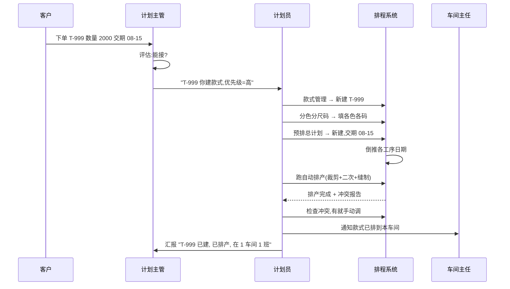
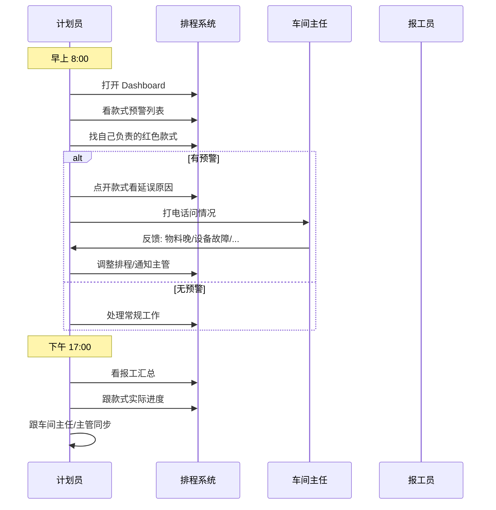
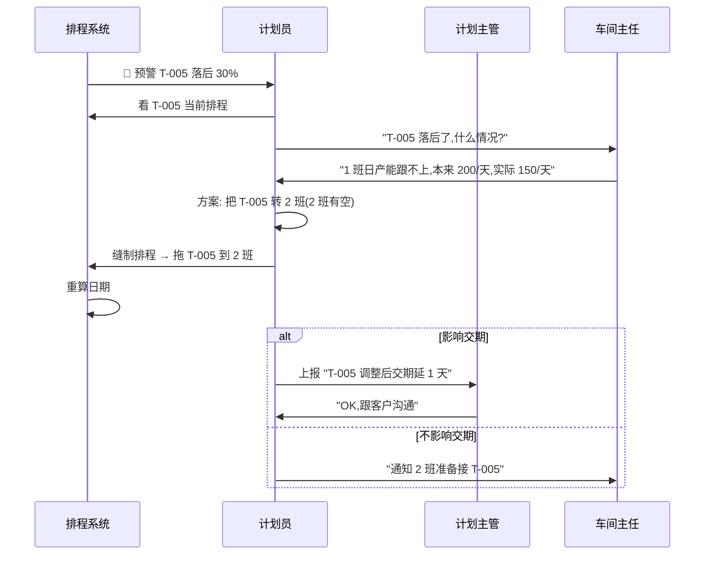
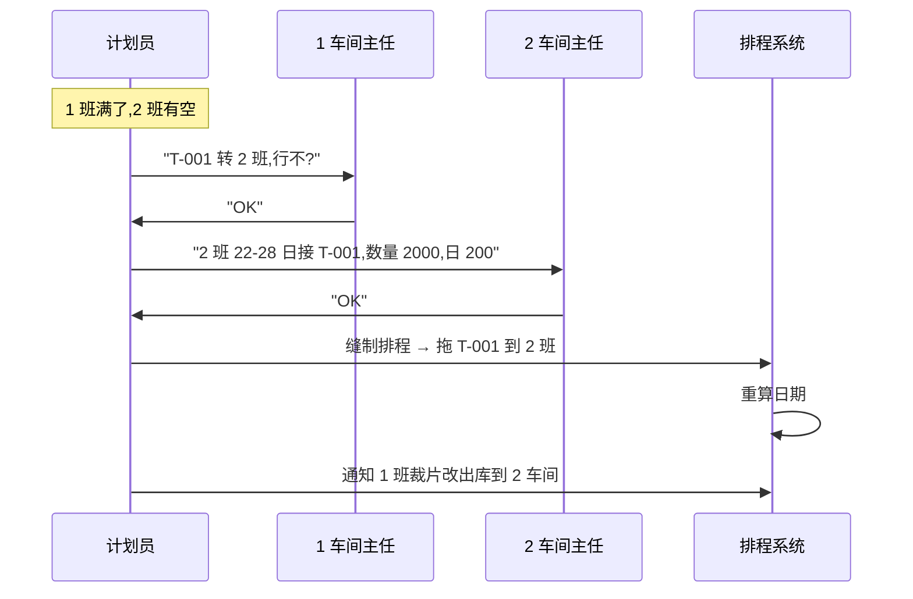

# SOP-03 计划员

> **适用对象**: 📋 计划员(全厂共 3 人,日常排程的执行者)
> **预计阅读**: 50 分钟
> **难度**: ⭐⭐⭐ (需要熟悉款式/排产算法/各车间业务)
> **核心职责**: 建款式、编计划、跑自动排产、跟进报工
> **前置阅读**: [SOP-00 总览与登录](./SOP-00-总览与登录.md)(必读)、[SOP-02 计划主管](./SOP-02-计划主管.md)(建议,了解主管决策)

---

## 一、角色定位

**一句话**: 计划主管拍板"做不做",计划员动手"怎么做"。

### 1.1 工厂里计划员是干什么的

```
┌──────────────────────────────────────────────────────────────┐
│  计划员日常:                                                │
├──────────────────────────────────────────────────────────────┤
│  • 早上 8:00 看 Dashboard + 看款式预警                      │
│  • 上午 9:00-12:00 建新款、编计划、跑自动排产                │
│  • 中午 12:00 看报工汇总(自己负责的款式)                    │
│  • 下午 14:00-17:00 处理款式调整、协调车间、跟进报工         │
│  • 下午 17:00 跟主管汇报"今天做了什么/待主管审批"           │
│  • 任意时间: 处理款式延误、协调车间、催物料                  │
└──────────────────────────────────────────────────────────────┘
```

### 1.2 3 名计划员分工

按款式类型/客户/车间分工(具体由计划主管分配):

| 计划员 | 常见分工 |
|--------|----------|
| 计划员 A | 客户 X 的所有款式,主要在 1-2 车间 |
| 计划员 B | 客户 Y 的所有款式,主要在 3-4 车间 |
| 计划员 C | 杂单/新客户,跨车间 |

💡 **提示**: 分工不是硬性,主管会根据工作量动态调整。

### 1.3 计划员核心职责清单

| 职责 | 干啥 | 频次 |
|------|------|------|
| 维护款式主数据 | 建款式、改信息、导入导出 | 每天 |
| 编总计划 | 新建/编辑主计划,看倒推结果 | 每天 |
| 跑自动排产 | 一键生成排程,处理冲突 | 每天 |
| 调排程 | 修排程、改产线、批量操作 | 每天 |
| 跟进报工 | 看汇总,代录漏录,处理异常 | 每天 |
| 协调车间 | 跟车间主任沟通款式安排 | 每天 |
| 报主管 | 汇报进展、提请审批 | 每天 |
| 处理预警 | 处理 Dashboard 红色款式 | 每天 |
| 月度归档 | 清理已完成款式 | 每月 |

### 1.4 与其他角色的关系

| 对接人 | 关系 | 主要协作 |
|--------|------|----------|
| 👔 计划主管 | 上下级 | 汇报工作、申请审批、提调整建议 |
| 🏭 车间主任 | 平行 | 款式分配、产能协调、报工跟进 |
| 📦 仓管员 | 平行 | 物料确认、催料 |
| ✍️ 报工员 | 服务 | 看汇总(不直接对接) |
| 🛡️ 系统管理员 | 平行 | 系统问题反馈 |

---

## 二、权限范围

### 2.1 菜单可见性(几乎全菜单,跟计划主管相同)

```
┌──────────────────────────────────────────────────────────────┐
│  📋 计划员 看到的菜单                                        │
├──────────────────────────────────────────────────────────────┤
│  🏠 工作台              ✅                                   │
│  📊 数据看板            ✅                                   │
│  📁 基础数据            ✅ 全部(款式/面料/车间/分色分码)       │
│  📅 计划管理            ✅ 全部(总计划/裁剪/二次/缝制)         │
│  ✂️ 报工管理            ✅ 全部 5 工序 + 缝制                  │
│  📦 裁片库              ✅                                   │
│  ⚙️ 系统设置            ✅(排产策略/系统参数只读)              │
│  📜 操作日志            ✅(只能看自己)                        │
│  👤 个人设置            ✅                                   │
│  👥 用户管理            ❌ 管理员专属                          │
└──────────────────────────────────────────────────────────────┘
```

### 2.2 按钮级权限差异(关键区别:跟计划主管比)

| 功能 | 计划员 | 计划主管 | 区别 |
|------|--------|----------|------|
| 新建款式 | ✅ | ⚠️ 偶尔 | 主管审核计划员建的 |
| 编辑款式(信息) | ✅ | ✅ | 都能改 |
| 改优先级 | ❌ | ✅ | 主管专属 |
| 批量改优先级 | ❌ | ✅ | 主管专属 |
| 删款式 | ⚠️ 慎用 | ✅ | 主管可批 |
| 跑自动排产 | ✅ | ✅ | 都能跑 |
| 改排产策略 | ❌ 只读 | ✅ | 主管专属 |
| 改系统参数 | ❌ 只读 | ✅ | 主管专属 |
| 改工作日历 | ❌ | ❌ | 管理员专属 |
| 跨车间拖款式 | ⚠️ 自己负责的可 | ✅ 全厂 | 主管全权,计划员有限 |
| 隔日报工修正 | ❌ | ✅ | 主管专属 |
| 强制重排 | ❌ | ✅ | 主管专属 |

### 2.3 计划员能独立完成的事

```
✅ 自己负责的款式:建款式、跑排产、跟排程
✅ 自己负责的款式:看款式报工汇总
✅ 报工代录(任何款式,任何时间)
✅ 跨车间协调(在自己负责的款式范围内)
❌ 改优先级 → 找主管
❌ 改算法/参数 → 找主管
❌ 改历史报工 → 找主管
❌ 改工作日历 → 找系统管理员
```

### 2.4 数据范围(全厂可见)

计划员看 **全厂** 数据,不受款式/车间限制:
- 款式列表(全厂所有款式)
- 排程(全厂 5 车间)
- 报工(全厂 5 工序)
- 款式日志(自己的操作)

但 **改的时候有限制**:
- 改款式: 任何人(因为是主数据,不是车间私有)
- 拖款式跨车间: 仅自己负责的款式
- 改报工: 仅自己负责款式的当天

---

## 三、主界面导航

### 3.1 计划员看到的菜单布局

```
┌──────────────────────────────────────────────────────────────┐
│  顶栏: [系统图标] 制衣排程系统   🔔 通知  👤 王计划(计划员)  ▼ │
├──────────┬───────────────────────────────────────────────────┤
│ 侧边栏    │            主内容区 (随菜单切换)                    │
│          │                                                   │
│ 🏠 工作台 │                                                   │
│ 📊 看板  │                                                   │
│ 📁 基础  │                                                   │
│  ├ 款式  │                                                   │
│  ├ 面料  │                                                   │
│  ├ 车间  │                                                   │
│  └ 分码  │                                                   │
│ 📅 计划  │                                                   │
│  ├ 总计划│                                                   │
│  ├ 裁剪  │                                                   │
│  ├ 二次  │                                                   │
│  └ 缝制  │                                                   │
│ ✂️ 报工  │                                                   │
│ 📦 仓库  │                                                   │
│ ⚙️ 设置  │  ← 可看,大部分只读                                │
│ 📜 日志  │                                                   │
│          │                                                   │
└──────────┴───────────────────────────────────────────────────┘
```

### 3.2 顶栏功能

| 图标 | 功能 | 计划员用法 |
|------|------|------------|
| 🔔 通知 | 预警消息 | 每天必看,有红色预警要处理 |
| 👤 用户名 | 显示账号 | 显示"王计划(计划员)" |
| ▼ 下拉 | 修改密码/退出 | 离开工位必退 |

### 3.3 侧边栏快速入口(按使用频率)

```
每天高频(20+ 次):
  📁 款式管理     →  建款式、看款式列表
  📅 预排总计划   →  编主计划
  📅 缝制排程     →  跑自动排产、调排程

每天中频(5+ 次):
  📊 数据看板     →  款式预警
  ✂️ 报工汇总     →  看报工
  📅 裁剪排程     →  调裁剪排程
  📅 二次加工     →  调二次排程

每周/异常时:
  📁 面料装柜清单 →  查面料到货
  📁 分色分尺码   →  维护尺码
  ⚙️ 系统设置     →  看策略(只读)
```

---

## 四、视图 1:款式管理(核心)

### 4.1 这个页面是干什么的

**全厂所有款式的主数据**。每个产品(比如"T-001 圆领短袖")在这里建档,系统所有其他模块都引用这里的数据。

### 4.2 进入路径

```
侧边栏 → 📁 基础数据 → 款式管理
```

### 4.3 页面示意图

```
┌──────────────────────────────────────────────────────────────────┐
│  👕 款式管理                              [+ 新建款式] [📥导入] [📤导出]│
├──────────────────────────────────────────────────────────────────┤
│  🔍 [款号______] [客户▼] [状态▼] [优先级▼] [日期范围]   [🔎查询] [↻重置]│
├──────┬─────────┬──────────┬──────┬──────┬─────┬──────┬──────────┤
│ 款号 │ 品名     │ 客户     │ 数量 │ 交期 │ 优先│ 状态 │ 操作     │
├──────┼─────────┼──────────┼──────┼──────┼─────┼──────┼──────────┤
│T-001 │ 圆领短袖  │ 客户 X  │ 2000 │ 08-15│ 高  │生产中│编辑 复制 │
│T-002 │ 翻领短袖  │ 客户 X  │ 1500 │ 08-20│ 中  │生产中│编辑 复制 │
│T-003 │ 背心     │ 客户 Y  │ 1000 │ 08-25│ 中  │待生产│编辑 复制 │
│T-005 │ 长袖     │ 客户 X  │  800 │ 08-15│ 高  │已延期│编辑 复制 │
└──────┴─────────┴──────────┴──────┴──────┴─────┴──────┴──────────┘
│  共 95 条   < 1 2 3 ... 8 >                                       │
└──────────────────────────────────────────────────────────────────┘
```

### 4.4 新建款式(计划员核心操作,完整步骤)

**场景**: 客户 X 下新单 T-006,数量 2000,交期 08-30。

```
步骤 1:  点页面右上角 [+ 新建款式]
步骤 2:  弹窗出现,字段逐项填:
```

```
┌──────────────────────────────────────────┐
│  新建款式                                │
├──────────────────────────────────────────┤
│  款号*:    [T-006                ]      │  ← 字母+数字,系统校验
│  品名*:    [圆领背心              ]      │  ← 中文/英文都行
│  客户*:    [▼ 客户 X           ]      │  ← 下拉选
│  订单数量*: [2000                  ]      │  ← 数字
│  交期*:    [2026-08-30            ]      │  ← 日期选择器
│  优先级:   [▼ 中                ]      │  ← 主管设置,计划员能选
│  颜色:     [▼ 黑色,白色         ]      │  ← 选已有的,没有的联系系统管理员
│  规格:     [▼ S,M,L              ]      │  ← 尺码
│  二次工序: [☐印花 ☐刺绣 ☐模板 ☐烫标]      │  ← 必选至少 0 个
│  缝制车间: [▼ 1车间            ]      │  ← 选一个目标车间
│  缝制线:   [▼ 1班               ]      │  ← 选班组
│  备注:     [客户要求加 logo    ]      │  ← 选填
│                                          │
│  [取消]                        [确定]    │
└──────────────────────────────────────────┘
```

```
步骤 3:  必填项都填了(标 * 的字段)
步骤 4:  点 [确定]
步骤 5:  弹窗关闭,列表自动刷新,T-006 出现在第一行
步骤 6:  状态显示"待生产"
步骤 7:  下一步: 跑自动排产(见第十章)
```

### 4.5 编辑款式

可改字段:**品名、客户、数量、交期、二次工序、缝制车间/线、备注**
不能改:**款号**(灰色)、客户(部分情况不能改)

```
步骤 1:  找到要改的那行,点 [编辑] 按钮
步骤 2:  弹出表单(同新建)
步骤 3:  修改字段
步骤 4:  点 [确定]
```

⚠️ **警告**: 改完 **数量/交期**,主计划日期会重算,但缝制排程不会自动重排。**改完要通知相关车间主任 + 必要时重跑排产**。

### 4.6 复制款式(常用)

**场景**: T-001 客户要追加 1000 件,款式一样,只是数量不同。

```
步骤 1:  找到 T-001
步骤 2:  点行尾 [复制] 按钮
步骤 3:  弹窗,款号自动改为 "T-001-A" 或类似
步骤 4:  改款号(避免重复)、数量、交期
步骤 5:  点 [确定]
```

### 4.7 批量导入款式

**场景**: 客户一次性发 20 款,手工一个个建太慢。

```
步骤 1:  点 [📥 导入] 按钮
步骤 2:  弹窗出现
步骤 3:  点 [下载模板] → 拿到 Excel 模板
步骤 4:  打开模板,按格式填款式信息
         (列:款号/品名/客户/数量/交期/...)
步骤 5:  回到导入页,点 [选择文件] 选填好的 Excel
步骤 6:  点 [开始导入]
步骤 7:  提示「导入完成:成功 X 条,失败 Y 条」
步骤 8:  失败行要看错误原因(常见:款号重复/必填项空)
```

### 4.8 导出款式

```
步骤 1:  (可选)先筛选要导出的款式
步骤 2:  点 [📤 导出] 按钮
步骤 3:  浏览器下载 Excel 文件
步骤 4:  打开核对
```

### 4.9 筛选 / 搜索

| 筛选条件 | 用途 |
|----------|------|
| 款号 | 输入"T-001"找具体款 |
| 客户 | 选"客户 X"只看 X 的款 |
| 状态 | 选"待生产"只看未排产的 |
| 优先级 | 选"高"只看高优先级 |
| 日期范围 | 选"08-01 ~ 08-31"看 8 月交期的 |

💡 **提示**: 这些筛选可叠加。

### 4.10 状态标签说明

| 标签 | 含义 | 计划员该干啥 |
|------|------|--------------|
| ⚪ 已建档 | 刚建还没排产 | 跑自动排产 |
| 🟡 待生产 | 排了还没开工 | 通知车间备料 |
| 🔵 生产中 | 在产 | 跟进报工 |
| 🟢 已完成 | 完工 | 归档 |
| 🔴 已延期 | 超过交期 | 紧急处理 |

### 4.11 常见错误

| 现象 | 原因 | 怎么办 |
|------|------|--------|
| 弹「款号已存在」 | 跟旧款撞名 | 换款号,加 -A/-B |
| 弹「客户必选」 | 客户下拉框没选 | 选一个客户 |
| 弹「数量必须 > 0」 | 填了 0 或负数 | 改数字 |
| 弹「交期必须晚于今天」 | 选了今天之前 | 选未来日期 |
| 导入 0 条成功 | Excel 格式不对 | 检查列名/数据格式 |
| 改完数量款式没动 | 主计划没刷新 | 强制刷新页面 |

---

## 五、视图 2:分色分尺码(配套)

### 5.1 这个页面是干什么的

每个款式可能分 **多个颜色 + 多个尺码**。这个页面维护每个颜色/尺码组合的具体生产数量(比如 T-006 黑色 S 码 300 件、黑色 M 码 500 件...)。

### 5.2 进入路径

```
侧边栏 → 📁 基础数据 → 分色分尺码
```

### 5.3 进入方式

从 **款式管理** → 行尾 → 「分色分尺码」链接进入更便捷。

### 5.4 维护数量(场景)

**场景**: T-006 总数 2000,客户分单如下:
- 黑色 S: 500
- 黑色 M: 700
- 黑色 L: 300
- 白色 M: 300
- 白色 L: 200
合计 2000 ✓

```
步骤 1:  打开 T-006 的分色分尺码页
步骤 2:  系统预填所有颜色×尺码组合(默认 0)
步骤 3:  逐格填数字
步骤 4:  底部自动算合计 = 2000
步骤 5:  跟总计划数核对,要等于 2000
步骤 6:  点 [保存]
```

⚠️ **警告**: 分色分尺码合计 **必须等于** 款式的总订单数,否则下游会乱。

### 5.5 常见错误

| 现象 | 原因 | 怎么办 |
|------|------|--------|
| 合计 ≠ 总数 | 漏填或多填 | 检查每行 |
| 某颜色所有尺码都是 0 | 客户不要这颜色 | 可以,但合计要减 |
| 选了颜色没尺码 | 没分尺码的款 | 正常,合计 = 单色数 |

---

## 六、视图 3:预排总计划(编计划核心)

### 6.1 这个页面是干什么的

**款式建好后的下一步**:把交期、数量推到系统,系统自动 **倒推** 裁剪 → 二次加工 → 缝制的起止日期。这是排产的"基础"。

### 6.2 进入路径

```
侧边栏 → 📅 计划管理 → 预排总计划
```

### 6.3 页面示意图

```
┌──────────────────────────────────────────────────────────────────────┐
│  📅 预排总计划                                       [+ 新建总计划]    │
├──────────────────────────────────────────────────────────────────────┤
│  🔍 [款号▼] [状态▼] [日期范围] [🔎查询] [↻重置]                       │
├──────┬──────┬────┬────┬─────┬─────┬─────┬─────┬─────┬─────┬──────────┤
│ 款号 │ 数量 │交期│状态│裁剪开│裁剪完│二次开│二次完│缝制开│缝制完│ 操作      │
│      │      │    │    │始日  │束日  │始日  │束日  │始日  │束日  │           │
├──────┼──────┼────┼────┼─────┼─────┼─────┼─────┼─────┼─────┼──────────┤
│T-001 │ 2000 │08-15│生产│08-01│08-03│08-04│08-07│08-08│08-15│编辑 删除│
│T-002 │ 1500 │08-20│生产│08-05│08-08│08-09│08-11│08-12│08-20│编辑 删除│
│T-003 │ 1000 │08-25│待产│08-10│08-12│08-13│08-14│08-15│08-20│编辑 删除│
└──────┴──────┴────┴────┴─────┴─────┴─────┴─────┴─────┴─────┴──────────┘
│  共 85 条                                                                │
└──────────────────────────────────────────────────────────────────────┘
```

### 6.4 新建总计划

**场景**: T-006 已经在「款式管理」建好,现在编主计划。

```
步骤 1:  点 [+ 新建总计划]
步骤 2:  弹窗,选款号 "T-006" → 自动带出数量/客户
步骤 3:  填交期 "2026-08-30"
步骤 4:  (可选)改缝制缓冲天数(默认按系统参数)
步骤 5:  点 [确定]
步骤 6:  系统自动倒推 5 个日期(裁剪/二次/缝制)
步骤 7:  主计划建好
步骤 8:  下一步: 跑自动排产(分配具体产线)
```

### 6.5 倒推算法(白话版)

```
输入: due_date + plan_qty
  ↓
1. 缝制下线 = due_date - 缝制缓冲(系统参数,默认 1)
2. 缝制上线 = 缝制下线 - ceil(plan_qty / 缝制日产量) + 1
3. 二次下线 = 缝制上线 - 1
4. 二次上线 = 二次下线 - ceil(plan_qty / 二次日产量) + 1
5. 裁剪下线 = 二次上线 - 1
6. 裁剪上线 = 裁剪下线 - ceil(plan_qty / 裁剪日产量) + 1
  ↓
输出: cutting_start ~ sewing_end 共 5 个日期
```

💡 **工作日**: 计算时自动跳过休息日(由「工作日历」决定)。

### 6.6 编辑总计划

**场景**: 客户 T-006 交期从 08-30 延到 09-05。

```
步骤 1:  找到 T-006 那行
步骤 2:  点 [编辑]
步骤 3:  改交期 2026-09-05
步骤 4:  点 [确定]
步骤 5:  5 个日期自动重算
```

⚠️ **警告**: 改了之后,下游的 **裁剪/二次/缝制排程不会自动改**。**改完要通知车间主任 + 必要时重跑排产**。

### 6.7 删除总计划

```
步骤 1:  点行尾 [删除]
步骤 2:  弹窗「确定删除?」
步骤 3:  [确定] → 删除
```

🔴 **危险**: 删除会 **级联删除** 关联的缝制排程、二次加工、裁剪排程。**删除前必须确认款式还没开工**。

### 6.8 批量操作(主管审批后)

主管可授权计划员做批量操作:
- 批量改交期
- 批量改优先级
- 批量归档(已完成)

💡 **提示**: 计划员日常不需要批量操作,有需要找主管。

### 6.9 常见错误

| 现象 | 原因 | 怎么办 |
|------|------|--------|
| 倒推日期早于今天 | 交期太近 | 改交期或加缓冲 |
| 二次加工日期=0 | 没选二次工序 | 款式管理加工序 |
| 删不掉 | 有下游引用 | 先删下游 |
| 改完日期没变 | 缓存 | 刷新页面 |

---

## 七、视图 4:裁剪排程

### 7.1 这个页面是干什么的

总计划建好后,**裁剪** 这一步要分配到具体的 **裁剪产线**(裁床),这是排产的第一步。

### 7.2 进入路径

```
侧边栏 → 📅 计划管理 → 裁剪排程
```

### 7.3 页面功能

- 看全厂裁剪排程
- 调整裁剪日期(从主计划倒推的结果微调)
- 处理裁剪冲突(多款同时要裁剪)
- 看裁剪完成情况(已完工多少)

### 7.4 裁剪排程关键操作

| 操作 | 干啥 | 何时做 |
|------|------|--------|
| 跑自动排产 | 一键分配款式到裁床 | 新款式入库时 |
| 改裁剪日期 | 调整单款裁剪时间 | 客户催货/物料晚到 |
| 改裁床 | 换条裁床 | 设备故障/产能平衡 |
| 标裁剪完成 | 报工员录完报工后自动 | (系统自动) |
| 看未排款式 | 哪些款式还没排 | 每天检查 |

### 7.5 自动排产裁剪阶段(白话)

```
输入: 主计划列表(已建好款式 + 倒推日期)
  ↓
算法:
  1. 按优先级 + 交期排序
  2. 逐个款式找空闲的裁床
  3. 优先用日产量高的裁床
  4. 跳过工作日历的休息日
  5. 处理二次加工(印花/刺绣等)的并行
  ↓
输出: 每天每条裁床的款式分配
```

### 7.6 跑裁剪排程

```
步骤 1:  裁剪排程页 → 点 [🚀 自动排产裁剪]
步骤 2:  弹窗:「将按主计划分配裁剪,确定?」
步骤 3:  [确定]
步骤 4:  系统跑 1-3 分钟
步骤 5:  提示「裁剪排产完成: X 款已分配」
步骤 6:  检查冲突(标红的款式)
```

### 7.7 处理裁剪冲突

**现象**: 部分款式标红 "裁床冲突"。

```
原因: 同时有 3 款要在 08-05 裁剪,但只有 2 条裁床
   ↓
计划员处理:
  1. 看冲突款式列表
  2. 方案:
     A. 推迟其中 1 款 1 天(改主计划)
     B. 加开 1 条临时裁床(找主管 + 系统管理员)
     C. 把款式合并到另一款的裁床上
  3. 重新跑自动排产
```

### 7.8 调整裁剪日期(手动)

**场景**: T-001 物料晚到 2 天,裁剪也要推迟 2 天。

```
步骤 1:  找到 T-001 的裁剪排程行
步骤 2:  点 [编辑]
步骤 3:  改「裁剪开始日」+ 2 天
步骤 4:  「裁剪结束日」自动 + 2 天
步骤 5:  [确定]
步骤 6:  通知下游(二次加工 + 缝制)的车间主任
```

### 7.9 看裁剪产能

页面下方有 **裁剪产能利用率** 图表:
- 绿色 (< 80%): 还有余量
- 黄色 (80-95%): 快满了
- 红色 (> 95%): 满了,可能要扩产

### 7.10 常见错误

| 现象 | 原因 | 怎么办 |
|------|------|--------|
| 自动排产报"产能不足" | 主计划太多/缓冲太长 | 找主管改参数 |
| 改完日期款式没了 | 改成了过去 | 改回未来日期 |
| 冲突款式不消失 | 没重跑 | 重跑自动排产 |
| 看不到款式 | 主计划没建 | 去建总计划 |

---

## 八、视图 5:二次加工

### 8.1 这个页面是干什么的

总计划里有二次工序(印花/刺绣/模板/烫标)的款式,需要在这里管理二次加工的排程。**4 种二次工序可并行**。

### 8.2 进入路径

```
侧边栏 → 📅 计划管理 → 二次加工
```

### 8.3 二次加工首页(分工序入口)

```
┌──────────────────────────────────────────────────────────────┐
│  二次加工                                  🚀 一键自动排产     │
├──────────────────────────────────────────────────────────────┤
│                                                              │
│  ┌────────┐ ┌────────┐ ┌────────┐ ┌────────┐               │
│  │ 🎨 印花 │ │ ⭐ 刺绣 │ │ 📋 模板 │ │ 🔥 烫标 │               │
│  │        │ │        │ │        │ │        │               │
│  │ 总: 8  │ │ 总: 12 │ │ 总: 5  │ │ 总: 3  │               │
│  │ 本周: 3│ │ 本周: 5│ │ 本周: 1│ │ 本周: 1│               │
│  └────────┘ └────────┘ └────────┘ └────────┘               │
└──────────────────────────────────────────────────────────────┘
```

### 8.4 进入某个二次工序

点卡片进入具体工序(比如印花):

```
印花工序详情:
  - 款式列表(所有需要印花的款式)
  - 每日排程(哪天哪个款式印花)
  - 产能利用率
  - 印花方式(网印/数码印/...)
```

### 8.5 印花排程操作

跟裁剪排程类似:
- 跑自动排产(分工序)
- 调整日期
- 改印花方式
- 处理冲突

### 8.6 二次加工并行特性

💡 **重要**: 4 种二次工序(印花/刺绣/模板/烫标)是 **可并行的**。比如 T-001 既有印花又有烫标,可以同时做,不用等印花做完再做烫标。

**但**:
- 同一种工序是 **串行**(不能同一款式同时在两台印花机上做)
- 不同款式可以并行

### 8.7 跑二次加工自动排产

```
步骤 1:  进入二次加工首页
步骤 2:  点 [🚀 一键自动排产] 按钮
步骤 3:  弹窗:「将按主计划分配印花/刺绣/模板/烫标,确定?」
步骤 4:  [确定]
步骤 5:  系统按工序并行,跑 1-3 分钟
步骤 6:  提示「二次排产完成:印花 X 款, 刺绣 Y 款, 模板 Z 款, 烫标 W 款」
步骤 7:  检查冲突
```

### 8.8 常见错误

| 现象 | 原因 | 怎么办 |
|------|------|--------|
| 印花排产失败 | 主计划没选印花工序 | 款式管理加工序 |
| 某款式 4 种二次都做 | 客户要求 | 正常,系统会并行 |
| 二次加工比裁剪早 | 工序错乱 | 检查主计划日期 |

---

## 九、视图 6:缝制排程(核心)

### 9.1 这个页面是干什么的

排产的最后一步:把款式分配到 **5 个车间的具体班组/产线**。这是 **计划员最常用的页面**。

### 9.2 进入路径

```
侧边栏 → 📅 计划管理 → 缝制排程 → 缝制排程首页
```

### 9.3 缝制排程首页

```
┌──────────────────────────────────────────────────────────────┐
│  缝制排程                              🚀 一键自动排产         │
├──────────────────────────────────────────────────────────────┤
│                                                              │
│  ┌─────────────┐    ┌─────────────┐                         │
│  │ 📊           │    │ 📋           │                         │
│  │ 目视化排程    │    │ 缝制计划详情  │                         │
│  │ 甘特图        │    │ 表格视图      │                         │
│  │              │    │              │                         │
│  │ 总任务: 95   │    │ 总任务: 95   │                         │
│  │ 本周: 35     │    │ 本周: 35     │                         │
│  │ 逾期: 8 🔴   │    │ 逾期: 8 🔴   │                         │
│  └─────────────┘    └─────────────┘                         │
└──────────────────────────────────────────────────────────────┘
```

### 9.4 跑自动排产(缝制阶段)

```
步骤 1:  缝制排程首页 → 点 [🚀 一键自动排产]
步骤 2:  弹窗:「将按主计划 + 缝制排程 + 报工数据 分配到产线,确定?」
步骤 3:  仔细看提示,确认
步骤 4:  [确定]
步骤 5:  系统跑 1-3 分钟
步骤 6:  提示「排产完成: X 款已分配, Y 款冲突」
步骤 7:  冲突款式需要手动调整
```

⚠️ **警告**: 自动排产会 **覆盖** 当前缝制排程。**已开工款式也会被重排**(谨慎使用)。

### 9.5 看缝制排程详情(表格视图)

```
┌──────────────────────────────────────────────────────────────────────┐
│  ← 返回    06-15 ~ 07-12    [+新增排程] [📥导入] [📤导出]              │
├──────┬─────┬──────┬──────┬──────┬─────┬──────┬────┬─────┬─────┬────┤
│ 车间 │ 班组│ 状态 │ 款号 │ 品名 │ 数量│ 交期│日产│ 开始│ 结束│ 操作│
├──────┼─────┼──────┼──────┼──────┼─────┼──────┼────┼─────┼─────┼────┤
│1车间 │ 1班 │ 进行中│T-001│ 圆领 │ 2000│ 0705│ 200│06-15│06-24│编辑│
│1车间 │ 2班 │ 待产  │T-002│ 翻领 │ 1500│ 0710│ 200│06-20│06-27│编辑│
└──────┴─────┴──────┴──────┴──────┴─────┴──────┴────┴─────┴─────┴────┘
```

### 9.6 三行模型(实际/计划/差异)

每个款式展开是 3 行:
- **第一行(计划)**: 系统算的每天该做多少
- **第二行(实际)**: 实际录入的当天产量
- **第三行(差异)**: 实际 - 计划

### 9.7 录入当日实际产量(计划员可代录)

**场景**: 报工员漏录,计划员代录。

```
步骤 1:  找到要录的那行(实际行)
步骤 2:  双击格子,输入数字
步骤 3:  按回车键 → 自动保存
步骤 4:  差异行立刻刷新
```

⚠️ **注意**: 计划员录数,要在备注里写"计划员代录 X 工号",便于追溯。

### 9.8 编辑缝制排程(改产线/改日期)

**场景**: T-001 从 1 班调到 2 班(因为 1 班故障)。

```
步骤 1:  找到 T-001 那行
步骤 2:  点 [编辑]
步骤 3:  改「车间」1车间 → 1车间 (不变)
         改「班组」1班 → 2班
步骤 4:  [确定]
步骤 5:  系统自动重排,通知相关车间主任
```

### 9.9 处理缝制冲突

**现象**: 排产完成后,部分款式标红 "缝制冲突"。

```
原因: 多款式同时要缝制,某产线/班组日产能不够
   ↓
计划员处理(3 选 1 或组合):
  A. 推迟款式交期(改主计划)
  B. 把款式换到其他车间/班组
  C. 加临时产能(找主管)
```

### 9.10 跨车间协调(计划员有限)

计划员可以 **拖款式** 到:
- ✅ 同一车间的其他班组
- ✅ 其他车间(但要主管授权,默认能)

**不能跨车间拖**:
- 已开工款式
- 高优先级锁定的款式

### 9.11 新增缝制排程(手动)

```
步骤 1:  点 [+ 新增排程]
步骤 2:  弹窗:
        - 选款号(自动带出数量/交期/客户)
        - 选车间/班组
        - 填日产量
        - 选缝制上线/下线
步骤 3:  [创建]
```

### 9.12 导入/导出缝制排程

**导出**:
```
1. 筛选要导出的款式
2. 点 [📤 导出]
3. 浏览器下载 Excel
```

**导入**:
```
1. 点 [📥 导入]
2. 下载模板
3. 按格式填
4. 上传
5. 选"跳过重复"或"覆盖"
6. [确认导入]
```

### 9.13 常见错误

| 现象 | 原因 | 怎么办 |
|------|------|--------|
| 自动排产报"冲突 N 款" | 产能不足 | 手动调整冲突款式 |
| 拖款式到其他班组失败 | 目标产线故障 | 换条产线 |
| 三行模型差异巨大 | 实际数录错 | 检查报工数据 |
| 改完日期款式消失 | 改成过去 | 改回未来 |

---

## 十、视图 7:目视化班组排程(甘特图)

### 10.1 这个页面是干什么的

**甘特图形式** 展示全厂 5 车间的缝制排程,支持鼠标拖拽。计划员日常用它调款式分配。

### 10.2 进入路径

```
缝制排程首页 → 点 [📊 目视化班组排程] 卡片
```

### 10.3 页面示意图

```
┌────────────────────────────────────────────────────────────────────┐
│  ← 返回  [全部车间▼][全部类别▼][搜班组]   ◀ 今天 ▶  06-15~07-12     │
├─────────────────┬──────────────────────────────────────────────────┤
│                 │ 06-15 06-16 06-17 ... 06-24(今天) ... 07-12         │
│ 待排班款式      │                                                  │
│ ┌──────────┐   │ 一车间                                          │
│ │T-003     │   │ ──────────────────────────────────────────────── │
│ │翻领短袖  │   │ 1班 [▓▓▓▓▓ T-001 圆领 06-15~06-24]              │
│ │2000件    │   │ 2班 [▓▓▓ T-002 翻领 06-20~06-27]                │
│ │交期 0712 │   │ 3班 [▓▓▓▓ T-005 背心 06-22~07-01]              │
│ └──────────┘   │ ──────────────────────────────────────────────── │
│                 │ 二车间                                          │
│ ┌──────────┐   │ ──────────────────────────────────────────────── │
│ │T-006     │   │ 1班 [▓▓ T-008 长袖 06-18~06-25]                │
│ │圆领背心  │   │ 2班 [空闲                                  ]      │
│ │1500件    │   │ 3班 [▓▓▓▓ T-010 外套 06-20~07-05]               │
│ │交期 0715 │   │                                                  │
│ └──────────┘   │ 故障产线(红色)                                  │
│                 │ 8班 [故障 暂时不可用]                            │
└─────────────────┴──────────────────────────────────────────────────┘
```

### 10.4 拖款式到产线(核心操作)

```
步骤 1:  鼠标按住左侧「待排班款式」的某一款
步骤 2:  拖到右侧甘特图某条产线上
步骤 3:  松开鼠标
步骤 4:  系统提示「排班成功:06-22 ~ 06-26,日产量 180 件」
步骤 5:  款式从左侧消失,出现在该产线甘特图
```

💡 **系统自动算**: 开始/结束日期按本产线日产能计算。

⚠️ **警告**: 故障产线(标红)拖不进去;同一产线同一天不能排两个款式。

### 10.5 调整款式所在产线(跨产线移动)

```
步骤 1:  鼠标按住甘特图上的任务条
步骤 2:  拖到另一条产线
步骤 3:  松开鼠标
步骤 4:  系统提示「移动成功」
```

🟡 **谨慎**: 跨产线移动会重算日期,影响报工数据。

### 10.6 取消排班

```
1. 双击任务条
2. 弹窗「确定取消该排班?」
3. [确定] → 款式从该产线移除,回到左侧
```

🔴 **禁止**: 已开工产线(已录报工)的款式 **不能轻易取消**,会变成孤儿数据。

### 10.7 常见错误

| 现象 | 原因 | 怎么办 |
|------|------|--------|
| 拖款式没反应 | 浏览器兼容 | 用谷歌浏览器 |
| 拖到故障产线被拒 | 产线状态=故障 | 换其他产线 |
| 看不到任务条 | 款式日期不在当前周 | 点"◀"往前翻 |
| 拖完日期变了 | 系统按新产线产能重算 | 正常,可能需要人工调整 |

---

## 十一、视图 8:报工汇总(自己负责的)

### 11.1 这个页面是干什么的

看 **自己负责款式** 的报工数据,以及 **代录报工** 用。计划员也能看全厂,但日常只看自己的。

### 11.2 进入路径

```
侧边栏 → ✂️ 报工管理 → 报工汇总
```

### 11.3 计划员用法

| Tab | 计划员用途 |
|-----|-----------|
| 明细列表 | 看自己负责款式的报工明细 |
| 按产线 | 看款式在哪条产线做 |
| 按车间 | 自己负责的款式在哪些车间 |
| 趋势图 | 看款式每日趋势,有没有落后 |
| 计划 vs 实际 | 看款式落后多少 |
| 预警款式 | 自己负责的预警款式 |

### 11.4 代录报工(计划员可做)

**场景**: 报工员请假,款式 T-001 没人录报工。

```
步骤 1:  报工汇总 → 找 T-001
步骤 2:  点 [+新增报工]
步骤 3:  弹窗:
        - 款号:T-001(预选)
        - 班组:1班(基于排程)
        - 车间:1车间
        - 日期:今天
        - 完成数:200
        - 次品数:2
        - 备注:计划员代录(因 XXX 报工员请假)
步骤 4:  [保存]
```

### 11.5 跟进异常

**场景**: T-001 报工数突然下降。

```
步骤 1:  报工汇总 → T-001 → 趋势图
步骤 2:  看到连续 3 天低于 200(目标日产量)
步骤 3:  联系 1 车间 1 班组长: "为什么最近产量掉了?"
步骤 4:  班组长: "1 名工人请假"
步骤 5:  计划员: 看是否需要加班或转款式
```

### 11.6 常见错误

| 现象 | 原因 | 怎么办 |
|------|------|--------|
| 看不到款式 | 款式不在自己负责范围 | 找负责该款式的计划员 |
| 代录失败 | 没权限 | 计划员可代录任何款式 |
| 报工数字奇怪 | 录错 | 当天可改,隔天找主管 |

---

## 十二、视图 9:数据看板(早班必看)

### 12.1 这个页面是干什么的

跟计划主管看的是同一个,但计划员视角不同:
- 主管看全厂管理
- 计划员看自己负责的款式预警

### 12.2 进入路径

```
侧边栏 → 📊 数据看板
```

### 12.3 计划员早班标准动作(15 分钟)

```
步骤 1:  打开 Dashboard(2 分钟)
步骤 2:  看「预警款式」列表(3 分钟)
步骤 3:  找出自己负责的预警款式(2 分钟)
步骤 4:  逐个点开看延误原因(5 分钟)
步骤 5:  联系车间主任,沟通调整(3 分钟)
```

### 12.4 自己负责的款式预警

**处理流程**:
```
1. 看到红色预警 → 点款式号
2. 看款式详情:数量/交期/当前进度
3. 看延误原因:
   - 产能不足 → 跨车间协调
   - 物料晚到 → 找仓管/主管
   - 报工慢 → 联系车间主任
4. 决策方案
5. 执行
6. 通知主管
```

---

## 十三、视图 10:面料装柜清单(辅助)

### 13.1 这个页面是干什么的

看 **面料到货** 情况。面料晚到会直接影响排程。

### 13.2 进入路径

```
侧边栏 → 📁 基础数据 → 面料装柜清单
```

### 13.3 计划员关注点

- 哪款式需要的面料是否到货
- 哪款式面料晚到,会延后排程
- 是否需要催料

### 13.4 关联到款式

每个款式有对应的面料需求,面料没到:
- 裁剪不能开工
- 排程会延后
- 需要催料或延期

### 13.5 常见错误

| 现象 | 原因 | 怎么办 |
|------|------|--------|
| 面料显示"未到" | 实际到了没登记 | 找仓管登记 |
| 面料晚到 5 天 | 海关/物流问题 | 找仓管/采购 |

---

## 十四、视图 11:工作日历(只读)

### 14.1 计划员看日历干什么

算交期时,系统会跳休息日。计划员需要知道哪天是休息日,方便沟通。

### 14.2 进入路径

```
侧边栏 → ⚙️ 系统设置 → 工作日历
```

### 14.3 计划员权限

- ✅ 看日历
- ✅ 看休息日
- ❌ 改日历(找系统管理员)

---

## 十五、视图 12:排产策略(只读)

### 15.1 计划员看策略干什么

跑自动排产时,系统按策略排。计划员需要知道:
- 当前策略(高优先级怎么排?跨车间允许?)
- 改了策略后排产会变

### 15.2 进入路径

```
侧边栏 → ⚙️ 系统设置 → 排产策略
```

### 15.3 计划员权限

- ✅ 看策略
- ❌ 改策略(找计划主管)

---

## 十六、视图 13:操作日志(自己的)

### 16.1 计划员看日志干什么

自查 + 跟主管同步。

### 16.2 进入路径

```
侧边栏 → 📜 操作日志
```

### 16.3 计划员常查

| 场景 | 怎么查 |
|------|--------|
| 我今天新建了哪些款式? | 模块=款式管理,操作=新增,操作人=自己 |
| 我改了哪些排程? | 模块=缝制排程,操作=修改 |
| 主管说"已审批"是什么? | 操作人=主管,看模块 |

### 16.4 计划员权限

- ✅ 看自己的日志
- ❌ 看别人日志(找系统管理员)

---

## 十七、端到端核心流程

### 17.1 流程一:从客户下单到安排产线(计划员视角)



### 17.2 流程二:每日款式跟进



### 17.3 流程三:款式延误处理



### 17.4 流程四:新建款式 + 跑排产(完整)

```mermaid
sequenceDiagram
    participant 计划员 as 计划员
    participant 系统 as 排程系统
    participant 主管 as 计划主管
    participant 车间主任 as 车间主任

    Note over 计划员: 早上 9:00, 收到新单
    计划员->>系统: 打开款式管理
    计划员->>系统: 新建 T-999 (款号/品名/客户/数量/交期)
    计划员->>系统: 分色分尺码 → 填各色各码
    计划员->>系统: 预排总计划 → 新建
    系统->>系统: 倒推 cutting/secondary/sewing 日期
    计划员->>系统: 跑裁剪排产
    计划员->>系统: 跑二次排产
    计划员->>系统: 跑缝制排产
    系统-->>计划员: 排产完成 (含冲突)
    计划员->>系统: 检查冲突,手动调整
    
    plan 通知主管
        计划员->>主管: "T-999 已排,1 车间 1 班,8-15 交期"
    end
    
    plan 通知车间
        计划员->>车间主任: "1 班准备接 T-999,数量 2000,8-1 开工"
    end
    
    Note over 系统: 款式进入生产
```

### 17.5 流程五:跨车间调款式(计划员)



---

## 十八、常见问题(FAQ)

### Q1: 我新建款式后,跑自动排产报错,怎么办?

**排查**:
```
[1] 主计划建了吗? → 没建,先建主计划
[2] 分色分尺码填了吗? → 没填,先填
[3] 工作日设了吗? → 没设,找系统管理员
[4] 产能参数合理吗? → 不合理,找主管
[5] 看具体错误截图,联系开发
```

### Q2: 改了总计划交期,缝制排程没动?

**答**: 总计划改完日期重算,但缝制排程 **不会自动重排**。

**解决**:
- 手动改缝制排程
- 或重跑自动排产
- 注意:重跑会覆盖现有缝制排程

### Q3: 跨车间拖款式失败?

**答**: 可能原因:
- 目标产线故障
- 款式已开工
- 目标产线当日已满

**解决**: 换其他产线 / 找主管协调。

### Q4: 看到款式是「已建档」,但下游没数据?

**答**: 款式建了但没跑自动排产。

**解决**: 跑「裁剪排产」→「二次排产」→「缝制排产」,按顺序。

### Q5: 计划员能改历史报工吗?

**答**: **不能**。隔日报工(昨天及之前)只能:
- 计划主管(可改)
- 系统管理员(可改)
- 计划员只能改当天

### Q6: 我跑了自动排产,款式都没了?

**答**: 自动排产会 **覆盖** 现有排程,已开工款式也包括。

**找回**:
- 操作日志里找之前的排程备份
- 联系系统管理员

**预防**: 重要排程改前截图。

### Q7: 计划员能跨车间拖款式吗?

**答**: **能**,但要符合:
- 款式未开工
- 主管没锁定
- 目标产线无故障

否则失败。

### Q8: 我想批量改款式,怎么办?

**答**: 计划员批量操作有限:
- 批量改交期(主管授权)
- 批量归档(已完成)
- 批量删除(主管授权)

普通计划员 **不要做批量操作**,先找主管。

### Q9: 报工汇总里看不到款式?

**答**: 报工数据按 **款式维度** 汇总,款式建了但没排产,就没报工数据。

**解决**: 款式建档后跑排产,排产完成后款式进入生产,才会有报工。

### Q10: 我想看其他计划员负责的款式,行吗?

**答**: **能看** 全厂款式(数据范围不限),但 **改的时候有限制**:
- 改款式主数据: 任何人
- 改缝制排程: 自己负责的可,别人找主管

### Q11: 客户问"现在款式排到哪天了",怎么回答?

**答**: 查缝制排程详情:
```
1. 打开「缝制排程详情」
2. 找该款式
3. 看「缝制下线」日期
4. 跟客户说: "排到 XX 日,实际进度 X%"
```

### Q12: 我想加款式数量,会影响什么?

**答**: 改数量会影响:
- 倒推日期会变(数量多了,需要更多时间)
- 缝制排程产能是否够
- 分色分尺码要重新填

**流程**:
- 改数量 → 重算 → 看缝制排程够不够 → 不够就改产线/改交期

### Q13: 我想看款式历史变更?

**答**: 款式管理 → 行尾 → 「历史」,或操作日志里查。

### Q14: 自动排产跑了,款式不在指定车间?

**答**: 自动排产会按"产能 + 优先级"选最优车间,不一定是你指定的。

**解决**:
- 看具体分配到哪
- 不满意手动拖
- 多次手动调

### Q15: 报工员说录不进报工,是不是我建款式有问题?

**答**: 不一定,可能是:
- 款式还没建
- 款式没跑排产
- 报工员账号没绑车间
- 系统问题

**排查**: 让报工员截图,看具体错误。

---

## 十九、紧急情况处理

### 19.1 紧急情况分类

```
┌────────────────────────────────────────────────┐
│  📋 计划员 紧急情况速查                         │
├────────────────────────────────────────────────┤
│  🔴 P0 - 全厂停产:系统全挂                     │
│  🟡 P1 - 关键款式延误:客户催单/物料不到        │
│  🟢 P2 - 单点问题:某款式数据错/某排程失败       │
└────────────────────────────────────────────────┘
```

### 19.2 P0 - 全厂停产

```
[1] 立即联系系统管理员(电话)
[2] 主管会同步所有计划员和车间主任
[3] 系统恢复后,重新登录,看排程是否还在
[4] 重要款式手动跟踪(用纸笔)
```

### 19.3 P1 - 关键款式延误

```
[1] 收到客户催单/物料晚通知
[2] 立即联系车间主任,了解情况
[3] 方案:
    A. 加快进度(加班/加产线)
    B. 部分外包
    C. 跟客户沟通延期
[4] 通知主管
[5] 修改排程/总计划
[6] 通知客户
```

### 19.4 P2 - 单点问题

```
[1] 评估影响(只影响 1 款式? 1 排程?)
[2] 自己能解决 → 改
[3] 自己不能解决 → 找主管/系统管理员
[4] 操作后看操作日志确认
```

### 19.5 紧急联系人

| 情况 | 联系人 |
|------|--------|
| 系统问题 | 系统管理员 |
| 款式决策 | 计划主管 |
| 跨车间协调 | 车间主任 |
| 物料问题 | 仓管员 |
| 客户投诉 | 计划主管 |

---

## 二十、定期工作清单

### 20.1 每日(1-2 小时)

```
□ 1. 早上 8:00 看 Dashboard(15 分钟)
□ 2. 处理款式预警(30 分钟)
□ 3. 新建/编辑款式(上午 1 小时)
□ 4. 跑自动排产(下午 1 小时)
□ 5. 调排程(下午 1 小时)
□ 6. 跟进报工(下午 30 分钟)
□ 7. 跟主管汇报(下午 30 分钟)
```

### 20.2 每周

```
□ 1. 审核本周新款式(查漏)
□ 2. 协调车间,处理跨款式问题
□ 3. 写周报(本周做了什么/待解决)
```

### 20.3 每月

```
□ 1. 清理已完成款式
□ 2. 回顾本月延误
□ 3. 提改进建议给主管
```

---

**版本**: v1.0 (2026-06-22)
**反馈**: 内容有误或看不懂的地方,联系系统管理员,或直接在本文件末尾追加修订意见。
