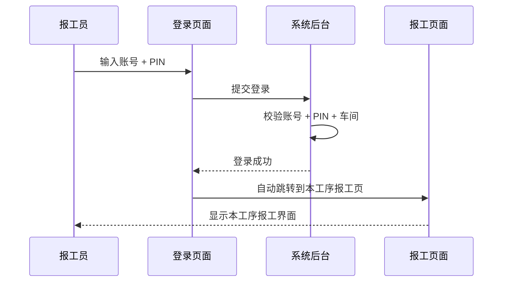
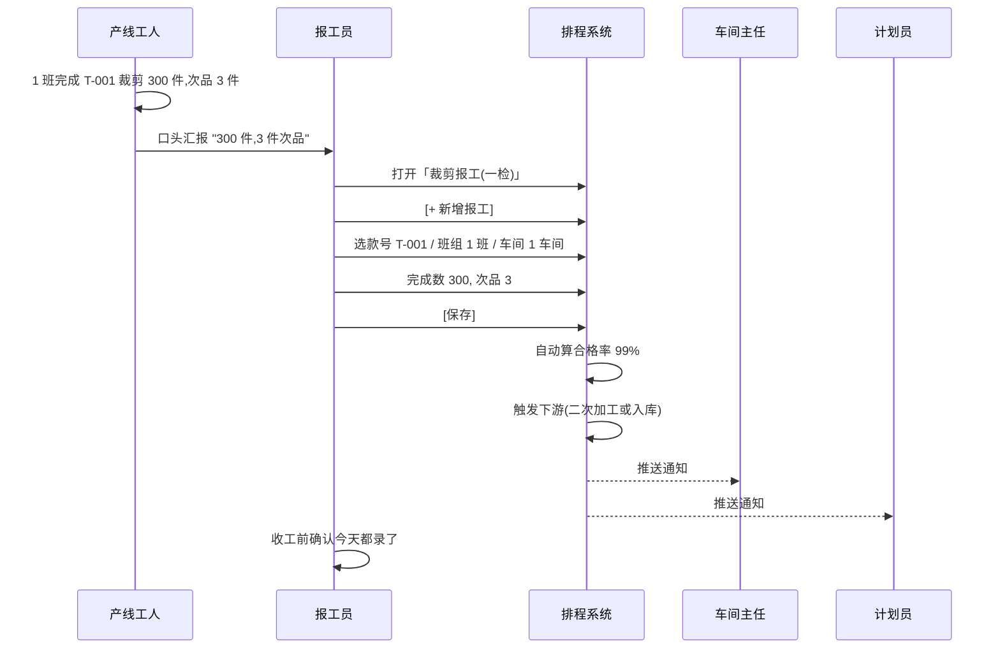
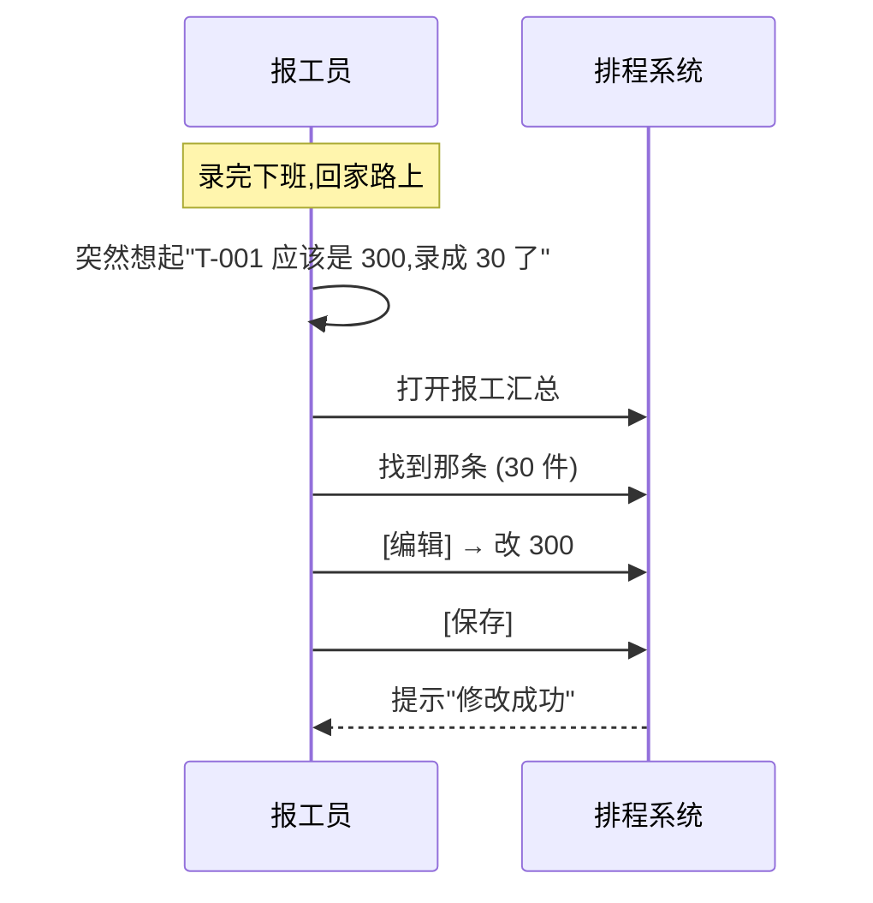
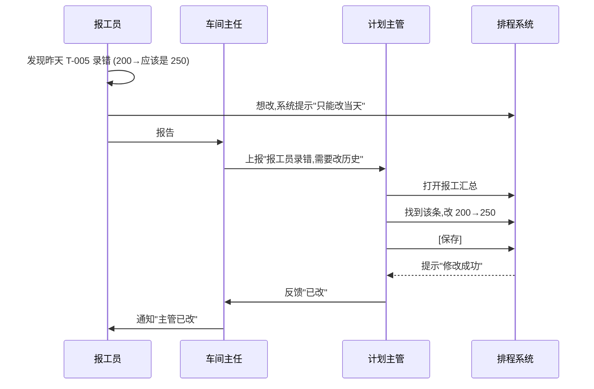
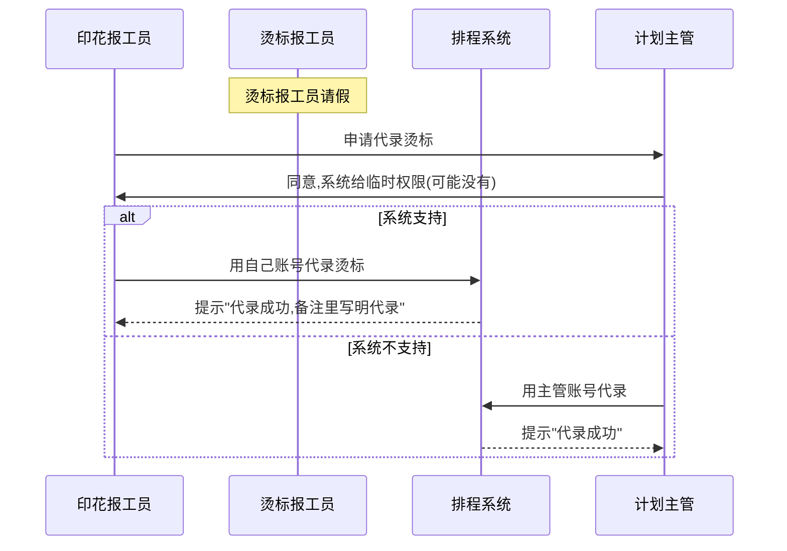
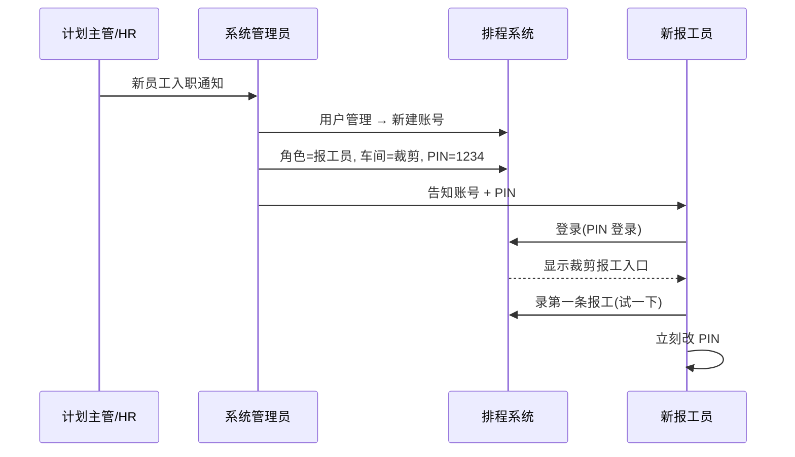

# SOP-04 报工人员

> **适用对象**: ✍️ 报工员(全厂共 6 人,每人负责 1 个工序:裁剪/印花/刺绣/模板/烫标/缝制)
> **预计阅读**: 20 分钟
> **难度**: ⭐⭐ (录数为主,操作简单)
> **核心职责**: 在本工序报工页面录每天的完成数量
> **前置阅读**: [SOP-00 总览与登录](./SOP-00-总览与登录.md)(必读)

---

## 一、角色定位

**一句话**: 产线每天做了多少件,系统靠你录。

### 1.1 工厂里报工员是干什么的

```
┌──────────────────────────────────────────────────────────────┐
│  报工员日常:                                                │
├──────────────────────────────────────────────────────────────┤
│  • 早上 8:00 上工                                           │
│  • 上午 10:00 录昨天数据(前一天录完)                        │
│  • 中午 12:00 录上午完成数                                   │
│  • 下午 16:00 录下午完成数                                   │
│  • 下午 17:30 收工,确认今天数据都录了                       │
│  • 任意时间: 发现录错,立刻改                                │
└──────────────────────────────────────────────────────────────┘
```

### 1.2 6 名报工员分工(按工序)

| 报工员 | 工序 | 人数 | 数据范围 |
|--------|------|------|----------|
| 裁剪报工员 | 裁剪一检 | 1-2 人 | 裁剪车间 |
| 印花报工员 | 印花 | 1 人 | 印花车间 |
| 刺绣报工员 | 刺绣 | 1 人 | 刺绣车间 |
| 模板报工员 | 模板 | 1 人 | 模板车间 |
| 烫标报工员 | 烫标 | 1 人 | 烫标车间 |
| 缝制报工员 | 缝制 | 1-2 人 | 缝制车间(可能每个车间 1 人) |

💡 **提示**: 缝制报工员可能 **每个车间 1 名**(因为 5 个车间分开报工)。

### 1.3 核心职责

| 职责 | 干啥 | 频次 |
|------|------|------|
| 录报工 | 把当日产量录进系统 | 每天 1-3 次 |
| 改报工 | 录错了改 | 任意 |
| 删报工 | 录错了删(仅当天) | 任意 |
| 看汇总 | 看自己录的数据 | 每天下班前 |
| 报工提醒 | 看到系统提醒,确认完成 | 每天 |

### 1.4 报工员能 / 不能做

| 能做 | 不能做 |
|------|--------|
| ✅ 录本工序的报工 | ❌ 看其他工序报工 |
| ✅ 改当天报工 | ❌ 改历史报工(隔天) |
| ✅ 删当天报工 | ❌ 删历史报工 |
| ✅ 看自己录的数据 | ❌ 看全厂款式 |
| ✅ 看款式基本信息 | ❌ 改款式信息 |
| | ❌ 改排程 |
| | ❌ 改系统设置 |

### 1.5 与其他角色的关系

| 对接人 | 关系 | 主要协作 |
|--------|------|----------|
| 🏭 车间主任 | 上下级 | 报工由车间主任看汇总 |
| 📋 计划员 | 服务 | 报工数据自动同步给计划员 |
| 🛡️ 系统管理员 | 求助 | 账号/PIN 忘记找他 |
| 📦 仓管员 | 平行 | 报工确认后裁片入库 |

---

## 二、权限范围

### 2.1 菜单可见性(只能看到报工)

报工员看到的菜单 **最少**,只有:

```
┌──────────────────────────────────────────────────────────────┐
│  ✍️ 报工员 看到的菜单                                        │
├──────────────────────────────────────────────────────────────┤
│  🏠 工作台              ✅                                   │
│  ✂️ 报工管理            ✅ (本工序入口)                      │
│  📜 操作日志            ✅ (只能看自己)                       │
│  👤 个人设置            ✅                                   │
│  其他所有菜单          ❌ 看不到                              │
└──────────────────────────────────────────────────────────────┘
```

### 2.2 5 工序报工入口(根据你的工序)

| 工序 | 报工员看到的菜单 |
|------|------------------|
| 裁剪 | 「裁剪报工(一检)」+「裁剪二检报工」 |
| 印花 | 「印花报工」 |
| 刺绣 | 「刺绣报工」 |
| 模板 | 「模板报工」 |
| 烫标 | 「烫标报工」 |
| 缝制 | 「缝制报工」 |

💡 **提示**: 报工员账号绑定工序,只能看本工序入口。**不能看其他工序报工**(数据隔离)。

### 2.3 缝制报工的特殊性

缝制有 **5 个车间**,缝制报工员可能:
- 方案 A: 每个车间 1 名报工员,各自录自己车间
- 方案 B: 1 名报工员录全 5 车间(不推荐,容易乱)

工厂目前是 **方案 A** 居多,看具体安排。

---

## 三、登录系统

### 3.1 报工员登录方式(2 种)

**方式 1: 账号 + 密码**(跟其他角色一样)
```
用户名: disp01
密码: ***
角色: 报工员
[登录]
```

**方式 2: 账号 + 4 位 PIN**(车间终端专用)
```
工号: disp01
PIN: ****
[登录]
```

💡 **提示**: 车间终端(大屏)推荐用 PIN 登录,4 位数字简单。**PIN 忘记找系统管理员重置**(SOP-01)。

### 3.2 登录流程



### 3.3 登录失败处理

| 现象 | 原因 | 怎么办 |
|------|------|--------|
| 「账号或密码错误」 | 输错/账号停用 | 重新核对,或找系统管理员 |
| 「PIN 错误」 | PIN 输错 | 重新输 4 位数字 |
| 「角色不匹配」 | 角色下拉选错 | 选「报工员」 |
| 登录后菜单空的 | 账号没绑车间 | 找系统管理员 |

---

## 四、主界面导航

### 4.1 报工员看到的菜单布局(裁剪报工员为例)

```
┌──────────────────────────────────────────────────────────────┐
│  顶栏: [系统图标] 制衣排程系统   🔔 通知  👤 柬小张(报工员)  ▼ │
├──────────┬───────────────────────────────────────────────────┤
│ 侧边栏    │            主内容区 (随菜单切换)                    │
│          │                                                   │
│ 🏠 工作台 │                                                   │
│ ✂️ 报工  │                                                   │
│  ├ 裁剪一检│                                                 │
│  └ 裁剪二检│                                                 │
│ 📜 日志  │                                                   │
│          │                                                   │
└──────────┴───────────────────────────────────────────────────┘
```

### 4.2 顶栏功能

| 图标 | 功能 | 报工员用法 |
|------|------|-----------|
| 🔔 通知 | 报工提醒 | 看到「还差 X 条报工」要立刻录 |
| 👤 用户名 | 显示账号 | 显示"柬小张(报工员)" |
| ▼ 下拉 | 改密码/退出 | 离开工位必退 |

### 4.3 报工入口(按工序)

侧边栏「✂️ 报工」下,根据账号绑定的工序显示:
- 裁剪报工员:看到「裁剪一检」+「裁剪二检」(裁剪是 2 步)
- 印花/刺绣/模板/烫标报工员:看到自己工序 1 个入口
- 缝制报工员:看到「缝制报工」

---

## 五、视图 1:报工总览(工作台)

### 5.1 这个页面是干什么的

**报工员看到的首页**,显示 **今日待办** 和 **最近报工**。

### 5.2 进入路径

```
登录后自动跳转,或点侧边栏「🏠 工作台」
```

### 5.3 页面示意图

```
┌──────────────────────────────────────────────────────────────┐
│  🏠 工作台                                          2026-06-22│
├──────────────────────────────────────────────────────────────┤
│                                                              │
│  今日待办:                                                   │
│  ┌─────────────────────┐                                    │
│  │ ⚠️ 还差 2 条报工      │  ← 提醒你录数                      │
│  │                      │                                    │
│  │  T-001 裁剪 06-22   │                                    │
│  │  T-005 裁剪 06-22   │                                    │
│  └─────────────────────┘                                    │
│                                                              │
│  最近报工(我录的):                                            │
│  ┌──────────────────────────────────────────────┐            │
│  │ 时间  │ 款号  │ 工序 │ 完成 │ 次品│ 操作    │            │
│  │ 16:30│ T-001 │ 裁剪 │  300 │  3  │ 编辑 删 │            │
│  │ 14:00│ T-005 │ 裁剪 │  200 │  2  │ 编辑 删 │            │
│  │ 10:00│ T-003 │ 裁剪 │  250 │  5  │ 编辑 删 │            │
│  └──────────────────────────────────────────────┘            │
│                                                              │
│  [快速录入]  [查看历史]                                        │
└──────────────────────────────────────────────────────────────┘
```

### 5.4 早班标准动作(5 分钟)

```
1. 打开工作台(1 分钟)
2. 看「今日待办」(1 分钟)
3. 有提醒 → 点对应款式 → 录数(2 分钟)
4. 没提醒 → 不用录(等车间主任通知)
5. 收工前再看一次,确认今天的都录了(1 分钟)
```

---

## 六、视图 2:裁剪一检报工(裁剪报工员用)

### 6.1 这个页面是干什么的

**裁剪工序的第一步**:布料裁好后,**第一次检查**(简称"一检")。录入每天的合格数和不良数。

### 6.2 进入路径

```
侧边栏 → ✂️ 报工 → 裁剪报工(一检)
```

### 6.3 页面示意图

```
┌──────────────────────────────────────────────────────────────┐
│  ✂️ 裁剪报工(一检)                          [+ 新增报工]      │
├──────────────────────────────────────────────────────────────┤
│  🔍 [款号____] [日期____]   [↻刷新]                          │
├────┬──────┬──────┬──────┬────┬────┬────┬────────────────────┤
│ ID │ 款号 │ 品名 │ 日期 │完成 │次品│合格率│ 操作              │
├────┼──────┼──────┼──────┼────┼────┼────┼────────────────────┤
│ 1  │T-001 │ 圆领 │06-22 │ 300 │  3 │ 99% │ 编辑 删除          │
│ 2  │T-005 │ 长袖 │06-22 │ 200 │  2 │ 99% │ 编辑 删除          │
│ 3  │T-003 │ 背心 │06-21 │ 250 │  5 │ 98% │ 编辑 删除          │
└────┴──────┴──────┴──────┴────┴────┴────┴────────────────────┘
```

### 6.4 新增报工(核心操作,完整步骤)

**场景**: 6-22 下午,1 班完成 T-001 圆领短袖裁剪 300 件,次品 3 件。

```
步骤 1:  点 [+ 新增报工] 按钮
步骤 2:  弹窗:
  ┌──────────────────────────────────┐
  │  新增报工                         │
  ├──────────────────────────────────┤
  │  款号*:  [▼ T-001 圆领短袖]    │  ← 选款号,品名自动带
  │  班组:   [▼ 1班            ]    │  ← 选班组
  │  车间:   [▼ 1车间          ]    │  ← 选车间
  │  日期*:  [2026-06-22        ]    │  ← 默认今天
  │  完成数*: [300               ]    │  ← 必填
  │  次品数:  [3                 ]    │  ← 选填
  │  备注:    [                  ]    │  ← 选填
  │                                    │
  │  [取消]              [保存]        │
  └──────────────────────────────────┘
步骤 3:  选款号 T-001(品名"圆领短袖"自动带出)
步骤 4:  选班组 1 班
步骤 5:  选车间 1 车间
步骤 6:  日期默认今天(06-22)
步骤 7:  完成数填 300
步骤 8:  次品数填 3
步骤 9:  备注: 可填"1 班上午完成"
步骤 10: 点 [保存]
步骤 11: 弹窗关闭,列表多出一行
步骤 12: 提示「报工成功」
```

### 6.5 选款号的逻辑

```
方式 A: 知道款号 → 直接下拉选
方式 B: 看款式列表(列出所有排在本工序的款式)
方式 C: 款号搜索 → 输入"001"自动匹配
```

💡 **提示**: 选款号时,系统只显示 **本车间 + 本工序** 的款式。如果款号下拉框是空的,说明该款式没排到本车间。

### 6.6 编辑报工(改错时用)

**场景**: 刚才录错了,完成数应该是 300,录成了 30。

```
步骤 1:  找到那一行
步骤 2:  点行尾 [编辑] 按钮
步骤 3:  弹窗(同新增表单)
步骤 4:  改完成数 30 → 300
步骤 5:  点 [保存]
步骤 6:  提示「修改成功」
```

🟡 **谨慎**: 只能改 **当天** 的报工。隔天的报工(昨天及之前)**不能自己改**,要联系计划主管。

### 6.7 删除报工(录错或重复时)

**场景**: 录重复了,删一条。

```
步骤 1:  找到那一行
步骤 2:  点行尾 [删除] 按钮
步骤 3:  弹窗「确定删除这条报工?」
步骤 4:  [确定] → 删除
```

🔴 **禁止**: 隔天的报工请勿随意删除,影响日报统计。

### 6.8 报工数据同步

录完报工后,系统自动:
- ✅ 更新款式进度(裁剪进度)
- ✅ 通知计划员/车间主任
- ✅ 推送到缝制排程详情(三行模型)
- ✅ 推送到报工汇总(全厂)
- ✅ 触发下游工序(裁剪完成 → 二次加工或缝制)

### 6.9 常见错误

| 现象 | 原因 | 怎么办 |
|------|------|--------|
| 款号下拉框空的 | 本车间没排该款式 | 联系计划员 |
| 「完成数必须 > 0」 | 填了 0 或负数 | 改填实际数字 |
| 「请选择款号」 | 没选款号 | 必选 |
| 「日期不能晚于今天」 | 选明天日期 | 选今天或过去 |
| 改不了隔日报工 | 系统限制 | 找计划主管 |
| 提示「款式不存在」 | 拼错款号 | 重新选 |

---

## 七、视图 3:裁剪二检报工(裁剪报工员用)

### 7.1 这个页面是干什么的

**裁剪工序的第二步**:需要二次加工(印花/刺绣/模板)的款式,加工完后 **第二次检查**(简称"二检")。

### 7.2 进入路径

```
侧边栏 → ✂️ 报工 → 裁剪二检报工
```

### 7.3 二检和一检的区别

| 维度 | 一检 | 二检 |
|------|------|------|
| 时机 | 裁剪完直接 | 印花/刺绣/模板完 |
| 用途 | 检查裁剪 | 检查印花质量 |
| 数量 | 裁剪总数 | 二次加工后数 |
| 次品 | 裁剪废品 | 印花废品 |
| 后续 | 二次加工或入库 | 入库 |

### 7.4 录入二检报工(同六检)

操作跟一检一样:
- 选款号(必须是 **有二次工序** 的款式)
- 填完成数/次品数
- 保存

💡 **提示**: 没二次工序的款式,二检下拉框看不到。

### 7.5 一检和二检的关系

```
布料 → 裁剪 → [一检] → 印花 → [二检] → 入库
         ↓(无印花)         ↓(有印花)
         直接入库          二检完入库
```

### 7.6 常见错误

| 现象 | 原因 | 怎么办 |
|------|------|--------|
| 看不到款式 | 该款式没二次工序 | 正常,只录一检 |
| 一检后必须二检吗? | 看款式有没有二次工序 | 有→必录二检,无→直接入库 |

---

## 八、视图 4:印花报工(印花报工员用)

### 8.1 这个页面是干什么的

**印花工序** 的报工。每个款式可能印不同的图案,录数跟裁剪类似。

### 8.2 进入路径

```
侧边栏 → ✂️ 报工 → 印花报工
```

### 8.3 操作(跟裁剪一检一样)

```
步骤 1:  点 [+ 新增报工]
步骤 2:  选款号(本印花车间的款式)
步骤 3:  选班组
步骤 4:  选车间(印花车间)
步骤 5:  填完成数 / 次品数
步骤 6:  选印花方式(网印/数码印,选填)
步骤 7:  [保存]
```

### 8.4 印花特有字段

- **印花方式**: 网印 / 数码印 / 烫画 (选填)
- **印花颜色数**: 1 色 / 2 色 / 3 色 (选填)

### 8.5 印花报工 = 二次加工开始

印花报工完成后:
- ✅ 触发二检报工
- ✅ 二检完才能入库

### 8.6 常见错误

| 现象 | 原因 | 怎么办 |
|------|------|--------|
| 看不到款式 | 款式没选印花工序 | 找计划员加工序 |
| 「印花方式必选」 | 没填印花方式 | 填上 |

---

## 九、视图 5:刺绣报工

### 9.1 同印花,换工序

操作跟印花报工一样,只是工序是「刺绣」。

### 9.2 刺绣特有字段

- **刺绣方式**: 平绣 / 立体绣 / 贴布绣 (选填)
- **针数**: 简单/复杂 (选填,影响产能)

### 9.3 入口

```
侧边栏 → ✂️ 报工 → 刺绣报工
```

---

## 十、视图 6:模板报工

### 10.1 同上,工序=模板

### 10.2 模板特有字段

- **模板类型**: 丝网印模板 / 数码模板 / 烫画模板 (选填)

### 10.3 入口

```
侧边栏 → ✂️ 报工 → 模板报工
```

---

## 十一、视图 7:烫标报工

### 11.1 同上,工序=烫标

### 11.2 烫标特点

烫标是 **最后** 的二次加工,可能跟缝制并行(因为是贴在衣服上的)。

### 11.3 入口

```
侧边栏 → ✂️ 报工 → 烫标报工
```

---

## 十二、视图 8:缝制报工(缝制报工员用,特殊)

### 12.1 这个页面是干什么的

**缝制工序** 的报工,是全厂最重要的一步,产线最终产出。**特殊**:缝制有 5 个车间,需要先选车间再录报工。

### 12.2 进入路径(2 步)

```
步骤 1: 侧边栏 → ✂️ 报工 → 缝制报工
步骤 2: 进入「选车间页」
步骤 3: 点本车间卡片(例如「1 车间」)
步骤 4: 进入缝制报工详情(本车间专属)
```

### 12.3 选车间页(第一步)

```
┌──────────────────────────────────────────────────────────────┐
│  ← 返回                                                    │
│           缝制报工                                          │
│      选择车间查看和录入报工数据                              │
│                                                            │
│  ┌──────────┐  ┌──────────┐  ┌──────────┐                  │
│  │ 🏭       │  │ 🏭       │  │ 🏭       │                  │
│  │ 一车间   │  │ 二车间   │  │ 三车间   │   →             │
│  │          │  │          │  │          │                  │
│  └──────────┘  └──────────┘  └──────────┘                  │
│                                                            │
│  ┌──────────┐  ┌──────────┐                                │
│  │ 🏭       │  │ 🏭       │                                │
│  │ 四车间   │  │ 五车间   │                                │
│  │          │  │          │                                │
│  └──────────┘  └──────────┘                                │
└──────────────────────────────────────────────────────────────┘
```

### 12.4 进入本车间后的页面

```
┌────────────────────────────────────────────────────────────────┐
│  ← 返回      🧵 缝制报工 · 一车间           [+ 新增报工]        │
├────────────────────────────────────────────────────────────────┤
│  ┌─────────┐  ┌──────────┐                                       │
│  │   15    │  │  2,350   │                                       │
│  │  报工记录│  │ 累计完成 │                                       │
│  └─────────┘  └──────────┘                                       │
├────────────────────────────────────────────────────────────────┤
│  车间 │ 班组 │ 款号   │ 品名      │ 完成 │ 次品│ 日期  │ 操作   │
│  ────────────────────────────────────────────────────────────────│
│  一车间│ 1班 │ T-001 │ 圆领短袖   │ 200 │  2  │ 06-22 │ 删除  │
│  一车间│ 2班 │ T-005 │ 长袖      │ 180 │  1  │ 06-22 │ 删除  │
│  一车间│ 1班 │ T-001 │ 圆领短袖   │ 195 │  3  │ 06-21 │ 删除  │
└────────────────────────────────────────────────────────────────┘
```

### 12.5 录入缝制报工

**场景**: 6-22 下午,1 车间 1 班完成 T-001 200 件,次品 2 件。

```
步骤 1:  点 [+ 新增报工]
步骤 2:  弹窗:
  ┌────────────────────────────────────┐
  │  新增报工                           │
  ├────────────────────────────────────┤
  │  选班组: [▼ 1班            ]      │
  │  车间:   [一车间](自动,不能改)    │
  │  款号:   [▼ T-001 圆领短袖]      │
  │  品名:   圆领短袖(自动带出)       │
  │  日期:   [2026-06-22](默认今天)   │
  │  完成数: [200](必填,> 0)         │
  │  次品数: [2](选填)               │
  │  备注:   [                  ]     │
  │                                    │
  │  [取消]                [保存]      │
  └────────────────────────────────────┘
步骤 3:  选班组 1 班
步骤 4:  选款号 T-001(品名自动带出)
步骤 5:  日期默认今天
步骤 6:  填完成数 200
步骤 7:  (选填)填次品数 2
步骤 8:  [保存]
```

💡 **提示**: 「车间」字段是 **自动填本车间,不能改**。这是数据隔离的体现。

### 12.6 选班组 → 选款号的逻辑

```
方式 A: 先选班组 → 款号列表自动过滤该班组下的款式
方式 B: 直接选款号 → 班组字段自动带出
```

💡 **建议**: 选班组后款号会少很多,方便快速找到要录的那款。

### 12.7 缝制报工数据同步

录完后:
- ✅ 款式「缝制进度」更新
- ✅ 推送到缝制排程详情(三行模型)
- ✅ 推送到报工汇总
- ✅ 完工时触发成品入库流程
- ✅ 推送给计划员 / 车间主任

### 12.8 常见错误

| 现象 | 原因 | 怎么办 |
|------|------|--------|
| 款号下拉框空的 | 本车间没排该款式 | 检查排程 |
| 「完成数必须 > 0」 | 填了 0 | 改填实际 |
| 「车间显示空」 | 账号数据问题 | 找系统管理员 |
| 改不了昨天数据 | 系统限制 | 找车间主任或主管 |

---

## 十三、视图 9:报工汇总(自己录的)

### 13.1 这个页面是干什么的

**报工员能看到自己录的所有报工数据** 的汇总页。

### 13.2 进入路径

```
侧边栏 → ✂️ 报工 → 报工汇总(本工序)
```

### 13.3 页面示意

```
┌──────────────────────────────────────────────────────────────┐
│  裁剪报工(我录的)            [+ 新增报工] [📤 导出表格]        │
├──────────────────────────────────────────────────────────────┤
│  今日完成: 950 件   次品: 10 件   合格率: 99%                 │
├──────────────────────────────────────────────────────────────┤
│  日期       │ 款号   │ 完成 │ 次品│ 合格率│ 操作             │
│  2026-06-22 │ T-001  │  300 │  3  │ 99%   │ 编辑 删除         │
│  2026-06-22 │ T-005  │  200 │  2  │ 99%   │ 编辑 删除         │
│  2026-06-21 │ T-003  │  250 │  5  │ 98%   │ 编辑 删除         │
└──────────────────────────────────────────────────────────────┘
```

### 13.4 报工员能做什么

| 操作 | 能做吗 | 备注 |
|------|--------|------|
| 看自己录的 | ✅ | 默认显示自己 |
| 改当天 | ✅ | 当天的能改 |
| 删当天 | ✅ | 当天的能删 |
| 改历史 | ❌ | 找车间主任/主管 |
| 删历史 | ❌ | 找车间主任/主管 |
| 看他人的 | ❌ | 数据隔离 |
| 看全厂 | ❌ | 报工员权限不够 |

### 13.5 导出表格

```
1. 筛选要导出的数据(可选)
2. 点 [📤 导出表格]
3. 浏览器下载 Excel
```

---

## 十四、视图 10:个人设置

### 14.1 这个页面是干什么的

改自己头像/密码/PIN。

### 14.2 进入路径

```
顶栏 → 👤 用户名 → 个人设置
```

### 14.3 改密码

```
1. 个人设置页
2. 填「原密码」+「新密码」+「确认新密码」
3. 新密码至少 8 位
4. 点 [保存]
5. 提示「密码已修改」
```

### 14.4 改 PIN(报工员特有)

```
1. 个人设置页
2. 找到「PIN」区
3. 填「原 PIN」+「新 PIN」(4 位数字)
4. 点 [保存]
5. 提示「PIN 已修改」
```

### 14.5 常见错误

| 现象 | 原因 | 怎么办 |
|------|------|--------|
| 改不了 PIN | 输入格式不对 | 4 位数字,字母不行 |
| 忘记原密码 | 不知道 | 找系统管理员重置 |

---

## 十五、视图 11:操作日志(自己的)

### 15.1 这个页面是干什么人

**报工员只能看自己的操作记录**(录数、修改、删除)。

### 15.2 进入路径

```
侧边栏 → 📜 操作日志
```

### 15.3 报工员日志示例

```
ID  │ 模块    │ 操作 │ 对象     │ 详情              │ 操作人  │ 时间
────┼─────────┼──────┼──────────┼──────────────────┼─────────┼────────
156 │ 报工管理 │ 新增 │ T-001   │ 裁剪 300 件      │ disp01 │ 16:30
155 │ 报工管理 │ 修改 │ T-005   │ 200→250 件       │ disp01 │ 14:00
154 │ 报工管理 │ 删除 │ T-003   │ 删除 06-20 报工  │ disp01 │ 10:00
```

### 15.4 报工员查日志干什么

- 确认自己录的数据
- 找录错的那条,看时间
- 主管问的时候能查

---

## 十六、端到端核心流程

### 16.1 流程一:产线完工到录数(裁剪一检)



### 16.2 流程二:发现录错,修改



### 16.3 流程三:录错但已经隔天



### 16.4 流程四:报工员代另一个工序录数(应急)



### 16.5 流程五:新报工员入职



---

## 十七、常见问题(FAQ)

### Q1: 我录错数了,怎么改?

**当天录错**:
```
1. 打开报工页面
2. 找到那一行
3. 点 [编辑]
4. 改数字
5. [保存]
```

**隔天录错**:
```
1. 自己改不了
2. 联系车间主任
3. 车间主任联系计划主管
4. 计划主管在系统里改
```

### Q2: 完成数录成 0 了,行不行?

**答**: 不行,系统拒绝。完成数必须 **> 0**。

如果今天确实没产量(比如产线故障):
- 不录数(不是每款每天都要录)
- 等产线恢复再录

### Q3: 款号下拉框空的,怎么办?

**答**: 本车间没排该款式。

**排查**:
```
1. 该款式有没有排到本车间?
   → 看「缝制排程详情」(车间主任会看)
2. 有 → 刷新页面
3. 没有 → 联系计划员,款式是不是排到其他车间了
```

### Q4: 我能录明天或后天的报工吗?

**答**: **不能**。报工只能录 **今天和之前** 的日期。

**原因**: 防止提前造假数据。

**解决**: 等到那一天再录。

### Q5: 「裁剪一检」录完了,「裁剪二检」还要录吗?

**答**: 看款式有没有二次工序:
- **没有**(比如纯色,无印花/刺绣)→ 只录一检 → 直接入库
- **有**(印花/刺绣/模板/烫标)→ 录一检 → 等二次加工 → 录二检 → 入库

### Q6: 次品数填了,合格率怎么算?

**自动算**:
```
合格率 = 完成数 / (完成数 + 次品数) × 100%

举例:
  完成 300, 次品 3
  合格率 = 300 / 303 × 100% = 99.0%
```

### Q7: 同款号同一天录了 2 次,行不行?

**答**: **不行**。系统会:
- 第一次成功
- 第二次报错"已存在"(款式+班组+日期 唯一)

**解决**: 想分多次录 → 编辑第一条 / 删第一条重录。

### Q8: 录错款号了,怎么改?

**答**: 只能改当天的:
```
1. 找到错误那条
2. [编辑] → 改款号
3. [保存]
```

隔天的找车间主任/主管。

### Q9: 「次品数」必须填吗?

**答**: 选填,不填默认 0。

但建议每次都填(次品数是质量追踪重要数据)。

### Q10: 「备注」写什么?

**答**: 选填,常用的:
- "1 班上午完成"
- "工人 XXX 录入"
- "特殊批次"
- "加班完成"

💡 **提示**: 重要情况(异常/质量事故) **必须写备注**,方便后续追溯。

### Q11: 我录的数,车间主任能看到吗?

**答**: **能**。录完自动同步给:
- 车间主任(本车间)
- 计划员
- 报工汇总(全厂,但其他人看不到自己录的具体操作)

### Q12: PIN 忘了怎么办?

**答**: 联系系统管理员重置。**不能自己改**。

### Q13: 密码忘了怎么办?

**答**: 联系系统管理员重置。

### Q14: 录报工要不要登录?

**答**: **要**。系统记录操作人,匿名录数会被拒。

### Q15: 我录了,系统没显示?

**答**: 1-2 分钟延迟是正常的(数据同步)。

**排查**:
```
1. 等 1-2 分钟,刷新页面
2. 还没显示 → 检查录的时间对不对
3. 还没显示 → 截图联系系统管理员
```

---

## 十八、紧急情况处理

### 18.1 紧急情况分类

```
┌────────────────────────────────────────────────┐
│  ✍️ 报工员 紧急情况速查                         │
├────────────────────────────────────────────────┤
│  🔴 P0 - 录不进报工:系统全挂/PIN 错             │
│  🟡 P1 - 录错数:录错款号/录错数量               │
│  🟢 P2 - 不会操作:不知道录哪款/填错字段         │
└────────────────────────────────────────────────┘
```

### 18.2 P0 - 录不进报工

**应急步骤**:
```
[1] 自己试一下,确认不是只有你的问题
    ↓
[2] 退出重新登录(可能 session 过期)
    ↓
[3] 还是不行 → 联系系统管理员
    ↓
[4] 严重时 → 用纸笔先记下来,等系统恢复补录
```

### 18.3 P1 - 录错数

**应急步骤**:
```
1. 当天 → 自己改(详见 Q1)
2. 隔天 → 报告车间主任 → 主管改
3. 重大错误(影响款式进度) → 立刻报告车间主任
```

### 18.4 P2 - 不会操作

**应急步骤**:
```
1. 看本 SOP 对应章节
2. 问车间主任
3. 问系统管理员
```

### 18.5 紧急联系人

| 情况 | 联系人 |
|------|--------|
| 系统问题 | 系统管理员 |
| 录数问题 | 车间主任 |
| 款式问题 | 计划员 |
| 跨车间协调 | 计划主管 |

### 18.6 报工员应该知道的基本事实

```
✓ 录数只能用当天
✓ 隔天找主管
✓ 一个款式同一天只能录一次
✓ 录完会同步给所有人
✓ 删了会影响日报统计
✓ PIN 4 位数字,密码 8 位以上
✓ 操作都有日志,不要乱录
```

---

## 十九、定期工作

### 19.1 每日

```
□ 1. 早上登录,看通知(2 分钟)
□ 2. 看工作台「今日待办」(1 分钟)
□ 3. 录昨天的数据(10:00 前,5 分钟)
□ 4. 录上午数据(中午 12:00,5 分钟)
□ 5. 录下午数据(下午 16:30,5 分钟)
□ 6. 收工前看汇总,确认都录了(2 分钟)
```

### 19.2 每周

```
□ 1. 看本周合格率(自检)
□ 2. 看本周次品数(质量反馈)
```

### 19.3 每月

```
□ 1. 改一次 PIN(可选,安全)
□ 2. 改一次密码
```

---

**版本**: v1.0 (2026-06-22)
**反馈**: 内容有误或看不懂的地方,联系系统管理员,或直接在本文件末尾追加修订意见。
