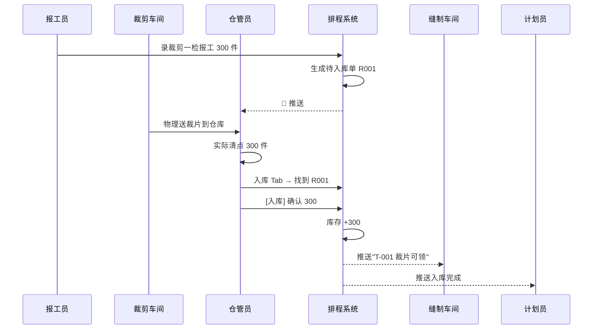
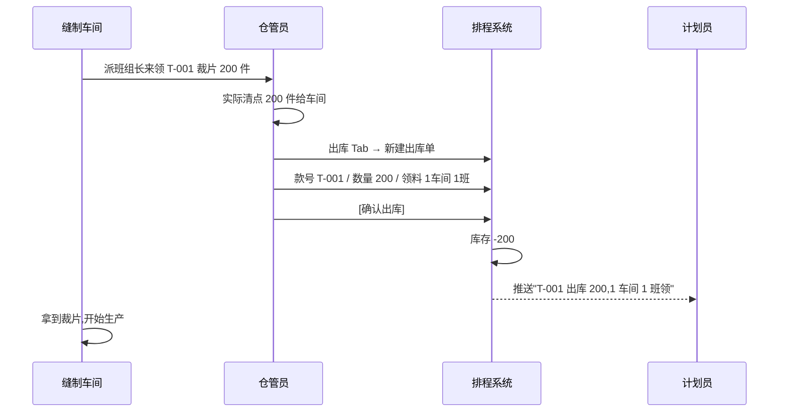
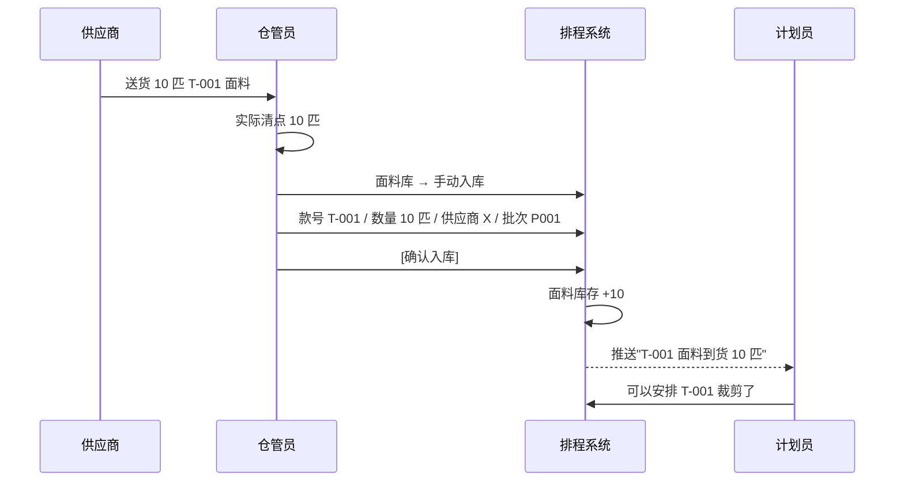
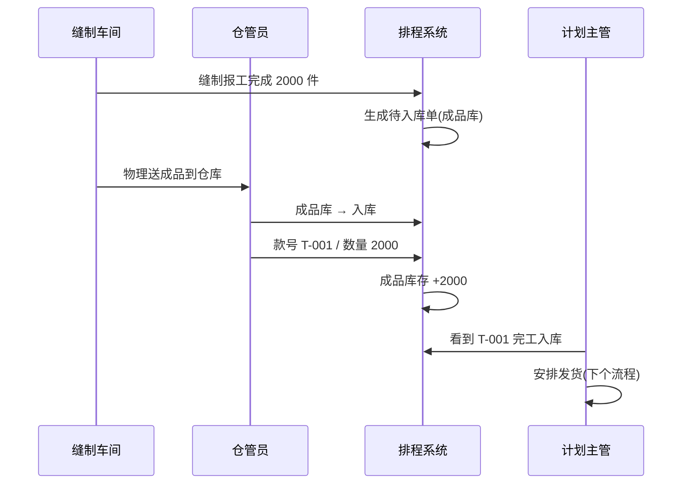
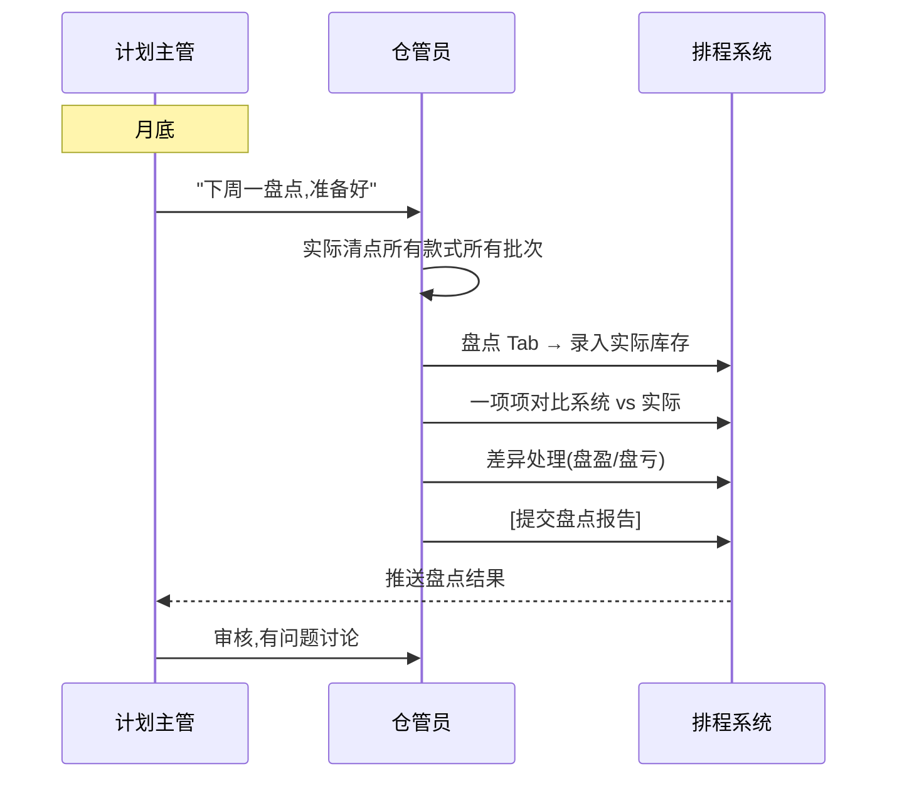

# SOP-05 裁片仓管员

> **适用对象**: 📦 裁片仓管员(全厂共 2 人,管仓库 4 类物资:面料/裁片/辅料/成品)
> **预计阅读**: 30 分钟
> **难度**: ⭐⭐ (基础电脑操作 + 仓库流程)
> **核心职责**: 入库确认、出库登记、库存查询、台账管理
> **前置阅读**: [SOP-00 总览与登录](./SOP-00-总览与登录.md)(必读)

---

## ⚠️ 重要声明:仓库功能当前状态

```
┌──────────────────────────────────────────────────────────────┐
│  🔴 仓库功能当前周期冻结(2026-06-16 起)                     │
├──────────────────────────────────────────────────────────────┤
│  • 工厂仍在用,功能保留运行                                  │
│  • 本次开发周期不开发新功能、不审查、不修复 bug              │
│  • 本 SOP 反映当前系统状态,后续可能微调                     │
│  • 恢复时间:owner 明确说"恢复仓库开发"                      │
│                                                              │
│  本 SOP 编写原则:                                            │
│  • 描述当前功能(用于培训新仓管员)                           │
│  • 重点标出"如果系统没有这个功能,改用人工"                   │
│  • 后续如有调整,系统管理员会通知                            │
└──────────────────────────────────────────────────────────────┘
```

---

## 一、角色定位

**一句话**: 仓库是生产链的"中转站",面料进、裁片出、成品入,全靠你盯着。

### 1.1 工厂里仓管员是干什么的

```
┌──────────────────────────────────────────────────────────────┐
│  仓管员日常:                                                │
├──────────────────────────────────────────────────────────────┤
│  • 早上 8:00 看仓库通知                                     │
│  • 上午 9:00 入库确认(报工完成后生成待入库单)                │
│  • 上午 10:00 处理出库(缝制车间领料)                        │
│  • 下午 14:00 入面料到货                                    │
│  • 下午 16:00 库存盘点                                      │
│  • 下午 17:00 收工,确认当天账实一致                          │
│  • 任意时间: 紧急出入库、库存异常                            │
└──────────────────────────────────────────────────────────────┘
```

### 1.2 4 类物资(按仓库)

| 物资 | 说明 | 流转 |
|------|------|------|
| 🧵 面料 | 整匹布,未裁 | 进 → 仓库 → 车间裁剪 |
| ✂️ 裁片 | 裁剪后,未缝 | 裁剪完 → 仓库 → 缝制车间 |
| 📦 辅料 | 拉链/纽扣/标签 | 进 → 仓库 → 缝制 |
| 👕 成品 | 缝制后,待出 | 缝制完 → 仓库 → 客户 |

### 1.3 核心职责

| 职责 | 干啥 | 频次 |
|------|------|------|
| 入库确认 | 报工/到货后,确认入库 | 每天 |
| 出库登记 | 车间领料,登记出库 | 每天 |
| 库存查询 | 查某款式库存 | 每天 |
| 台账管理 | 出入库流水 | 每天 |
| 盘点 | 实际库存 vs 系统库存 | 每月 |
| 异常上报 | 库存异常、报工生成单据异常 | 任意 |

### 1.4 与其他角色的关系

| 对接人 | 关系 | 主要协作 |
|--------|------|----------|
| 🛡️ 系统管理员 | 求助 | 仓库功能异常/账号问题 |
| 👔 计划主管 | 上下级 | 库存异常汇报 |
| 📋 计划员 | 服务 | 库存查询/催料 |
| 🏭 车间主任 | 服务 | 出库通知/催料 |
| ✍️ 报工员 | 上游 | 报工后生成入库单 |
| 📦 供应商 | 上游 | 面料到货接收 |

---

## 二、权限范围

### 2.1 菜单可见性

```
┌──────────────────────────────────────────────────────────────┐
│  📦 仓管员 看到的菜单                                        │
├──────────────────────────────────────────────────────────────┤
│  🏠 工作台              ✅                                   │
│  📦 裁片库              ✅                                   │
│  📜 操作日志            ✅ (只能看自己)                       │
│  👤 个人设置            ✅                                   │
│  其他所有菜单          ❌ 看不到                              │
└──────────────────────────────────────────────────────────────┘
```

### 2.2 仓库 4 种类型(菜单入口)

| 仓库类型 | 中文名 | 仓管员能做什么 |
|----------|--------|----------------|
| fabric | 面料库 | 入库/出库/查库存 |
| cutting_piece | 裁片库 | 入库/出库/查库存 |
| auxiliary | 辅料库 | 入库/出库/查库存 |
| finished | 成品库 | 入库/出库/查库存 |

### 2.3 仓管员能 / 不能做

| 能做 | 不能做 |
|------|--------|
| ✅ 看所有 4 种仓库 | ❌ 改款式信息 |
| ✅ 入库/出库登记 | ❌ 改排程 |
| ✅ 查库存/台账 | ❌ 录报工 |
| ✅ 导出表格 | ❌ 改系统设置 |
| ✅ 盘点(实际) | ❌ 看全厂款式 |
| ✅ 改自己密码 | ❌ 改历史(隔天) |

---

## 三、登录系统

### 3.1 登录方式

跟其他角色一样,**账号 + 密码** 登录。

```
用户名: wh01
密码: ***
角色: 仓管员(可能不需要选,看登录页设计)
[登录]
```

### 3.2 登录后看到什么

```
┌──────────────────────────────────────────────────────────────┐
│  顶栏: [系统图标] 制衣排程系统   🔔 通知  👤 仓管员(wh01) ▼ │
├──────────┬───────────────────────────────────────────────────┤
│ 侧边栏    │            主内容区                                │
│          │                                                   │
│ 🏠 工作台 │  欢迎使用仓库系统                                  │
│ 📦 裁片库 │  ...                                              │
│ 📜 日志  │                                                   │
│ 👤 个人  │                                                   │
│          │                                                   │
└──────────┴───────────────────────────────────────────────────┘
```

---

## 四、主界面导航

### 4.1 进入仓库

侧边栏点「📦 裁片库」,系统跳转(或显示 4 种仓库类型选一个)。

### 4.2 仓库详情页(选 1 个类型后)

```
┌──────────────────────────────────────────────────────────────┐
│  ← 返回    📦 裁片库(cutting_piece)                          │
├──────────────────────────────────────────────────────────────┤
│  [入库] [出库] [库存] [台账] [导入] [导出]   (5 个 Tab)      │
├──────────────────────────────────────────────────────────────┤
│  库存总览:                                                   │
│  ┌──────────┐ ┌──────────┐ ┌──────────┐ ┌──────────┐        │
│  │ 50      │ │ 12,350   │ │ 30,000   │ │ 6        │        │
│  │ 款号数  │ │ 总库存   │ │ 总容量   │ │ 预警款   │        │
│  └──────────┘ └──────────┘ └──────────┘ └──────────┘        │
├──────────────────────────────────────────────────────────────┤
│  当前 Tab 内容                                               │
└──────────────────────────────────────────────────────────────┘
```

### 4.3 顶栏功能

| 图标 | 功能 | 仓管员用法 |
|------|------|-----------|
| 🔔 通知 | 库存预警 | 库存不足时提醒 |
| 👤 用户名 | 显示账号 | 显示"仓管员(wh01)" |
| ▼ 下拉 | 改密码/退出 | 离开工位必退 |

---

## 五、视图 1:入库(核心)

### 5.1 这个页面是干什么的

**物资进仓库** 的确认页面。两种入库场景:
- **报工生成**:报工员录完报工,系统自动生成待入库单
- **手动入库**: 供应商送货(面料),仓管员手动登记

### 5.2 进入路径

```
侧边栏 → 📦 裁片库 → 选具体仓库类型 → [入库] Tab
```

### 5.3 报工生成的入库(主要场景)

**场景**: 裁剪一检报工完成 300 件,系统生成"待入库单"。

```
步骤 1:  仓管员登录,看到 🔔 通知 "3 张待入库单"
步骤 2:  进入裁片库 → 入库 Tab
步骤 3:  看到「待入库」列表:
   ┌────────────────────────────────────┐
   │ 待入库单号 │ 款号    │ 数量│ 来源   │ 操作 │
   │ R20260622001│ T-001  │ 300 │ 裁剪   │ [入库] [拒收]
   │ R20260622002│ T-005  │ 200 │ 裁剪   │ [入库] [拒收]
   └────────────────────────────────────┘
步骤 4:  现场实际清点(300 件到了 / 没到)
步骤 5:  点 [入库] 按钮
步骤 6:  弹窗,确认数量(可改),选库位(可选)
步骤 7:  点 [确认入库]
步骤 8:  系统:
   - 库存 +300
   - 生成入库流水
   - 通知报工员
   - 通知车间主任
```

### 5.4 手动入库(面料到货等)

**场景**: 供应商送了 10 匹 T-001 用的面料。

```
步骤 1:  选「手动入库」按钮(可能在入库 Tab 右上角)
步骤 2:  弹窗:
   ┌────────────────────────────────────┐
   │ 手动入库                           │
   ├────────────────────────────────────┤
   │ 款号*:  [▼ T-001 圆领短袖]      │
   │ 数量*:  [10                   ]    │  ← 10 匹
   │ 单位:   [匹]                     │
   │ 库位:   [▼ A-01              ]    │  ← 货架位置
   │ 供应商: [▼ XX 布料厂           ]    │
   │ 批次号: [PO202606-001          ]    │
   │ 到货日期:[2026-06-22          ]    │
   │ 备注:   [送货单号 XXXX         ]    │
   │                                    │
   │ [取消]                  [确认入库] │
   └────────────────────────────────────┘
步骤 3:  填信息
步骤 4:  [确认入库]
步骤 5:  库存 +10 匹
```

### 5.5 拒收入库

**场景**: 报工生成了 300 件入库单,实际到了 280 件(20 件报损)。

```
步骤 1:  找到该入库单
步骤 2:  点 [拒收] 按钮(在 [入库] 旁边)
步骤 3:  弹窗:
   - 实际数量:280(可改)
   - 拒收原因:报损 20 件
步骤 4:  [确认]
步骤 5:  系统:
   - 库存 +280
   - 报损 20 件记录
   - 通知计划员(款式数量差异)
```

### 5.6 入库数量校验

系统会校验:
- **数量 > 0**(不能入库 0)
- **不能超报工数量**(报工 300,不能入库 500)
- **日期不能晚于今天**(防止提前录)

### 5.7 常见错误

| 现象 | 原因 | 怎么办 |
|------|------|--------|
| 看不到待入库单 | 没刷新/报工没完成 | 强制刷新 |
| 「数量超报工数」 | 录错了 | 改成 ≤ 报工数 |
| 「日期晚于今天」 | 选明天 | 改今天 |
| 「款号不存在」 | 拼错款号 | 重新选 |

---

## 六、视图 2:出库(核心)

### 6.1 这个页面是干什么的

**物资从仓库出** 的登记页面。两种出库:
- **缝制领料**:缝制车间领裁片
- **出库发货**:成品发给客户

### 6.2 进入路径

```
侧边栏 → 📦 裁片库 → 选具体仓库类型 → [出库] Tab
```

### 6.3 缝制领料(主要场景)

**场景**: 1 车间 1 班领 T-001 裁片 200 件开工。

```
步骤 1:  出库 Tab
步骤 2:  点 [+ 新建出库单] 按钮
步骤 3:  弹窗:
   ┌────────────────────────────────────┐
   │ 新建出库单                         │
   ├────────────────────────────────────┤
   │ 出库类型: [▼ 缝制领料]            │
   │ 款号*:   [▼ T-001 圆领短袖]      │
   │ 数量*:   [200                  ]    │
   │ 领料车间: [▼ 1 车间            ]    │
   │ 领料班组: [▼ 1 班              ]    │
   │ 领料人:   [____________________]    │  ← 班组长姓名
   │ 出库日期: [2026-06-22          ]    │
   │ 是否需要烫标: [☐]                  │  ← 选填
   │ 备注:   [____________________]    │
   │                                    │
   │ [取消]                  [确认出库] │
   └────────────────────────────────────┘
步骤 4:  填信息
步骤 5:  [确认出库]
步骤 6:  系统:
   - 库存 -200
   - 生成出库流水
   - 通知缝制车间
   - 通知计划员
```

### 6.4 出库发货(成品)

**场景**: 客户要 T-001 成品 2000 件,准备发货。

```
步骤 1:  出库 Tab → 选「成品库」类型
步骤 2:  [+ 新建出库单]
步骤 3:  出库类型:成品发货
步骤 4:  款号:T-001
步骤 5:  数量:2000
步骤 6:  客户:XX 客户
步骤 7:  发货日期:2026-06-22
步骤 8:  发货方式:船运/汽运
步骤 9:  关联发货通知单(DN):XXX
步骤 10: [确认出库]
```

### 6.5 库存不足提示

**场景**: 想出库 200,但库存只有 150。

```
系统提示:「库存不足,当前库存 150」
   ↓
方案:
  A. 改出库数量 ≤ 库存
  B. 拆批出库(分多次)
  C. 找计划员协调(等下一批到货)
```

### 6.6 出库数量校验

- **数量 > 0**
- **数量 ≤ 库存**
- **出库日期 ≤ 今天**
- **关联入库单**(如果需要)

### 6.7 常见错误

| 现象 | 原因 | 怎么办 |
|------|------|--------|
| 「库存不足」 | 库存<想出库数 | 改小出库数 |
| 「款号不存在」 | 拼错款号 | 重新选 |
| 「没有可出库的批次」 | 该款库存为 0 | 等入库 |
| 「日期晚于今天」 | 选明天 | 改今天 |

---

## 七、视图 3:库存查询(常用)

### 7.1 这个页面是干什么的

看 **某款式/某车间/某时间段** 的库存情况。

### 7.2 进入路径

```
侧边栏 → 📦 裁片库 → 选具体仓库类型 → [库存] Tab
```

### 7.3 页面示意

```
┌──────────────────────────────────────────────────────────────┐
│  库存查询                                                    │
├──────────────────────────────────────────────────────────────┤
│  🔍 [款号______] [仓库类型▼] [库存>0 ☐]    [🔎查询] [↻重置] │
├──────┬──────────┬──────┬──────┬──────┬──────┬──────────────┤
│ 款号  │ 品名     │颜色  │ 规格 │库存  │批次  │ 最后变动     │
├──────┼──────────┼──────┼──────┼──────┼──────┼──────────────┤
│T-001 │ 圆领短袖  │ 黑色  │ M   │ 500  │P001  │ 06-22 14:30 │
│T-001 │ 圆领短袖  │ 黑色  │ L   │ 300  │P001  │ 06-22 14:30 │
│T-005 │ 长袖     │ 白色  │ M   │ 200  │P001  │ 06-22 10:00 │
│T-003 │ 背心     │ 蓝色  │ S   │   0  │P001  │ 06-20 09:00 │
└──────┴──────────┴──────┴──────┴──────┴──────┴──────────────┘
│  共 50 条  30条/页  < 1 2 >                                   │
└──────────────────────────────────────────────────────────────┘
```

### 7.4 筛选方式

| 筛选 | 用途 |
|------|------|
| 按款号 | 查某款库存 |
| 按仓库类型 | 区分面料/裁片/辅料/成品 |
| 库存>0 | 过滤空库存 |
| 按批次 | 查某批次库存 |

### 7.5 列头筛选

每列右上角有漏斗,点开:
- 多选具体值
- 排序
- 包含空值

### 7.6 库存预警

库存<某阈值时:
- 数字变红
- 🔔 推送通知
- 顶栏有「预警」徽章

```
预警阈值在「系统参数」里配(默认 10%)
```

### 7.7 库存详情

点某一行 → 弹出详情:
- 总库存
- 各批次库存
- 待入库数
- 待出库数
- 历史变动

### 7.8 常见错误

| 现象 | 原因 | 怎么办 |
|------|------|--------|
| 库存显示 0 | 真的没库存了 | 等入库 |
| 库存对不上 | 漏录/录错 | 查台账找原因 |
| 筛选没结果 | 条件太严 | 清筛选 |

---

## 八、视图 4:库存台账(流水)

### 8.1 这个页面是干什么的

**所有出入库流水的明细**,按时间倒序。可以按款式/批次/日期/类型筛选。

### 8.2 进入路径

```
侧边栏 → 📦 裁片库 → 选具体仓库类型 → [台账] Tab
```

### 8.3 页面示意

```
┌──────────────────────────────────────────────────────────────┐
│  库存台账                                                    │
├──────────────────────────────────────────────────────────────┤
│  🔍 [款号___] [类型▼] [日期范围]   [🔎查询] [↻重置]         │
├────────────┬──────┬──────┬──────┬─────┬──────┬─────────────┤
│ 时间        │ 款号  │ 类型 │ 数量 │单价 │ 操作人│ 单号        │
├────────────┼──────┼──────┼──────┼─────┼──────┼─────────────┤
│06-22 14:30│T-001  │ 入库 │ +300 │ --  │ wh01 │ R20260622001│
│06-22 10:00│T-001  │ 出库 │ -200 │ --  │ wh01 │ O20260622001│
│06-22 09:00│T-001  │ 入库 │ +500 │ --  │ wh01 │ R20260622000│
│06-21 16:00│T-005  │ 出库 │ -150 │ --  │ wh01 │ O20260621003│
└────────────┴──────┴──────┴──────┴─────┴──────┴─────────────┘
```

### 8.4 流水类型

| 类型 | 说明 |
|------|------|
| 入库 | 报工生成/手动入库 |
| 出库 | 缝制领料/成品发货 |
| 调拨 | 不同仓库间调拨 |
| 盘点 | 盘盈/盘亏调整 |
| 退货 | 供应商退货 |

### 8.5 仓管员查台账干什么

- 查某款式某天的出入库
- 找库存对不上的原因
- 给计划员/主管提供数据
- 制作报表

### 8.6 常见错误

| 现象 | 原因 | 怎么办 |
|------|------|--------|
| 流水不全 | 时间范围太短 | 调大范围 |
| 某天没数据 | 当天没出入库 | 正常 |

---

## 九、视图 5:导入/导出

### 9.1 导出表格

**场景**: 月底给计划员/主管发库存表。

```
1. 库存 Tab
2. (可选)筛选条件
3. 点 [📤 导出] 按钮
4. 浏览器下载 Excel
5. 文件名:裁片库存_2026-06-22.xlsx
```

### 9.2 导入(批量入库)

**场景**: 一次性入 20 款面料,一个个录太慢。

```
1. 库存 Tab → [📥 导入]
2. 选模式:覆盖/追加
3. 下载模板
4. 按模板填
5. 上传
6. 预览确认
7. [确认导入]
```

⚠️ **警告**: 模板格式要严格按系统给的(列:款号/数量/单位/批次/库位...)。

---

## 十、视图 6:库存盘点(每月)

### 10.1 这个页面是干什么的

**实际库存 vs 系统库存** 的对比,每月至少 1 次。

### 10.2 盘点流程

```
步骤 1: 系统管理员或主管发起盘点(可能有盘点单)
步骤 2: 仓管员实际清点(数清楚每款每批多少)
步骤 3: 在系统录入实际库存(在盘点 Tab)
步骤 4: 系统对比实际 vs 系统库存
步骤 5: 差异处理:
   - 实际 > 系统:盘盈,系统 + 差额
   - 实际 < 系统:盘亏,系统 - 差额,找原因
步骤 6: 写盘点报告(系统有/没有)
步骤 7: 提交主管审核
```

### 10.3 盘点数据

每个款式每批次:
- 系统库存
- 实际库存
- 差异
- 差异原因(选填:破损/漏录/录错/...)

### 10.4 常见错误

| 现象 | 原因 | 怎么办 |
|------|------|--------|
| 差异大 | 漏录/录错 | 查台账 |
| 差异小(±5%) | 正常 | 写备注 |
| 实际 0 | 真没库存 | 系统归 0 |

---

## 十一、视图 7:工作台

### 11.1 仓管员的工作台

```
┌──────────────────────────────────────────────────────────────┐
│  🏠 工作台                                          2026-06-22│
├──────────────────────────────────────────────────────────────┤
│                                                              │
│  今日待办:                                                   │
│  ┌─────────────────────┐                                    │
│  │ ⚠️ 3 张待入库单     │  ← 优先处理                         │
│  │ ⚠️ 2 张待出库单     │                                    │
│  │ ⚠️ 1 款库存预警     │                                    │
│  └─────────────────────┘                                    │
│                                                              │
│  今日流水(我录的):                                            │
│  最近 10 条出入库                                            │
│                                                              │
│  [快速入库]  [快速出库]  [查库存]                                │
└──────────────────────────────────────────────────────────────┘
```

### 11.2 早班标准动作(10 分钟)

```
1. 打开工作台(1 分钟)
2. 看「今日待办」(2 分钟)
3. 处理待入库单(30 分钟)
4. 处理待出库单(20 分钟)
5. 查库存预警(2 分钟)
6. 看昨日流水(1 分钟)
7. 收工前再确认都处理了(1 分钟)
```

---

## 十二、视图 8:个人设置 + 操作日志(同其他角色)

### 12.1 个人设置

- 改密码
- 改头像(如果有)

### 12.2 操作日志(自己的)

仓管员只能看自己的出入库操作记录。

```
ID │ 模块   │ 操作 │ 对象  │ 详情             │ 操作人│ 时间
───┼────────┼──────┼───────┼──────────────────┼──────┼──────
23 │ 仓库   │ 入库 │ T-001 │ +300 件 1车间   │ wh01 │ 14:30
22 │ 仓库   │ 出库 │ T-001 │ -200 件 1车间   │ wh01 │ 10:00
21 │ 仓库   │ 入库 │ T-001 │ +500 件 1车间   │ wh01 │ 09:00
```

---

## 十三、端到端核心流程

### 13.1 流程一:报工完成后裁片入库



### 13.2 流程二:缝制车间领裁片(出库)



### 13.3 流程三:面料到货入库



### 13.4 流程四:成品入库(缝制完)



### 13.5 流程五:月度盘点



---

## 十四、常见问题(FAQ)

### Q1: 我录错入库数了,怎么改?

**当天录错**:
```
1. 库存台账 → 找到那条
2. 看能不能编辑(看系统有没有这个功能)
3. 有 → 改 → 保存
4. 没有 → 录一笔反向流水(出库 = 负数)
```

**隔天录错**:
```
1. 自己改不了
2. 联系主管
3. 主管在系统里调整
```

### Q2: 库存对不上,怎么办?

**排查顺序**:
```
[1] 看台账,找最近几天的出入库
    ↓
[2] 是不是漏录?
    ↓ 补录
[3] 是不是录错?
    ↓ 改流水
[4] 是不是盘点错误?
    ↓ 重新盘点该款
[5] 找主管或系统管理员
```

### Q3: 报工生成的入库单,数量不对怎么办?

**答**: 报工 300 件,实际到了 280 件。

**处理**:
- **点 [拒收]**:实际 280,差异 20 件记"报损"
- 通知计划员:款式实际数量差异

### Q4: 缝制车间来领料,库存不够怎么办?

**答**: 系统会提示"库存不足"。

**处理**:
```
1. 跟领料人说:库存只有 X 件
2. 方案:
   A. 减量领料(领 X 件)
   B. 等下一批入库
   C. 从其他款式调(很少见)
3. 通知计划员:库存预警
```

### Q5: 我能跨仓库调拨吗?

**答**: 系统支持的话,可以。

```
1. 出库 Tab → 选"调拨"
2. 源仓库:裁片库
3. 目标仓库:成品库
4. 数量
5. [确认]
```

### Q6: 出库数量填错了,系统不让改?

**答**: 隔天的不能改。

**处理**:
- 当天:系统可改
- 隔天:找主管调

### Q7: 「面料库」和「裁片库」有什么区别?

```
面料库: 整匹布,未裁
裁片库: 裁剪完,未缝

举例:
  T-001 面料 10 匹 → 面料库
  T-001 裁剪 1000 件 → 裁片库
  T-001 缝制 950 件 → 成品库(剩余 50 件次品)
```

### Q8: 仓库功能 freeze 是啥意思?我还能用吗?

**答**: 仓库功能 **冻结** = 不开发新功能、不修 bug。

**但当前功能还能用**:
- ✅ 入库/出库 正常
- ✅ 查库存 正常
- ✅ 台账 正常
- ❌ 新功能不会上线
- ❌ bug 短期不修

**遇到 bug**:
- 先用纸笔记录
- 继续工作
- 报告主管/系统管理员
- 等修复或人工 workaround

### Q9: 盘点差异大,谁负责?

**答**: 仓管员主要负责。

```
1. 找原因(查台账)
2. 写盘点报告
3. 主管审核
4. 报损/盘盈 → 财务(可能)
```

### Q10: 成品发货能直接发货,不入库吗?

**答**: 理论上不能。

**流程**:
```
缝制完 → 入成品库 → 等待发货 → 出库
```

**应急**:
- 主管授权,直接出库(系统有"直接发货"模式)
- 之后补录入库

### Q11: 我能看其他仓管员操作的吗?

**答**: 看自己的操作日志(操作日志 Tab),看不到别人的。

### Q12: 怎么导出月度库存报表?

**答**:
```
1. 库存 Tab
2. 筛选:日期范围 = 上月 1 号 ~ 上月最后一天
3. [📤 导出]
4. 浏览器下载 Excel
5. 文件名:面料库存_2026-05.xlsx
```

### Q13: 仓库功能 freeze,系统还有改进空间吗?

**答**: 暂时不能,等 owner 决定。

**如果有好想法**:
- 写下来,放仓库需求文档
- 等恢复开发时一起做

### Q14: 出库没确认就走了,怎么办?

**答**: 立刻补录。

```
1. 找到该款/该批次
2. 出库 Tab → 新建出库单
3. 数量按实际出库数
4. 日期填实际出库日
5. 备注:补录
```

### Q15: 入库数量跟采购单对不上?

**答**: 联系采购/供应商。

```
1. 不入库,拒收
2. 联系供应商:少货了
3. 供应商补货
4. 实际收到后入库
```

---

## 十五、紧急情况处理

### 15.1 紧急情况分类

```
┌────────────────────────────────────────────────┐
│  📦 仓管员 紧急情况速查                         │
├────────────────────────────────────────────────┤
│  🔴 P0 - 系统全挂:无法出入库                    │
│  🟡 P1 - 库存异常:库存对不上/短缺               │
│  🟢 P2 - 操作问题:不会录/录错                   │
└────────────────────────────────────────────────┘
```

### 15.2 P0 - 系统全挂

**应急步骤**:
```
[1] 自己试一下,确认不是只有你的问题
    ↓
[2] 联系系统管理员
    ↓
[3] 严重时 → 用纸笔先记录出入库
    ↓
[4] 系统恢复后补录
```

### 15.3 P1 - 库存异常

```
[1] 现场实际盘点,确认差异
[2] 查台账,找原因
[3] 写盘点报告
[4] 通知主管
[5] 严重 → 联系系统管理员查数据
```

### 15.4 P2 - 操作问题

```
[1] 看本 SOP 对应章节
[2] 问同事仓管员
[3] 问系统管理员
```

### 15.5 紧急联系人

| 情况 | 联系人 |
|------|--------|
| 系统问题 | 系统管理员 |
| 库存异常 | 计划主管 |
| 款式问题 | 计划员 |
| 出库催料 | 车间主任 |

### 15.6 仓管员应急原则

```
1. 先记下来:纸笔记录出入库,避免漏数据
2. 尽快录:系统恢复后立刻补录
3. 及时报:异常情况立刻报告
4. 备手写单:出入库单,留底
```

---

## 十六、定期工作

### 16.1 每日

```
□ 1. 早上 8:00 看工作台(2 分钟)
□ 2. 处理待入库单(30 分钟)
□ 3. 处理待出库单(20 分钟)
□ 4. 查库存预警(2 分钟)
□ 5. 收工前看台账,确认都录了(2 分钟)
```

### 16.2 每周

```
□ 1. 整理本周出入库
□ 2. 检查库存预警款
□ 3. 跟计划员/车间主任对账
```

### 16.3 每月

```
□ 1. 月度盘点(月底)
□ 2. 写盘点报告
□ 3. 提交主管审核
□ 4. 制作月度库存表
```

### 16.4 每季度

```
□ 1. 库存预警回顾
□ 2. 流程改进(基于本月问题)
□ 3. 跟系统管理员反馈系统问题
```

---

## 附:仓库功能 freeze 期间的工作原则

### 原则 1:当前能用,继续用

仓库功能虽然 freeze,但现有功能稳定,仓管员继续按 SOP 工作。

### 原则 2:不开发,只记录

遇到需求或改进想法,记录在文档里,等恢复开发时一起做。

### 原则 3:bug 不修,用 workaround

遇到系统 bug:
- 找系统管理员确认是 bug
- 找临时 workaround(手工记录/Excel 辅助)
- 报告 owner,等修复

### 原则 4:本 SOP 反映当前状态

SOP 可能跟代码不完全一致(代码可能微调过),以当前系统为准。如有差异,反馈系统管理员更新 SOP。

---

**版本**: v1.0 (2026-06-22)
**反馈**: 内容有误或看不懂的地方,联系系统管理员,或直接在本文件末尾追加修订意见。
