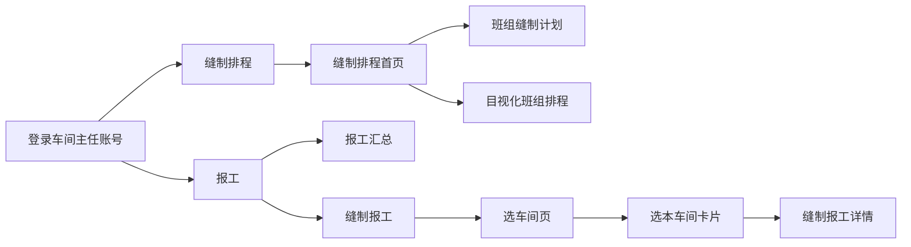
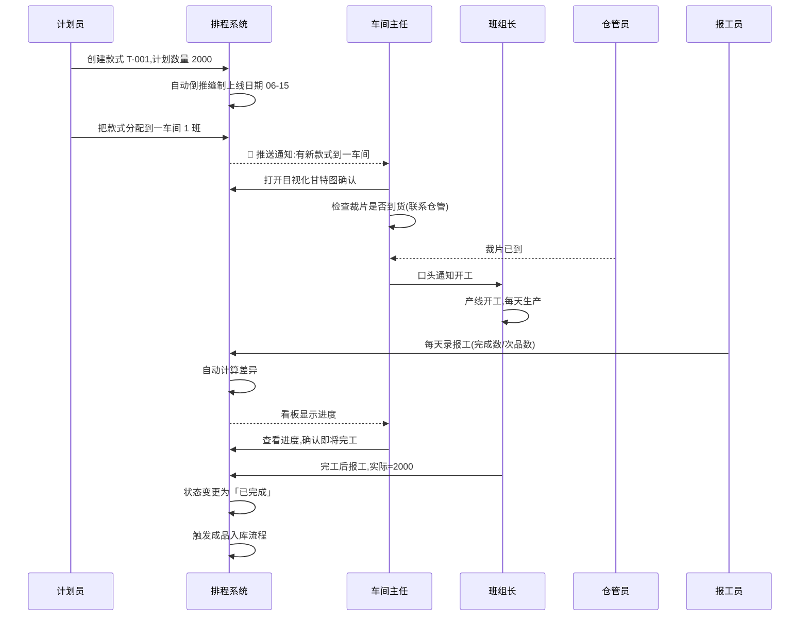
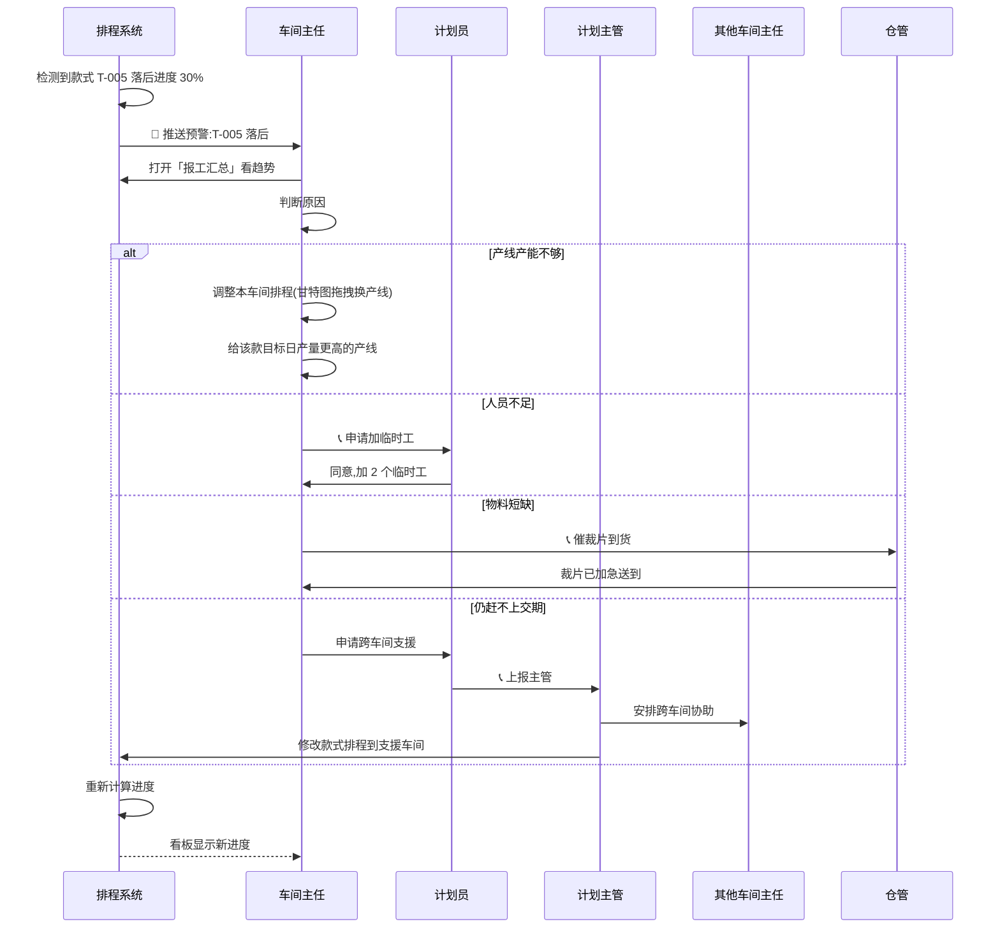
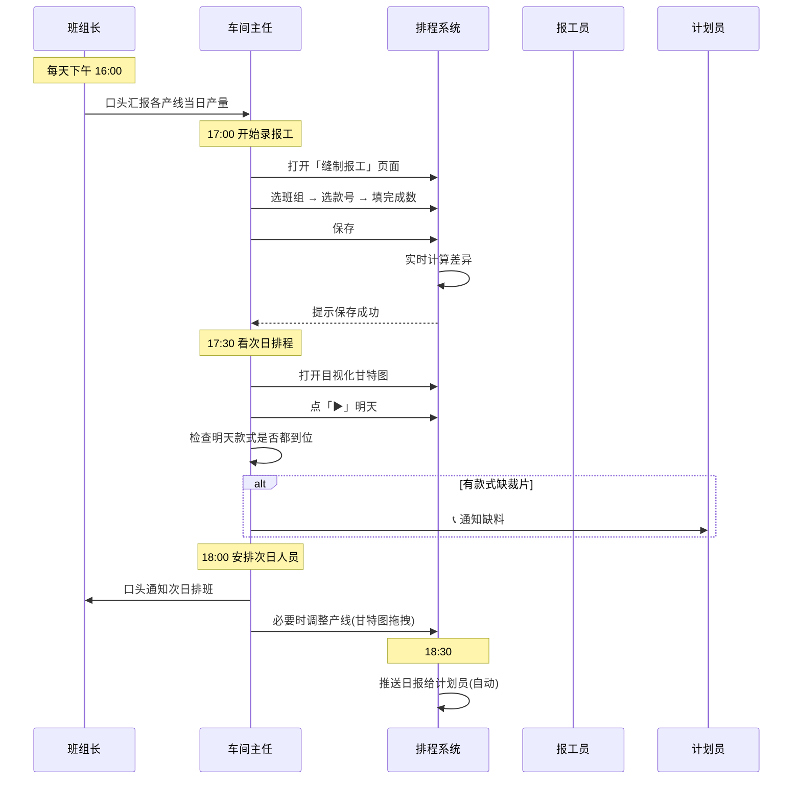
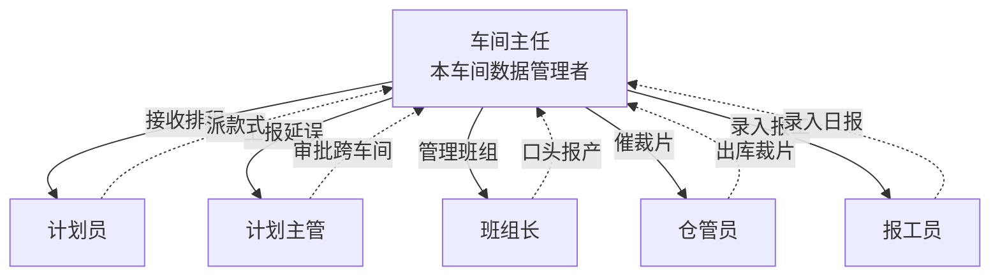

# SOP-06 缝制车间主任

> **适用对象**: 缝制车间主任(本车间数据的管理者,共 5 人,一人一个车间)
> **预计阅读**: 30 分钟
> **难度**: ⭐⭐ (需要熟悉缝制业务,软件部分属入门级)
> **前置阅读**: [SOP-00 总览与登录](./SOP-00-总览与登录.md)(必读)

---

## 一、角色定位

缝制车间主任是 **本车间数据的管理者**,通俗讲就是「5 个车间各自的车间主任,只管自己车间那条流水线」。

### 1.1 工厂背景

柬埔寨制衣工厂,缝制环节一共 **5 个车间**,每个车间配 **1 名车间主任**,分管约 **10 条产线**(全厂共 50 条)。计划员先排款式到车间,车间主任再把任务具体分配到产线,报工员每天录产线实际产出。

### 1.2 数据隔离原则(本 SOP 最核心一条)

```
┌──────────────────────────────────────────────────────────────┐
│  🔴 数据隔离硬规则(违反会导致生产事故)                       │
├──────────────────────────────────────────────────────────────┤
│  • 一车间主任 → 只能看到一车间的产线、款式、报工              │
│  • 二车间主任 → 只能看到二车间,以此类推                       │
│  • 看不到其他 4 个车间的任何数据                               │
│  • 不能改其他车间的款式排程(只能改本车间)                      │
│  • 系统按登录账号自动过滤,无需手动选车间                      │
└──────────────────────────────────────────────────────────────┘
```

💡 **提示**: 登录后看到的车间名字、款式列表、报工数据,都是 **本车间专属**,不是系统坏了。

### 1.3 车间主任的核心职责

| 职责 | 干啥 | 频次 |
|------|------|------|
| 看板查看 | 看本车间排了什么款式、哪天到期 | 每天早班前 |
| 任务分配 | 把款式排到具体产线(目视化甘特图) | 每天 |
| 录报工 | 产线完工后,把数字录进系统 | 每天下班前 |
| 报工修正 | 当天录错或漏录时,修改/补录 | 随时 |
| 异常上报 | 产线故障、人员短缺、延期预警 | 发生时立刻 |
| 数据核对 | 看日报表、对账、找延误原因 | 每天 |

---

## 二、权限范围

车间主任的权限边界很清晰,**数据按车间隔离**,**操作按角色限制**:

### 2.1 能做什么(看 + 录)

| 操作 | 范围 | 说明 |
|------|------|------|
| 查看本车间款式 | ✅ 能 | 主计划里的款式列表 |
| 查看本车间排程 | ✅ 能 | 缝制排程详情 + 目视化甘特图 |
| 查看本车间报工 | ✅ 能 | 报工汇总 + 缝制报工 |
| 查看本车间产线状态 | ✅ 能 | 三层树(车间→班组→品类) |
| 新增/编辑本车间排程 | ✅ 能 | 缝制排程详情里改 |
| 录入/修改/删除本车间报工 | ✅ 能 | 当天报工可改 |
| 导入/导出本车间电子表格 | ✅ 能 | 数据迁移用 |
| 拖动任务条改产线 | ✅ 能 | 目视化甘特图 |

### 2.2 不能做什么(看不到 + 改不了)

| 操作 | 范围 | 说明 |
|------|------|------|
| 看其他车间款式 | ❌ 不能 | 数据隔离 |
| 看其他车间报工 | ❌ 不能 | 数据隔离 |
| 看全厂汇总数据 | ❌ 不能 | 只有计划主管能看 |
| 改其他车间排程 | ❌ 不能 | 数据隔离 |
| 改款式主数据 | ❌ 不能 | 只有计划员能改 |
| 改裁剪/二次加工排程 | ❌ 不能 | 上游工序,由计划员管 |
| 删除其他用户账号 | ❌ 不能 | 只有系统管理员 |
| 改历史报工(隔天) | 🔴 受限 | 当天可改;隔天需计划主管 |

### 2.3 权限矩阵简表

| 模块 | 查看 | 新增 | 编辑 | 删除 | 导出 |
|------|------|------|------|------|------|
| 本车间款式列表 | ✅ | ❌ | ❌ | ❌ | ✅ |
| 本车间缝制排程 | ✅ | ✅ | ✅ | ✅ | ✅ |
| 本车间缝制报工 | ✅ | ✅ | ✅ | ✅ | ✅ |
| 本车间产线管理 | ✅ | ❌ | ❌ | ❌ | ❌ |
| 其他车间所有数据 | ❌ | ❌ | ❌ | ❌ | ❌ |
| 全厂汇总看板 | ❌ | ❌ | ❌ | ❌ | ❌ |

---

## 三、主界面导航

### 3.1 车间主任看到的菜单

```
┌──────────────────────────────────────────────────────────────┐
│  顶栏: [系统图标] 制衣排程系统   🔔 通知  👤 张主任(一车间)  ▼ │
├──────────┬───────────────────────────────────────────────────┤
│          │                                                   │
│  侧边栏   │            主内容区 (随菜单切换)                    │
│          │                                                   │
│ 📊 首页   │                                                   │
│ 👕 款式   │                                                   │
│ 📅 计划   │                                                   │
│ 📆 缝制排程│  ← 重点(本车间)                                  │
│ ✂️ 报工   │  ← 重点(本车间)                                  │
│ 📦 仓库   │                                                   │
│ ⚙️ 设置   │                                                   │
│          │                                                   │
└──────────┴───────────────────────────────────────────────────┘
```

### 3.2 顶栏功能

| 图标 | 功能 | 说明 |
|------|------|------|
| 🔔 通知 | 系统消息 | 报工超时提醒、款式即将到期等 |
| 👤 用户名 | 显示当前账号 | 显示「一车间主任」等字样 |
| ▼ 下拉 | 修改密码 / 退出登录 | 离开工位必退 |

### 3.3 缝制相关菜单入口

缝制车间的所有操作,集中在 **两个一级菜单** 里:



---

## 四、缝制排程首页

### 4.1 用途

进入系统的第一站,显示本车间排程的 **总览数据**,两个入口卡片。

### 4.2 进入路径

```
顶栏「登录」→ 左侧菜单「缝制排程」→ 进入首页
```

### 4.3 页面示意图

```
┌──────────────────────────────────────────────────────────────┐
│  缝制排程                              🚀 一键自动排产         │
├──────────────────────────────────────────────────────────────┤
│                                                              │
│  ┌─────────────────────┐    ┌─────────────────────┐           │
│  │ 📊                  │    │ 📋                  │           │
│  │ 目视化班组排程       │    │ 班组缝制计划         │           │
│  │ 甘特图拖拽排班       │    │ 缝制工序计划与排程管理 │           │
│  │                     │    │                     │           │
│  │ 总任务: 23          │    │ 总任务: 23          │           │
│  │ 本周待处理: 8       │    │ 本周待处理: 8       │           │
│  │ 逾期任务: 2 🔴      │    │ 逾期任务: 2 🔴      │           │
│  │ 最近更新: 06-21 14:30│   │ 最近更新: 06-21 14:30│          │
│  └─────────────────────┘    └─────────────────────┘           │
│                                                              │
└──────────────────────────────────────────────────────────────┘
```

### 4.4 操作步骤

#### 4.4.1 查看首页数据

1. 🟢 登录后自动跳转到首页,或点左侧「缝制排程」
2. 🟢 看到 2 张卡片:「目视化班组排程」「班组缝制计划」
3. 🟢 每张卡片显示 3 个数字:
   - **总任务**: 本车间当前所有未完工的款式数
   - **本周待处理**: 7 天内要开工或正在做的款式数
   - **逾期任务**: 已经超过交期但没完工的款式数(红色警告)

#### 4.4.2 进入排程详情

1. 🟢 点「📋 班组缝制计划」卡片 → 进入排程详情(见第五章)
2. 🟢 点「📊 目视化班组排程」卡片 → 进入甘特图(见第六章)

#### 4.4.3 一键自动排产(谨慎使用)

> ⚠️ **此功能会影响所有 5 个车间,不只本车间**

1. 🟡 点右上角「🚀 一键自动排产」按钮
2. 🟡 系统弹确认框:「将根据预排总计划和当前激活策略,自动分配到缝制产线。确定继续?」
3. 🟡 仔细看提示,确认无误
4. 🟢 点「确定」→ 系统开始排产
5. 🟢 提示「排产完成:XX 条计划已分配到产线」

📞 **找人**: 一般情况下, **不要主动按这个按钮**。自动排产通常由计划员操作,会重新分配全厂所有车间的产线。如果只是想排本车间款式,请用第六章的目视化甘特图拖拽分配。

### 4.5 常见错误

| 现象 | 原因 | 怎么办 |
|------|------|--------|
| 卡片显示「总任务:0」 | 本车间暂无未完工款式 | 正常,等计划员派款式 |
| 「逾期任务:3」红色 | 有 3 款超过交期 | 立刻看甘特图找延误款式(第六章) |
| 页面一直「加载中」 | 网络问题 | 按 Ctrl+F5 强制刷新 |
| 点卡片没反应 | 浏览器卡了 | 关闭重开,或换谷歌浏览器 |

### 4.6 与其他模块联动

- 「总任务」数字 → 来自「班组缝制计划」表(第五章)
- 「本周待处理」→ 筛选条件:今天 ~ 7 天后开工的款式
- 「逾期任务」→ 当前日期 > 计划结束日期 的款式
- 数据 **实时刷新**,计划员或本车间改了排程,这里马上同步

---

## 五、班组缝制计划详情

### 5.1 用途

本车间款式排程的 **核心操作页面**,可以看成「本车间每天每个款式的明细账」。

**白话对比**:
- **以前**: 用电子表格手填款式、日期、每天产量,容易错
- **现在**: 系统按三行模型(计划/实际/差异)展示,每天产量一录就自动算差异

### 5.2 进入路径

```
缝制排程首页 → 点「📋 班组缝制计划」卡片
或 左侧菜单「缝制排程」→「班组缝制计划」
```

### 5.3 页面示意图

```
┌──────────────────────────────────────────────────────────────────────────────┐
│  ← 返回   ◀ 今天 ▶    06-15 ~ 07-12    [+新增排程] [导入表格][导出表格]       │
├──────┬─────┬───────┬──────┬─────┬──────┬────┬─────┬─────┬─────┬───┬───┬──────┤
│ 车间 │ 班组 │ 状态  │ 款号 │ 品名 │ 计划 │ 交期│ 日产│ 开始│ 结束│合计│类型│每天明细...│
├──────┼─────┼───────┼──────┼─────┼──────┼────┼─────┼─────┼─────┼───┼───┼──────┤
│一车间│ 1班 │ 进行中│T-001 │圆领 │ 2000 │0705│ 200 │06-15│06-24│2000│计划│ 计划列...│
│      │     │       │      │     │      │    │     │     │     │ 850│实际│ 实际列...│
│      │     │       │      │     │      │    │     │     │     │-150│差异│ 差异列...│
├──────┼─────┼───────┼──────┼─────┼──────┼────┼─────┼─────┼─────┼───┼───┼──────┤
│一车间│ 2班 │ 待生产│T-002 │翻领 │ 1500 │0710│ 200 │06-20│06-27│1500│计划│ ...  │
│      │     │       │      │     │      │    │     │     │     │   0│实际│ ...  │
│      │     │       │      │     │      │    │     │     │     │   0│差异│ ...  │
└──────┴─────┴───────┴──────┴─────┴──────┴────┴─────┴─────┴─────┴───┴───┴──────┘
```

### 5.4 三行模型说明

每个款式排程展开是 **3 行**:

```
┌────────────────────────────────────────────────────────┐
│  第一行(蓝色标签):「计划」                               │
│  → 系统根据排程起止 + 目标日产量算出每天该做多少          │
│                                                        │
│  第二行(绿色标签):「实际QC1」                            │
│  → 当天产线实际产出数,可在格子直接录入数字               │
│                                                        │
│  第三行(黄色标签):「日差异」                             │
│  → 实际 - 计划,绿色=超前,红色=落后,灰色=未开始          │
└────────────────────────────────────────────────────────┘
```

💡 **提示**: 看到差异行变红色,意味着本车间落后进度,要关注!

### 5.5 操作步骤

#### 5.5.1 查看本车间款式

1. 🟢 打开页面 → 默认显示本车间所有款式(已按车间自动过滤)
2. 🟢 每个款式展开 3 行:计划/实际/差异
3. 🟢 右侧日期网格,今天列紫色高亮
4. 🟢 上下滚动可看历史 + 未来,左右滚动看每天明细

#### 5.5.2 周视图切换

1. 🟢 点「◀」看上一周
2. 🟢 点「今天」回到本周
3. 🟢 点「▶」看下一周

#### 5.5.3 录入当日实际产量(高频操作)

1. 🟢 找到要录的那行(「实际QC1」行)
2. 🟢 在「今天列或之前的列」对应格子 **双击 / 直接输入数字**
3. 🟢 按回车键 → 自动保存,系统提示「修改成功」
4. 🟢 差异行立刻刷新,显示新的差异数

⚠️ **警告**:
- 只能录 **今天及之前** 的实际数,未来日期录不进去
- 一旦录错,只要当天就能改;隔天需要计划主管改

#### 5.5.4 新增排程

1. 🟢 点「+ 新增排程」按钮
2. 🟢 弹窗出现,先点「选择款式」,选好款式(品名/颜色/规格自动带出)
3. 🟢 填「车间」(默认本车间)和「班组」(例如 1 班)
4. 🟢 填「裁床计划数量」「目标日产量」「交期」
5. 🟢 填「缝制上线」(开始日期),缝制下线 **自动算**
6. 🟢 点「创建」→ 提示「创建成功」

🟡 **谨慎**: 「缝制下线」系统自动算,不需要手动填;填了也会被覆盖。

#### 5.5.5 编辑现有排程

1. 🟢 找到要改的那款,点行尾「编辑」按钮
2. 🟢 改成新值(可以改车间、班组、计划数量、目标日产量、日期)
3. 🟢 缝制下线会自动重算
4. 🟢 点「保存」→ 提示「修改成功」

🔴 **禁止**: 已完工的款式(状态显示「已完成」)不要乱改,会破坏下游数据。

#### 5.5.6 删除排程

1. 🟡 点行尾「删除」按钮
2. 🟡 系统弹确认框「确定删除?」
3. 🟢 点「确定」→ 删除成功
4. 🟢 列表自动刷新

🔴 **禁止**: 已经有报工数据的款式,删之前先和计划员确认,否则历史报工会变成「孤儿数据」。

#### 5.5.7 导入/导出表格

**导出**:
1. 🟢 (可选)在表头筛选条件缩窄范围
2. 🟢 点「导出表格」→ 浏览器下载一个表格文件
3. 💡 文件名默认是 `缝制排程.xlsx`

**导入**:
1. 🟢 点「导入表格」按钮
2. 🟢 选择模式:「跳过重复」或「覆盖已有」
3. 🟢 上传表格文件(大小不超过 5MB)
4. 🟢 点「解析预览」→ 看到预览列表
5. 🟢 确认无误 → 点「确认导入」
6. 🟢 提示「导入完成:X 条,跳过 Y 条」

⚠️ **警告**: 表格模板字段顺序必须按系统格式(车间/班组/款号/品名/裁床计划数量/交期/目标日产量/缝制开始/缝制结束),否则解析失败。

### 5.6 列筛选与排序

表头每列右上角有个 **漏斗图标** 🪣,点开可筛选:

| 操作 | 效果 |
|------|------|
| 文字筛选 | 勾选要显示的款号 / 班组 / 车间等 |
| 数字筛选 | 设置数量范围(如计划数量 ≥ 1000) |
| 日期筛选 | 设置起止日期范围 |
| 排序 | 点列名,升序 / 降序切换 |

🟢 想清空所有筛选 → 刷新页面(F5)即可重置。

### 5.7 状态标签说明

| 标签颜色 | 文字 | 含义 |
|----------|------|------|
| 灰色 | 待生产 | 还没到缝制上线日期 |
| 蓝色 | 进行中 | 已开工,还没完工 |
| 绿色 | 已完成 | 已完成全部计划数量 |

每个状态标签下方还有 **进度条**,直观显示完成百分比。

### 5.8 常见错误

| 现象 | 原因 | 怎么办 |
|------|------|--------|
| 双击格子没反应 | 浏览器卡了 | 刷新页面,或换谷歌浏览器 |
| 输入数字保存后消失 | 表格格式问题 | 检查表格是否有合并单元格 |
| 「缝制下线」算出来不对 | 计划数量 / 日产量填错 | 回头检查数值 |
| 看不到其他款式 | 数据隔离 | 正常,本车间就这样 |
| 看到「未来日期不能录」 | 想录明天的数 | 不行,只能录今天和之前的 |
| 状态一直「待生产」 | 没到开工日期 | 正常,等开始日期到了自动变 |

### 5.9 与其他模块联动

- **款式主数据**: 这里的款号来自「款式管理」,款式改名这里跟着变
- **目视化甘特图**: 这边的明细,会以任务条形式显示在甘特图
- **报工数据**: 在「实际QC1」行录的数,会同步到「报工汇总」
- **裁床计划数量**: 来自上游裁剪排程,改裁剪会带动这里
- **数据权限**: 仅显示本车间款式,改不了其他车间

---

## 六、目视化班组排程(甘特图)

### 6.1 用途

把本车间所有款式 **以甘特图形式可视化**,可以直观看到每天每条产线排了什么,**支持鼠标拖动分配和调整**。

**白话对比**:
- **以前**: 在纸上看排程表,不能直观看出产线冲突
- **现在**: 鼠标拖一下,款式就排到产线上了

### 6.2 进入路径

```
缝制排程首页 → 点「📊 目视化班组排程」卡片
```

### 6.3 页面示意图

```
┌────────────────────────────────────────────────────────────────────┐
│  ← 返回  [全部车间▼][全部类别▼][搜班组/类别]   ◀ 今天 ▶  06-15~07-12 [刷新] │
├─────────────────┬──────────────────────────────────────────────────┤
│                 │ 06-15 06-16 06-17 ... 06-24(今天) ... 07-12         │
│ 待排班款式      │ ──────────────────────────────────────────────── │
│ ┌──────────┐   │                                                  │
│ │T-003     │   │ 一车间                                          │
│ │翻领短袖  │   │ ──────────────────────────────────────────────── │
│ │2000件    │   │ 1班 [▓▓▓▓▓ T-001 圆领 06-15~06-24]              │
│ │交期 0712 │   │ 2班 [▓▓▓ T-002 翻领 06-20~06-27]                │
│ └──────────┘   │ 3班 [▓▓▓▓ T-005 背心 06-22~07-01]              │
│                 │ ──────────────────────────────────────────────── │
│ ┌──────────┐   │                                                  │
│ │T-006     │   │ 故障产线(红色,不能拖任务进去)                     │
│ │圆领背心  │   │ ──────────────────────────────────────────────── │
│ │1500件    │   │ 8班  [故障 暂时不可用]                            │
│ │交期 0715 │   │                                                  │
│ └──────────┘   │                                                  │
└─────────────────┴──────────────────────────────────────────────────┘
```

### 6.4 操作步骤

#### 6.4.1 查看本车间款式

1. 🟢 进入页面 → 默认显示本车间所有车间和产线
2. 🟢 左侧「待排班款式」: **还没分配到产线** 的款式
3. 🟢 右侧甘特图: 按车间 → 产线 → 日期排列,每个款式是一个 **紫色任务条**

#### 6.4.2 筛选本车间数据

1. 🟢 「全部车间」下拉框 → 选本车间名字(一车间 / 二车间...)
2. 🟢 「全部类别」下拉框 → 按品类过滤(如「短袖」「背心」)
3. 🟢 「搜班组」输入框 → 输入班组名或类别名,实时筛选
4. 🟢 想清空筛选 → 点「✕ 清除」

💡 **提示**: 筛选后只显示 **本车间** 数据(因为车间主任账号本身已隔离),如果筛选后没有数据,说明本车间没款式。

#### 6.4.3 排款式到产线(拖拽分配)

这是 **最常用的功能**,把待排班款式拖到具体产线:

```
步骤 1: 鼠标按住左侧「待排班款式」的某一款
步骤 2: 拖到右侧甘特图某条产线上
步骤 3: 松开鼠标
步骤 4: 系统提示「排班成功:06-15 ~ 06-24,日产量 200 件」
步骤 5: 款式自动从左侧消失,出现在该产线的甘特图上
```

💡 **提示**: 系统自动算开始/结束日期,按本产线的日产能计算;不必手动填日期。

⚠️ **警告**:
- 故障产线(标红的)拖不进去,系统会拒绝
- 同一条产线一天只能排一个款式,系统会自动避开冲突

#### 6.4.4 调整款式所在产线(跨产线移动)

款式已排在某产线,但想换到别的产线:

```
步骤 1: 鼠标按住甘特图上的任务条(不是左侧的款式)
步骤 2: 拖到另一条产线
步骤 3: 松开鼠标
步骤 4: 系统提示「移动成功:XX-XX ~ XX-XX,日产量 XXX 件」
```

🟡 **谨慎**: 跨产线移动会重新算日期;如果原产线已部分开工,移动后会重新排程,可能影响报工数据。**最好和班组长口头沟通后再移**。

#### 6.4.5 取消排班(从产线移回待排)

1. 🟡 **双击** 甘特图上的任务条
2. 🟡 系统弹确认框「确定取消该排班?」
3. 🟢 点「确定」→ 款式从该产线移除,回到左侧「待排班」

🔴 **禁止**: 已经开工产线(已录报工)的款式取消后,之前的报工数据会变成「孤儿数据」。**必须先和计划员确认**。

#### 6.4.6 周视图切换

1. 🟢 点「◀」看上一周
2. 🟢 点「今天」回到本周
3. 🟢 点「▶」看下一周

默认显示「今天前 1 周 ~ 今天后 3 周」,共 4 周。

#### 6.4.7 故障产线识别

产线状态显示「故障」时:

```
┌──────────────────────────────────────────┐
│  故障产线的样子:                          │
│  • 行底色: 浅红色                         │
│  • 任务条: 变灰色(失效)                  │
│  • 标牌: 「故障」红色小标                 │
│  • 鼠标拖不进去                          │
└──────────────────────────────────────────┘
```

📞 **找人**: 产线故障一般是计划员或系统管理员标的状态;如果系统没标但产线真坏了,联系计划员手动标。

### 6.5 常见错误

| 现象 | 原因 | 怎么办 |
|------|------|--------|
| 拖款式没反应 | 浏览器兼容性 | 用谷歌浏览器或微软 Edge 浏览器 |
| 拖到故障产线被拒绝 | 该产线状态为「故障」 | 换条产线,或联系计划员修产线 |
| 拖完没变化 | 款式已存在该产线 | 正常,系统自动跳过 |
| 看不到任务条 | 款式日期不在当前周 | 点「◀」往前翻,或点「今天」 |
| 拖动任务条失败 | 鼠标在文字上 | 把鼠标放在任务条的空白处拖 |
| 「移动成功」但日期变了 | 系统按新产线产能重算 | 正常,系统自动优化排期 |

### 6.6 与其他模块联动

- **缝制排程详情**: 这里的拖拽操作,会同步在「班组缝制计划」详情表里
- **款式主数据**: 左侧待排班款式来自款式表(本车间)
- **产线三层树**: 产线名字来自「缝制车间管理」(第八章)
- **数据权限**: 只显示本车间款式和产线

---

## 七、报工汇总

### 7.1 用途

**本车间所有产线每天报工数据的统计页**,可以按产线/工人/日期/款式等多个维度看数据,**支持图表分析**。

### 7.2 进入路径

```
左侧菜单「报工」→「报工汇总」
或 左侧菜单「缝制排程」内的链接
```

### 7.3 页面示意图

```
┌──────────────────────────────────────────────────────────────────┐
│  缝制报工 · 一车间              [+新增报工] [批量导入] [导出表格]  │
├──────────────────────────────────────────────────────────────────┤
│  ┌─────────┐ ┌─────────┐ ┌─────────┐ ┌─────────┐                  │
│  │ 12,350  │ │   45    │ │  99.6%  │ │   3 🔴  │                  │
│  │总完成   │ │总次品   │ │合格率   │ │预警数   │                  │
│  └─────────┘ └─────────┘ └─────────┘ └─────────┘                  │
├──────────────────────────────────────────────────────────────────┤
│  筛选: [款号____] [开始日期] [结束日期]   [↻刷新]                 │
├──────────────────────────────────────────────────────────────────┤
│  [明细列表][按产线][按车间][按工人][趋势图][计划vs实际]            │
├──────────────────────────────────────────────────────────────────┤
│  生产日期 │ 款号    │ 车间 │ 班组 │ 完成 │ 次品│ 合格率│ 操作      │
│  06-21   │ T-001  │一车间│ 1班 │  200 │  2  │ 99%   │ 编辑 删除  │
│  06-20   │ T-001  │一车间│ 1班 │  180 │  1  │ 99%   │ 编辑 删除  │
│  06-19   │ T-001  │一车间│ 1班 │  195 │  3  │ 98%   │ 编辑 删除  │
└──────────────────────────────────────────────────────────────────┘
```

### 7.4 操作步骤

#### 7.4.1 查看本车间报工数据

1. 🟢 进入页面 → 默认显示本车间所有报工
2. 🟢 顶部 4 个汇总卡片:
   - **总完成**: 累计完成件数
   - **总次品**: 累计次品件数
   - **合格率**: 完成数 / (完成 + 次品)
   - **预警数**: 落后进度的款式数(红色警示)

3. 🟢 默认 Tab 是「明细列表」,显示每天每款每班组的报工

#### 7.4.2 筛选数据

1. 🟢 「款号」输入框 → 输入完整或部分款号
2. 🟢 「开始日期」/「结束日期」→ 选日期范围
3. 🟢 筛选实时生效,列表自动更新

#### 7.4.3 多 Tab 切换分析

页面有 **6 个 Tab**,每个视角不同:

| Tab | 用途 | 看什么 |
|-----|------|--------|
| 明细列表 | 每天每款每班组的原始数据 | 详细报工记录 |
| 按产线 | 按班组汇总 | 哪个班做得多 |
| 按车间 | 按车间对比(本车间) | 总产量对比 |
| 按工人 | 按工人个人产量 | 工人绩效 |
| 趋势图 | 每天完成数折线图 | 看走势 |
| 计划vs实际 | 款式维度对比柱状图 | 落后/超前一目了然 |

**示例:看趋势图**

1. 🟢 点「趋势图」Tab
2. 🟢 系统加载 30 天数据(默认)
3. 🟢 蓝色线:每天完成数;红色线:每天次品数
4. 🟢 鼠标悬停看具体日期的数字

**示例:看计划vs实际**

1. 🟢 点「计划vs实际」Tab
2. 🟢 系统加载本车间所有款式
3. 🟢 柱状图:灰色 = 计划数,蓝色 = 实际数
4. 🟢 下面有进度条,显示完成百分比

#### 7.4.4 新增单条报工

1. 🟢 点「+新增报工」按钮
2. 🟢 弹窗出现,填写:
   - **款号**: 选款式(自动带出品名/颜色/规格)
   - **生产日期**: 默认今天,可改
   - **完成数量**: **必填,大于 0**
   - **次品数量**: 选填,默认 0
   - **班组**: 自动带出(基于款号的排程)
   - **车间**: **自动填本车间,不能改**(数据隔离)
   - **备注**: 选填
3. 🟢 点「保存」→ 提示「保存成功」

🟡 **谨慎**: 「车间」字段是固定的,系统按登录账号自动填,不能手动改成其他车间。

#### 7.4.5 编辑报工

1. 🟢 找到要改的那条 → 点「编辑」按钮
2. 🟢 弹出同样的表单,数值已带出
3. 🟢 改数字 → 点「保存」

⚠️ **警告**: 隔天报工原则上不让车间主任改,如需修改请联系计划主管。

#### 7.4.6 删除报工

1. 🟡 点「删除」按钮
2. 🟡 系统弹确认框「确定删除吗?」
3. 🟢 点「确定」→ 删除成功

🔴 **禁止**: 批量删除前必须和计划员确认;一旦删除无法恢复。

#### 7.4.7 批量导入报工

1. 🟢 点「批量导入」按钮
2. 🟢 下载模板 → 按模板格式填数据(产线/班组/款号/日期/完成数/次品数)
3. 🟢 上传表格 → 系统解析预览
4. 🟢 确认 → 批量入库

⚠️ **警告**: 表格中的「车间」必须填本车间,否则会被系统过滤掉。

#### 7.4.8 导出表格

1. 🟢 (可选)先筛选要导出的数据
2. 🟢 点「导出表格」→ 浏览器下载一个表格文件

### 7.5 预警款式列表

如果 **有预警款式**(落后进度的款式),明细列表下方会出现一个 **红色表格**:

```
┌─────────────────────────────────────────────────────────┐
│  ⚠️ 滞后款预警 (3 款)                                    │
├─────────────────────────────────────────────────────────┤
│  款号    │ 类型 │ 计划数 │ 实际数 │ 进度 │ 计划结束日期 │
│  T-005  │ 缝制 │  2000  │  500   │ 25%  │   06-30      │
│  T-008  │ 缝制 │  1500  │  200   │ 13%  │   06-28      │
└─────────────────────────────────────────────────────────┘
```

📞 **找人**: 看到这些款式,立刻安排加班或调整产线,严重的联系计划员跨车间支援。

### 7.6 常见错误

| 现象 | 原因 | 怎么办 |
|------|------|--------|
| 列表是空的 | 还没录报工 | 先去「缝制报工」录(第八章) |
| 完成数显示负数 | 历史录错 | 联系计划主管改 |
| 合格率异常低 | 大量次品 | 正常,联系品控 |
| Tab 切换转圈圈 | 网络卡 | 稍等再试 |
| 导出文件打不开 | 表格软件问题 | 用微软电子表格软件打开 |
| 看不到预警款式 | 当前数据无预警 | 正常,说明都在按计划走 |

### 7.7 与其他模块联动

- **缝制报工**: 这里看到的明细,就是「缝制报工」录入的数据汇总
- **款式主数据**: 款号来自款式表
- **缝制排程**: 实际数 vs 计划数 对比,显示款式是否落后
- **数据权限**: 只显示本车间报工

---

## 八、缝制报工(本车间录数)

> 本章是 **车间主任最常用的录数页面**。每天下班前都要把当天产线产量录进去。

### 8.1 用途

**专门给缝制车间主任录当日报工**,比第七章的「报工汇总」更聚焦、更快捷。

### 8.2 进入路径

缝制报工有 **两步导航**:

```
步骤 1: 左侧菜单「报工」→「缝制报工」
步骤 2: 进入「选车间页」(即选车间卡片那一页)
步骤 3: 点本车间卡片(例如「一车间」)
步骤 4: 进入缝制报工详情(本车间专属)
```

```
┌────────────────────────────────────────────────────────┐
│  「选车间页」样子                                       │
│                                                        │
│  ← 返回                                                │
│           缝制报工                                      │
│      选择车间查看和录入报工数据                          │
│                                                        │
│  ┌──────────┐  ┌──────────┐  ┌──────────┐              │
│  │ 🏭       │  │ 🏭       │  │ 🏭       │              │
│  │ 一车间   │  │ 二车间   │  │ 三车间   │   →         │
│  │          │  │          │  │          │              │
│  └──────────┘  └──────────┘  └──────────┘              │
│                                                        │
└────────────────────────────────────────────────────────┘
```

💡 **提示**: 车间主任账号其实只能看到本车间,但系统还是显示了 5 个车间卡片(因为通用入口);直接点本车间即可。

### 8.3 缝制报工详情页(本车间)

进入本车间后的页面示意图:

```
┌────────────────────────────────────────────────────────────────┐
│  ← 返回      🧵 缝制报工 · 一车间           [+ 新增报工]        │
├────────────────────────────────────────────────────────────────┤
│  ┌─────────┐  ┌──────────┐                                       │
│  │   15    │  │  2,350   │                                       │
│  │  报工记录│  │ 累计完成 │                                       │
│  └─────────┘  └──────────┘                                       │
├────────────────────────────────────────────────────────────────┤
│  车间 │ 班组 │ 款号   │ 品名      │ 完成 │ 次品│ 日期  │ 录数时间│ 操作│
│  ────────────────────────────────────────────────────────────────│
│  一车间│ 1班 │ T-001 │ 圆领短袖   │ 200 │  2  │ 06-21 │ 14:30 │ 删除│
│  一车间│ 1班 │ T-001 │ 圆领短袖   │ 180 │  1  │ 06-20 │ 14:25 │ 删除│
│  一车间│ 2班 │ T-002 │ 翻领短袖   │ 195 │  3  │ 06-21 │ 14:35 │ 删除│
└────────────────────────────────────────────────────────────────┘
```

### 8.4 操作步骤

#### 8.4.1 新增报工(本车间核心操作)

1. 🟢 点「+ 新增报工」按钮
2. 🟢 弹窗出现:
   ```
   ┌────────────────────────────────────┐
   │  新增报工                           │
   ├────────────────────────────────────┤
   │  选择班组: [▼  1班          ]    │
   │  车间:    [一车间](自动,不能改)   │
   │  款号:    [▼  T-001 圆领短袖 ]    │
   │  品名:    圆领短袖(自动带出)       │
   │  班组:    1班(选款后自动带出)      │
   │  日期:    [2026-06-21](默认今天)   │
   │  完成数量:[200](必填,> 0)         │
   │  次品数量:[2](选填)               │
   │  备注:    [____________________]   │
   │                                    │
   │         [取消]      [保存]         │
   └────────────────────────────────────┘
   ```
3. 🟢 选班组 → 选款号(品名自动带出)
4. 🟢 填完成数量(必填)
5. 🟢 (选填)填次品数量和备注
6. 🟢 点「保存」→ 提示「报工成功」

💡 **提示**: 「车间」字段自动填本车间,不能改。这是数据隔离的体现。

#### 8.4.2 删除报工

1. 🟡 在记录行尾点「删除」按钮
2. 🟡 系统弹确认框「确定删除这条报工记录?」
3. 🟢 点「确定」→ 删除成功

🔴 **禁止**: 隔天的报工请勿随意删除,会影响日报统计。

#### 8.4.3 数据排序

默认按 **生产日期倒序** 排列(最近的在上)。可以通过日期筛选找到历史数据。

### 8.5 选班组 → 选款号的逻辑

录入报工时,有 **两种进入方式**:

```
方式 A: 先选班组 → 款号列表自动过滤该班组下的款式
方式 B: 直接选款号 → 班组字段自动带出
```

💡 **提示**: 选班组后款号会少很多,方便快速找到要录的那款。建议优先用方式 A。

### 8.6 常见错误

| 现象 | 原因 | 怎么办 |
|------|------|--------|
| 款号下拉框空的 | 本车间没排该款式 | 检查「班组缝制计划」是否有款式 |
| 「完成数量必须大于 0」 | 填了 0 或负数 | 改填实际数字 |
| 「请选择款号」 | 没选款号 | 必须先选款号 |
| 弹窗里车间显示空 | 账号数据问题 | 联系系统管理员 |
| 保存失败 | 网络问题 | 稍等再试,数据没丢 |

### 8.7 与其他模块联动

- **款式主数据**: 款号下拉框来自款式表(本车间款式)
- **缝制排程详情**: 款号自动带出品名/班组
- **报工汇总**: 这里录的数,会实时汇总到「报工汇总」页面
- **差异计算**: 录完数据,「班组缝制计划」详情表的「实际QC1」行 + 「日差异」行自动更新
- **数据权限**: 仅显示本车间款式和班组

---

## 九、缝制车间管理(产线三层树)

### 9.1 用途

查看本车间产线的 **三层结构**:车间 → 班组 → 款式分类。车间主任只读,不能改。

### 9.2 进入路径

```
左侧菜单「缝制排程」→「缝制车间管理」
(实际权限下,车间主任看到的是只读视图)
```

### 9.3 三层结构示意

```
┌────────────────────────────────────────────────────────┐
│  一车间                                                │
│  ├─ 1班                                               │
│  │   ├─ 短袖                                          │
│  │   ├─ 长袖                                          │
│  │   └─ 背心                                          │
│  ├─ 2班                                               │
│  │   ├─ 短袖                                          │
│  │   └─ 翻领                                          │
│  ├─ 3班                                               │
│  │   └─ 短裤                                          │
│  └─ ...                                               │
└────────────────────────────────────────────────────────┘
```

### 9.4 操作步骤

1. 🟢 进入页面 → 默认显示 5 个车间的三层树
2. 🟢 看到车间名字、班组名字、款式分类
3. 🟢 数字列「日产」显示每条产线的日产能

🟡 **谨慎**: 车间主任账号在大多数情况下 **只有查看权限**,不能新增 / 编辑 / 删除。如果需要调整产线结构,联系计划主管或系统管理员。

### 9.5 常见错误

| 现象 | 原因 | 怎么办 |
|------|------|--------|
| 看不到本车间 | 账号没绑车间 | 联系系统管理员 |
| 想加班组但没按钮 | 没编辑权限 | 联系计划主管 |
| 「日产」显示 0 | 该产线没设日产能 | 联系系统管理员配置 |

### 9.6 与其他模块联动

- **目视化甘特图**: 产线名字从这里取
- **缝制排程详情**: 班组从这里取
- **款式分类**: 款式可以归类到具体的产线类别

---

## 十、端到端核心流程

下面 3 个流程覆盖车间主任的 **核心工作场景**,每个都有完整的 Mermaid 流程图。

### 10.1 流程一:本车间接单到完工

> 这是车间主任最完整的工作流:接到款式 → 分配产线 → 报工 → 完工。



**流程说明**:

1. 🟢 **接单阶段**: 计划员创建款式并分配到本车间,系统推送通知
2. 🟢 **备料阶段**: 车间主任确认裁片到货(联系仓管)
3. 🟢 **分配阶段**: 通过甘特图确认款式在产线上(可能需要拖拽调整)
4. 🟢 **开工阶段**: 口头通知班组长,产线开工
5. 🟢 **报工阶段**: 每天录报工,系统自动算差异
6. 🟢 **完工阶段**: 报工完成后,状态变更为「已完成」,系统自动触发入库

### 10.2 流程二:本车间延误处理

> 看板发现延误 → 调整本车间 → 申请支援 / 加班。



**流程说明**:

1. 🟢 **发现延误**: 看板红色预警 / 报工汇总显示滞后
2. 🟢 **判断原因**: 产能、人员、物料三大类
3. 🟢 **本车间能解决**: 用甘特图拖拽调整产线 / 申请加班
4. 🟢 **需要外部支援**: 联系计划员 → 计划主管 → 跨车间协助
5. 🟢 **系统跟进**: 重新计算进度,看板实时更新

### 10.3 流程三:本车间日报

> 每天下班前的标准动作:录完数 → 看次日排程 → 安排明天。



**流程说明**:

1. 🟢 **17:00 前**: 班组长口头汇报当天产量
2. 🟢 **17:00-17:30**: 车间主任在系统录入报工
3. 🟢 **17:30-18:00**: 看次日排程,提前发现问题
4. 🟢 **18:00 后**: 安排次日人员和产线
5. 🟢 **系统自动**: 18:30 后系统自动推送日报给计划员

---

## 十一、跨模块协作

车间主任不是孤军作战,需要和 **4 类人** 紧密配合。

### 11.1 协作关系图



### 11.2 与计划员协作(排程接收)

| 场景 | 谁主动 | 怎么协作 |
|------|--------|----------|
| 新款式分配到本车间 | 计划员通知 | 系统自动推送,车间主任去甘特图确认 |
| 款式调整交期 | 计划员通知 | 系统自动推送,车间主任看新日期 |
| 款式取消 | 计划员通知 | 车间主任取消本车间任务分配 |
| 款式数量修改 | 计划员通知 | 车间主任看新数量,必要时调整产线 |

📞 **找人**: 计划员 3 人,各自负责不同款式。具体的对接人由计划主管分配。

### 11.3 与计划主管协作(跨车间协调)

| 场景 | 谁主动 | 怎么协作 |
|------|--------|----------|
| 跨车间支援申请 | 车间主任上报 | 主管审批后安排其他车间协助 |
| 历史报工修改 | 车间主任申请 | 主管审批后可改 |
| 产线结构变更 | 车间主任申请 | 主管审批后改三层树 |
| 紧急加班申请 | 车间主任申请 | 主管审批 |

📞 **找人**: 计划主管是 **全厂排程的总指挥**,遇到跨车间问题第一时间找他。

### 11.4 与班组长协作(本车间内部)

| 场景 | 谁主动 | 怎么协作 |
|------|--------|----------|
| 每日产量汇报 | 班组长口头 | 车间主任据此录报工 |
| 款式开工通知 | 车间主任口头 | 班组长安排产线 |
| 产线调整通知 | 车间主任口头 | 班组长调整人员 |
| 产线故障上报 | 班组长口头 | 车间主任联系计划员标故障 |
| 次品异常上报 | 班组长口头 | 车间主任联系品控 |

💡 **提示**: 班组长不是系统用户,口头沟通为主。

### 11.5 与仓管员协作(裁片领料)

| 场景 | 谁主动 | 怎么协作 |
|------|--------|----------|
| 裁片出库 | 仓管员送到车间 | 车间主任接收并核对 |
| 裁片短缺 | 仓管员通知 | 车间主任联系计划员延期 |
| 裁片品质异常 | 车间主任通知 | 仓管员联系上游 |

📞 **找人**: 仓管员 2 人,白天班。

### 11.6 与报工员协作(本车间录数)

| 场景 | 谁主动 | 怎么协作 |
|------|--------|----------|
| 当日报工录入 | 报工员录入 | 系统实时同步,车间主任可看 |
| 漏录补录 | 车间主任联系 | 报工员补录或车间主任自己补 |
| 错误修改 | 车间主任改当天 | 隔天联系计划主管 |

💡 **提示**: 部分车间的报工员直接由车间主任承担,直接用第八章的「缝制报工」录数即可。

### 11.7 协作关键时点

| 时间 | 必做 | 协作对象 |
|------|------|----------|
| 早班 08:00 | 看本车间当日款式 | 计划员 |
| 上午 10:00 | 检查款式开工情况 | 班组长 |
| 中午 12:00 | 看趋势,处理预警 | 计划员(如有延误) |
| 下午 16:00 | 收日报,准备录数 | 班组长 |
| 下午 17:00 | 录报工 | 报工员 / 自己 |
| 下午 17:30 | 看次日排程 | 计划员(如有缺料) |
| 下午 18:00 | 安排次日人员 | 班组长 |
| 任意时间 | 处理预警 | 计划员 / 主管 |

---

## 十二、常见问题(FAQ)

### Q1: 我登录后看不到任何款式,是系统坏了吗?

**答**: 不是系统坏了,是 **数据隔离**。车间主任账号只能看到本车间款式。

```
┌────────────────────────────────────────────────────┐
│  排查顺序:                                         │
│  [1] 计划员有没有给本车间派款式?                    │
│      没有 → 联系计划员,等款式分配                  │
│      有 →                                       │
│  [2] 本车间有款式但显示 0?                         │
│      → 看「班组缝制计划」表是否有数据              │
│      → 没有 → 联系计划员确认款式是否还在其他车间  │
│  [3] 都确认了还是看不到?                            │
│      → 联系系统管理员查账号权限                    │
└────────────────────────────────────────────────────┘
```

### Q2: 我能看到二车间的款式吗?为什么显示「权限不足」?

**答**: **不能**。车间主任的数据权限是 **按车间硬隔离** 的,这是工厂的安全策略,防止误操作其他车间数据。

```
┌────────────────────────────────────────────────────┐
│  🔴 数据隔离硬规则:                                │
│  • 一车间主任 → 只能看到一车间                     │
│  • 二车间主任 → 只能看到二车间                     │
│  • 想看其他车间数据 → 找计划主管                  │
│  • 觉得权限不对 → 找系统管理员                    │
└────────────────────────────────────────────────────┘
```

### Q3: 「报工汇总」看到的款式,有些不是本车间的怎么办?

**答**: 不可能。「报工汇总」是按登录账号自动过滤的,如果看到非本车间数据,说明系统出问题,**立刻截图联系系统管理员**。

### Q4: 我录了报工,但系统提示「未来日期不能录」

**答**: 报工只能录 **今天和之前** 的日期,不能录明天。

```
原因: 系统按业务规则限制,防止提前造假数据
解决: 录当天数据即可;明天到了再录
```

### Q5: 「目视化甘特图」拖款式到产线失败

**答**: 可能是以下几种原因:

| 原因 | 现象 | 解决 |
|------|------|------|
| 目标产线故障 | 行底色红色 | 换其他产线 |
| 款式已存在该产线 | 系统提示「已存在」 | 正常,系统跳过 |
| 浏览器兼容 | 拖拽无反应 | 换谷歌浏览器 |
| 网络中断 | 提示「移动失败」 | 检查网络后重试 |

### Q6: 我发现款式落后进度,怎么紧急处理?

**答**: 三步走:

```
步骤 1: 看「报工汇总」预警款式列表,找出具体款式
步骤 2: 打开目视化甘特图,拖款式到日产量更高的产线
步骤 3: 如果本车间产线都满,联系计划员申请跨车间支援
```

📞 **找人**: 严重延误(差 30% 以上) → 立刻联系计划主管。

### Q7: 排程里的「缝制下线」日期不对,怎么改?

**答**: 「缝制下线」是系统自动算的(开始 + 数量 / 日产量)。

```
如果日期不对:
  → 检查「裁床计划数量」「目标日产量」「缝制上线」是否填错
  → 改这三项中的任意一项,系统自动重算「缝制下线」
```

⚠️ **警告**: 不要直接改「缝制下线」,会被自动覆盖。

### Q8: 「一键自动排产」按钮我可以按吗?

**答**: **不建议**。这个按钮会重新分配 **全厂所有车间** 的产线。

```
如果只是想排本车间款式:
  → 用「目视化甘特图」拖拽(第六章)
  → 不会影响其他车间

如果确实要按「一键自动排产」:
  → 必须先和计划员沟通
  → 确认全厂计划调整方案后再按
```

🔴 **禁止**: 没和计划员沟通前 **不要按**「一键自动排产」。

### Q9: 我的密码忘了怎么办?

**答**: 联系系统管理员重置。

```
步骤:
  [1] 找系统管理员(当面或电话)
  [2] 提供您的账号(一车间主任 → 工号)
  [3] 管理员重置为临时密码
  [4] 登录后立刻改密码(SOP-00 第七章)
```

### Q10: 录报工时款号下拉框空的,怎么办?

**答**: 本车间没排该款式,系统显示空。

```
排查:
  [1] 该款式是否在本车间排程里?
      → 看「班组缝制计划」(第五章)
  [2] 是 → 但下拉框没显示 → 刷新页面
  [3] 否 → 可能是款式还没分配到本车间,联系计划员
```

### Q11: 我录了报工,但「班组缝制计划」详情表没更新

**答**: 系统有 1-2 分钟延迟。

```
排查:
  [1] 等 1-2 分钟,刷新页面
  [2] 还没显示 → 检查录的时间是否在今天/之前
  [3] 还没显示 → 联系系统管理员看接口日志
```

### Q12: 「目视化甘特图」里看到的款式比「班组缝制计划」少

**答**: 这是正常现象。甘特图只显示 **已分配到产线** 的款式。

```
「班组缝制计划」= 所有款式(含未分配)
「目视化甘特图」= 已分配到产线的款式

所以「班组缝制计划」会 ≥「目视化甘特图」
```

---

## 十三、紧急情况处理

### 13.1 产线故障

```
┌────────────────────────────────────────────────────────────┐
│  产线故障处理流程(5 分钟内必做)                            │
├────────────────────────────────────────────────────────────┤
│  1. 口头通知班组长停机,记录故障时间                          │
│  2. 联系计划员,说明故障产线 + 影响款式                       │
│  3. 计划员在系统里把该产线标为「故障」                       │
│  4. 车间主任用目视化甘特图把该款式拖到其他产线               │
│  5. 故障修复后,通知计划员取消「故障」状态                   │
└────────────────────────────────────────────────────────────┘
```

📞 **找人**: 严重故障(全车间停)→ 立刻联系 **计划主管**。

### 13.2 人员短缺

```
┌────────────────────────────────────────────────────────────┐
│  人员短缺处理流程                                          │
├────────────────────────────────────────────────────────────┤
│  1. 统计缺几个人、缺几天                                   │
│  2. 短期缺(1-2 天)→ 内部调配(其他班组借人)               │
│  3. 长期缺(3 天以上)→ 联系计划员申请临时工                │
│  4. 临时工仍不够 → 联系计划主管跨车间协调                  │
│  5. 在系统里调低「目标日产量」(如有需要)                    │
└────────────────────────────────────────────────────────────┘
```

### 13.3 物料短缺(裁片没到)

```
┌────────────────────────────────────────────────────────────┐
│  物料短缺处理流程                                          │
├────────────────────────────────────────────────────────────┤
│  1. 联系仓管员确认裁片状态                                   │
│  2. 仓管员能当天送到 → 等待                                 │
│  3. 仓管员送不到 → 联系计划员延期款式上线日期               │
│  4. 系统调整后,看板自动更新                                 │
│  5. 物料到了再开工,并通知班组长                             │
└────────────────────────────────────────────────────────────┘
```

### 13.4 紧急插单(突然加款式)

```
┌────────────────────────────────────────────────────────────┐
│  紧急插单处理流程                                          │
├────────────────────────────────────────────────────────────┤
│  1. 计划员创建新款式并分配到本车间                           │
│  2. 计划主管口头通知车间主任(加急)                          │
│  3. 车间主任打开目视化甘特图,把现有低优先级款式挪开         │
│  4. 把加急款拖到空出来的产线                                 │
│  5. 口头通知班组长加急开工                                   │
└────────────────────────────────────────────────────────────┘
```

### 13.5 系统故障(打不开页面)

```
┌────────────────────────────────────────────────────────────┐
│  系统故障处理流程                                          │
├────────────────────────────────────────────────────────────┤
│  1. 按 Ctrl+F5 强制刷新                                    │
│  2. 换谷歌浏览器试试                                        │
│  3. 换电脑试试                                              │
│  4. 还不行 → 联系系统管理员确认后端服务是否在跑             │
│  5. 后端挂了 → 等待恢复,期间用纸质单据临时记录报工        │
│  6. 系统恢复后,把纸质记录补录进系统                         │
└────────────────────────────────────────────────────────────┘
```

### 13.6 数据误删

```
┌────────────────────────────────────────────────────────────┐
│  数据误删处理流程                                          │
├────────────────────────────────────────────────────────────┤
│  🔴 数据删除后无法立即恢复!                                 │
│                                                            │
│  1. 立刻联系系统管理员                                      │
│  2. 管理员从操作日志查到删除记录                            │
│  3. 如果当天有备份,管理员可恢复                             │
│  4. 但会丢失备份点之后的全部数据(慎用)                      │
│  5. 教训:删除前先和计划员确认                              │
└────────────────────────────────────────────────────────────┘
```

---

## 十四、与其他角色的差异

车间主任和报工员、计划员最容易混淆,这里专门说明差异。

### 14.1 车间主任 vs 报工员

| 维度 | 车间主任 | 报工员 |
|------|----------|--------|
| 人数 | 5 人 | 6 人 |
| 范围 | 整个车间 | 单条产线 |
| 数据权限 | 全车间 | 仅自己产线 |
| 主要操作 | 看排程 + 录报工 + 调产线 | 仅录本产线报工 |
| 能改排程吗 | ✅ 能 | ❌ 不能 |

💡 **提示**: 部分车间的报工由车间主任直接承担,此时直接用第八章的「缝制报工」录数。

### 14.2 车间主任 vs 计划员

| 维度 | 车间主任 | 计划员 |
|------|----------|--------|
| 人数 | 5 人 | 3 人 |
| 范围 | 1 个车间 | 全厂 |
| 数据权限 | 本车间 | 全部车间 |
| 主要操作 | 看排程 + 录报工 + 调产线 | 建款式 + 跑自动排产 |
| 能建款式吗 | ❌ 不能 | ✅ 能 |

💡 **提示**: 计划员管「建款式 + 派车间」,车间主任管「车间内部 + 录报工」。

### 14.3 车间主任 vs 计划主管

| 维度 | 车间主任 | 计划主管 |
|------|----------|----------|
| 人数 | 5 人 | 1 人 |
| 范围 | 1 个车间 | 全厂 |
| 数据权限 | 本车间 | 全部 |
| 能改产线结构吗 | ❌ 不能 | ✅ 能 |
| 能跨车间协调吗 | ❌ 不能(只能申请) | ✅ 能 |

---

## 十五、术语速查表

工厂里大家平时说的口头语,在系统里叫啥:

| 口头语 / 工厂里说 | 系统术语 | 说明 |
|-------------------|----------|------|
| 车间 | 车间 | 一车间 / 二车间 / 三车间 / 四车间 / 五车间 |
| 班组 / 流水线 | 班组 | 1 班 / 2 班 / 3 班... |
| 款式 | 款式 | T-001 / T-002... |
| 排产 | 排程 | 把款式排到具体哪天、哪条产线 |
| 报产 / 报工 | 报工 | 录当天产线做了多少件 |
| 完成数 | 实际QC1 | 产线实际产出 |
| 计划数 | 计划数量 | 款式总共要做多少件 |
| 落后 / 落后了 | 滞后 | 实际 < 计划 |
| 超产 / 提前 | 提前 | 实际 > 计划 |
| 准交 | 按期完工 | 在交期内完工 |
| 延期 / 晚交 | 逾期 | 超过交期 |
| 款式分类 | 款式分类 | 短袖 / 长袖 / 背心 / 翻领... |
| 产能 | 日产能 | 产线一天能出多少件 |
| 上线 | 缝制开始 | 款式开始缝制的那天 |
| 下线 | 缝制结束 | 款式缝制完成的那天 |

---

## 十六、反馈渠道

文档内容有误或看不懂的地方,可以通过以下渠道反馈:

| 渠道 | 怎么用 | 适用场景 |
|------|--------|----------|
| 顶栏 🔔 通知 | 系统内反馈 | 功能 bug、菜单找不到 |
| 找系统管理员(当面) | 当面沟通 | 紧急问题 |
| 找系统管理员(电话) | 通话 | 非当面场合 |
| 找计划主管 | 计划主管办公室 | 业务规则疑问 |
| 本文件末尾追加 | 编辑文档 | 文档改进建议 |

**最常用**: 紧急情况 → 当面或电话找系统管理员;文档改进 → 在本文件末尾追加修订意见。

---

## 十七、版本与维护

| 项目 | 内容 |
|------|------|
| 文档版本 | v1.0 |
| 生效日期 | 2026-06-21 |
| 维护人 | 系统管理员 |
| 适用系统版本 | 制衣工厂生产排程系统 v2.x |
| 配套 SOP | [SOP-00 总览与登录](./SOP-00-总览与登录.md)、[SOP-02 计划主管](./SOP-02-计划主管.md)、[SOP-04 报工人员](./SOP-04-报工人员.md) |

---

**反馈**: 内容有误或看不懂的地方,联系系统管理员,或直接在本文件末尾追加修订意见。